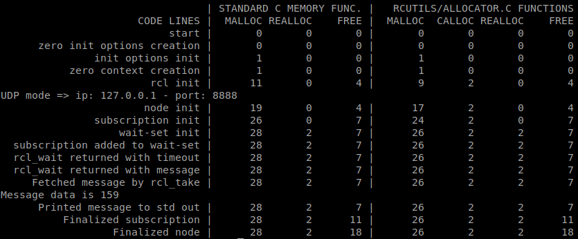
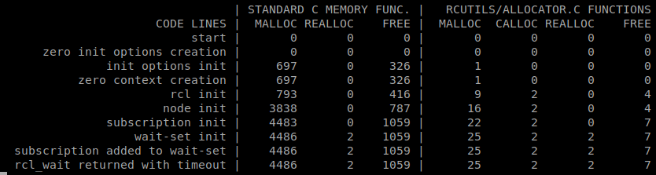

This document shall serve as decision template for the design and implementation of the micro-ROS client library. We discuss different options and existing starting points for this undertaking, decision criteria and analysis results regarding the existing assets.

## Assumptions

From the past discussions and developments in 2018, we assume that a [rosserial](http://wiki.ros.org/rosserial)- or [ros2arduino](https://github.com/ROBOTIS-GIT/ros2arduino)-like approach is not an option in the context of the [ROS 2 Embedded SIG](https://discourse.ros.org/t/ros2-embedded-sig-meeting-1/) and the EU project [OFERA](http://ofera.eu/), but that we strive for a solution based on rmw and rcl.

## Major Options

1. rclc: Implement a new client library in the C programming language from scratch or from the [few existing, unmaintained lines of code at https://github.com/ros2/rclc/](https://github.com/ros2/rclc/).
2. rclcplus: Implement a new client library from scratch featuring basic C++ mechanisms (such as templates), but not requiring a full-fledged libstdc++ (but some very basic subset only).
3. rclcpp: Modify the rclcpp to be usable on MCUs and NuttX using an (almost) full-fledged libstdc++

## Decision Criteria

* Runtime efficiency
  * Memory consumption
  * Heap fragmentation
  * CPU consumption
  * Flash footprint
* Supported programming concepts
  * Plain C or some C++
  * Support of dynamic memory management
  * Abstraction level
* Portability of user code
  * Supported ROS 2 API concepts
  * Accordance with rclcpp API
* Portability to other RTOS and MCUs
  * Dependencies on other libraries
  * Requirements to compilers
* Long-term maintenance
  * Portion of new code outside of rmw-rcl-rclcpp stack
  * Long-term commitment given by third party
* Development effort
  * Action items for implementation/port to NuttX
  * Potential action items for port to other RTOS and HW platforms
* Target users ("Clients")
  * ROS 2 users with high-level abstraction and ROS 2 concepts in mind.
  * Embedded developers with no high level abstractions requirement.

## Requirements to micro-ROS Client Library

In the [EU project OFERA](http://ofera.eu/), a list of high-level requirements to the whole micro-ROS stack including the client library has been compiled in the Deliverable [D1.7 Reference Scenarios and Technical System Requirements Definition](http://ofera.eu/storage/deliverables/OFERA_D1.7_Requirements.pdf). Import requirements immediately linked to the client library are:

* ROS2 lifecycle: micro-ROS nodes should support the node lifecycle defined for ROS2 nodes.
* Dynamic component parameters: micro-ROS shall provide mechanisms for dynamic management of component parameters, compatible with ROS mechanisms.
* Time precision: Clock synchronization between main micro-processor and MCU should be precise, with precision not less than 1ms.
* No-copy: Communication between nodes on the same MCU should be effective (no-copy).
* Memory usage: Relevant micro-ROS components (serialization, diagnostics, runtime configuration, RTOS abstractions, ...) shall fit on MCU with 192kB SRAM, together with existing application software.
* ROS standards: Compliance with ROS standards.
* Transferable: Moving a standard ROS 2 node to micro-ROS or the other way around should be straightforward and documented.

## Technical Background and Open Questions

### rclcpp Library

The rclcpp library features all ROS 2 concepts -- including parameters and lifecycle node -- and is maintained actively by the OSRF. Use of rclcpp would give best conditions for porting of ROS 2 user-code to micro-ROS.

Questions:

* Rclcpp is optimized for dynamic creation/destroying of subscriptions, publishers, timers, etc.
  * How can a static variant be implemented?
  * Is it possible to separate between an initialization and a run phase?
* Rclcpp comes with a fine-grained, complex structure of interfaces and data types. For example, a node is composed from eight interfaces.
  * How much CPU and memory overhead is caused by this architecture?
  * Does this architecture even allow to configure different static variants?
* Extensive use of advanced C++ concepts and dynamic memory management (std::vector, std::unique_lock, std::atomic_bool, std::shared_ptr)
  * Is it possible to provide abstractions and substitute types for an RTOS like NuttX?
* How much memory does rclcpp consume at runtime?

### rclc

Only very basic concepts (node, subscription and publisher) implemented so far. Whole library has just 500 LoC in sum.

Has OSRF plans for it in the midterm? They have mentioned it on the roadmap, [ROS2 roadmap](https://github.com/micro-ROS/rclc/tree/feature/api_documentation).

## Dynamic Memory Management in ROS 2

Dynamic memory allocation and deallocation fragments heap, which causes indefinite computing times (for those operations) and may cause unpredictable crashes.

rmw and rcl make intensive use of dynamic memory management. The PIMPL technique is used on both layers, so the types being allocated on the heap are even not visible at the API level (i.e. not defined in the provided header files).

rcutils defines allocator struct (rcutils_allocator_t) and helper-functions ([allocator.h](https://github.com/ros2/rcutils/blob/master/include/rcutils/allocator.h)/[allocator.c](https://github.com/ros2/rcutils/blob/master/src/allocator.c)) to pass own allocator to rcl functions. At many places, rcl calls rcutils_get_default_allocator, which probably requires some (minor) refactoring to allow consistent use of custom allocators throughout whole rcl and rmw.

For the rmw layer, an ['API for pre-allocating messages in the middleware'](https://github.com/ros2/rmw/issues/159) is currently discussed.

A list of issues on dynamic memory management and real-time is also discussed in the context of Autoware at [AutowareAuto/AutowareAuto#65](https://gitlab.com/AutowareAuto/AutowareAuto/issues/65), but without the specific requirements by microcontrollers.

Questions:

* Is it possible to avoid a large heap at all by providing tiny heaps for each concept (node, subscription, publisher) on the corresponding data types on top-most layer? Can each allocation on the lower layers be clearly assigned/related to one instance on the top-most layer?
* Is a two-phase approach -- allow dynamic allocation in some initialization phase but not in a later run phase -- possible? How much effort is it to implement? Would such an approach be acceptable for some safety-certified implementation?

As a first experiment, we implemented a simple node and subscriber directly against the rcl in the C programming language and counted the allocations and frees. The code can be found at [https://github.com/micro-ROS/micro-ROS_experiments/tree/experiment/measure_allocations/rcl_int32_subscriber](https://github.com/micro-ROS/micro-ROS_experiments/tree/experiment/measure_allocations/rcl_int32_subscriber).

In detail, we counted the calls of the standard C memory functions (malloc, realloc, free) and the calls of the functions of the default allocator (which uses the standard C memory functions) in rcutils/allocator.c

With the Micro XRCE-DDS middleware, we obtained the following numbers:

For curiosity, the numbers for Fast-RTPS:
  

### Current work on ROS 2

Currently there is an active interest in making ROS2 a real "real time" platform. These interest have strive to a set of developments regarding the amount of dynamic memory used along the full stack. From eProsima side they are making a big effort changing Fast RTPS dynamic memory to a static system. This eProsima approach aligns with the idea of two-steps: 1) reserve all memory needed and then 2) work with the pre-allocated memory and avoid new allocations.

To develop this mechanism currently there are to main changes, all regarding STL containers:

* Use of [https://github.com/foonathan/memory](https://github.com/foonathan/memory) system, where similar to the point previously listed in this section questions, there are heaps holding sets of container elements. Then, all the operations on the containers are done without relaying in new allocations.
* Own vector specialization using two steps, a first reserve of the memory and then make some checks on the traditional API. [https://github.com/eProsima/Fast-RTPS/pull/386](https://github.com/eProsima/Fast-RTPS/pull/386)
* Reuse of container entities.

The duality using foonathan and own vector is due to the fact that foonathan implementation is great for node based containers but not as good for continuous memory ones.
A design document of Fast RTPS approach: [https://github.com/eProsima/Fast-RTPS/issues/344](https://github.com/eProsima/Fast-RTPS/issues/344)

## Embedded C++ and the C++ library

Libstdc++ makes use of dynamic memory allocation and provides features which may not be available on microcontrollers, i.e. not portable to relevant RTOS. Also, its resource consumption (in particular code size) might be relevant. Nevertheless, C++ may be used on microcontrollers.

First, it is possible to use a subset only, which does not require libstdc++ at all. A tiny demo with rclc is provided at [https://github.com/micro-ROS/rclc/blob/example/c_with_templates/rclc/include/rclc/rclc.h#L24](https://github.com/micro-ROS/rclc/blob/example/c_with_templates/rclc/include/rclc/rclc.h#L24) and [https://github.com/micro-ROS/micro-ROS_experiments/blob/experiment/c_with_templates/c_with_templates/main.cpp](https://github.com/micro-ROS/micro-ROS_experiments/blob/experiment/c_with_templates/c_with_templates/main.cpp).

Further links:

* [How to write a C++ program without libstdc++ (http://ptspts.blogspot.com)](http://ptspts.blogspot.com/2010/12/how-to-write-c-program-without-libstdc.html)
* [g++ without libstdc++ -- can it be done? (https://stackoverflow.com/questions/3714167/)](https://stackoverflow.com/questions/3714167/g-without-libstdc-can-it-be-done-a-very-configurable-lightweight-libstd)
* [Bit Bashing: C++ On Embedded Systems](https://bitbashing.io/embedded-cpp.html) discusses different language features of C++ and provides guidelines which to enable and which to disable for embedded programming.

### Libcxx

During early stages of NuttX support, eProsima did a small POC using libcxx support provided by NuttX. [http://nuttx.org/doku.php?id=wiki:nshhowtos:llvm-stdcxx](http://nuttx.org/doku.php?id=wiki:nshhowtos:llvm-stdcxx). The POC was done using the Assis branch of libcxx however some changes on the makefile were required to be able to compile NuttX.

Another options are stripped-down libstdc++ variants with reduced feature sets optimized for embedded applications:

* [https://github.com/arobenko/embxx](https://github.com/arobenko/embxx)
* [https://cxx.uclibc.org/](https://cxx.uclibc.org/)
* [https://www.etlcpp.com/](https://www.etlcpp.com/)
* [http://libmicxx.sourceforge.net/](http://libmicxx.sourceforge.net/)

Further links:

* [Michael Caisse on 'Modern C++ in an Embedded World' at C++ Now 2018](https://www.youtube.com/watch?v=c9Xt6Me3mJ4&t=14s)
* [Bare Metal C++](https://embeddedartistry.com/newsletter-archive/2018/5/7/may-2018-c-embedded-frameworks) -- note that I (Ingo Lütkebohle) am not advocating for bare metal (rather for NuttX), but it's interesting to see what's possible

### C++ abstractions with platform dependencies

Some of the Cortex-MX we use does not have support for atomic operations on 64bits atomic variables:

* [https://stackoverflow.com/questions/35776372/atomic-int64-t-on-arm-cortex-m3#35777259](https://stackoverflow.com/questions/35776372/atomic-int64-t-on-arm-cortex-m3#35777259)
* [https://answers.launchpad.net/gcc-arm-embedded/+question/616213](https://answers.launchpad.net/gcc-arm-embedded/+question/616213)

GCC implementation:

* [https://gcc.gnu.org/wiki/Atomic/GCCMM?action=AttachFile&do=view&target=libatomic.c](https://gcc.gnu.org/wiki/Atomic/GCCMM?action=AttachFile&do=view&target=libatomic.c)

We have work around this issue implementing the atomic operations on 64Bits as regular memory read/writes.

A discrimination of the usage of the workaround is still to be done. This should be used ONLY on those architectures not supporting that kind of atomic operations.

See the modified rcl version at [https://github.com/micro-ROS/rcl/commit/cdb0cca50d49c5b5576bf88d2bb7a1d57ae1e00b](https://github.com/micro-ROS/rcl/commit/cdb0cca50d49c5b5576bf88d2bb7a1d57ae1e00b)

## Decision in the OFERA Project

* In a face-to-face meeting in Bucharest in March 2019, the partners from the OFERA project decided to take a double-tracked approach as follows:

1. Use rcl as C-based Client Library for micro-ROS by enriching it with small, modular libraries for parameters, graph, logging, clock, timers, execution management, lifecycle and system modes, TF, diagnostics, and power management.
2. Analyze fitness of rclcpp for use on microcontrollers, in particular regarding memory and CPU consumption as well as dynamic memory management.

In this meeting, we decided explicitly against a separate client library in the style of rclc.

### Responsibilities for extensions to rcl

Parameters (eProsima)

* Optimized implementation planned, where MCU client queries agent specifically for parameter values rather than all values being sent to the node on the MCU

Graph (eProsima)

* Similar to parameters

Logging (eProsima)

* Optimized implementation for MCU

Time / Clock and Timers (eProsima, Bosch, Acutronic Robotics)

* Bosch will analyze rcl time and clock interface
* Synchronization with microprocessor -- message types already available in Micro XRCE-DDS
* Adapter for RTOS required -- part of abstraction layer

Executor (Bosch)

* Very simple mechanism will be developed in the micro-ROS Turtlebot demo until August 2019.

Lifecycle / System modes (Bosch)

* To be developed in a second step in the micro-ROS Turtlebot demo.

TF (Bosch)

* To be developed in a third step in the micro-ROS Turtlebot demo.

Diagnostics (Bosch)

* To be developed in the second step in the micro-ROS Turtlebot demo.
* Liveliness of node: Introduce mechanism in Micro XRCE-DDS similar to standard DDS?
* Make PR for rmw extension with abstract interface to be informed about liveliness of other nodes?!

Power management (Acutronic Robotics)

* Highly dependent on RTOS, it would require implementation for each one