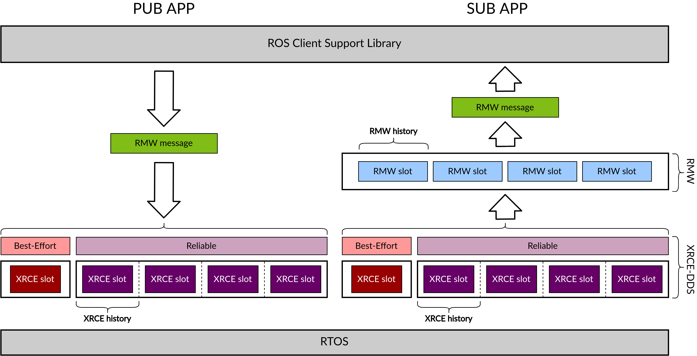
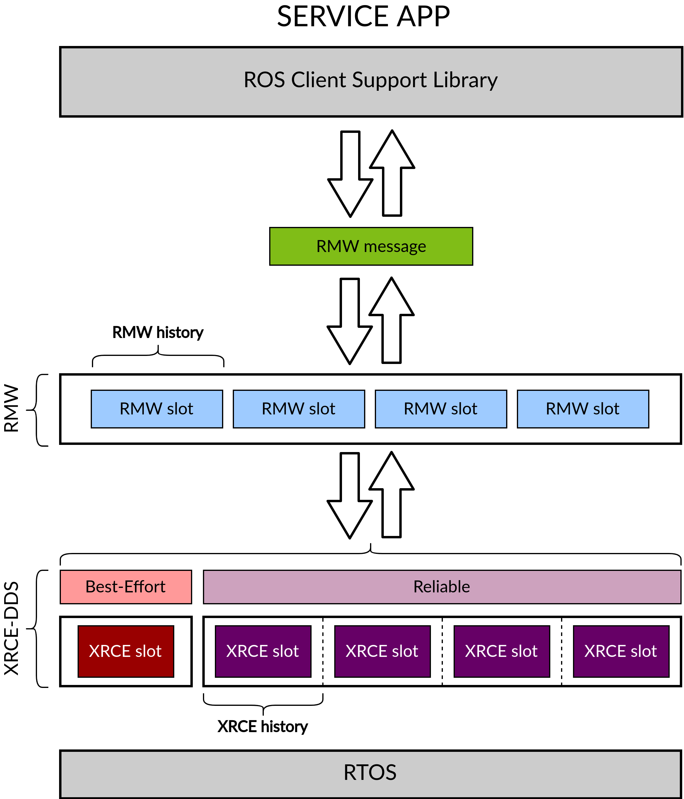
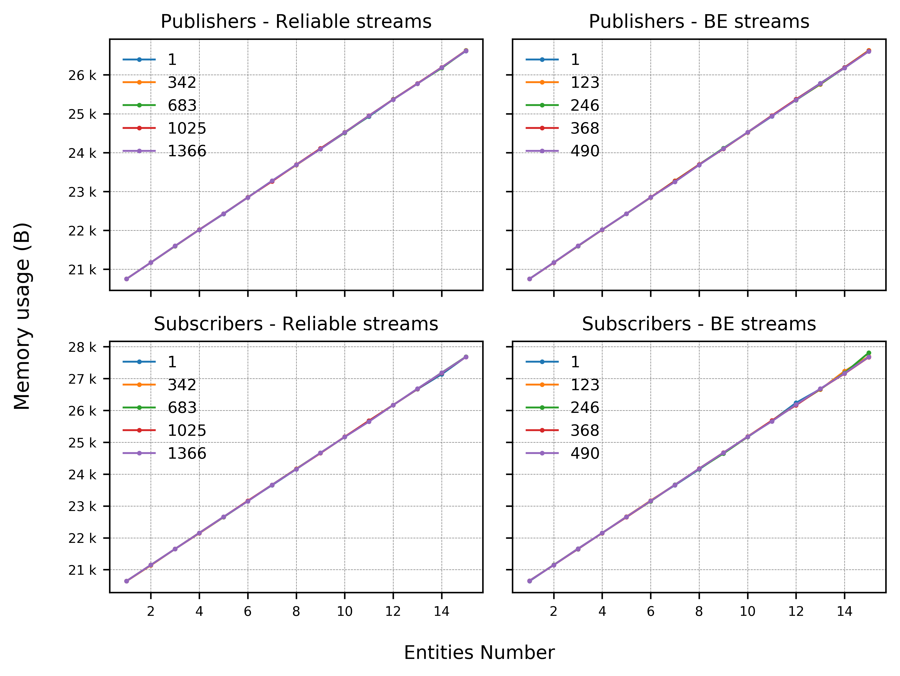
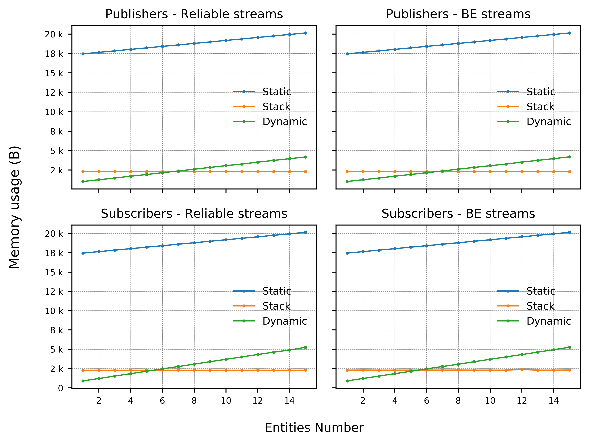
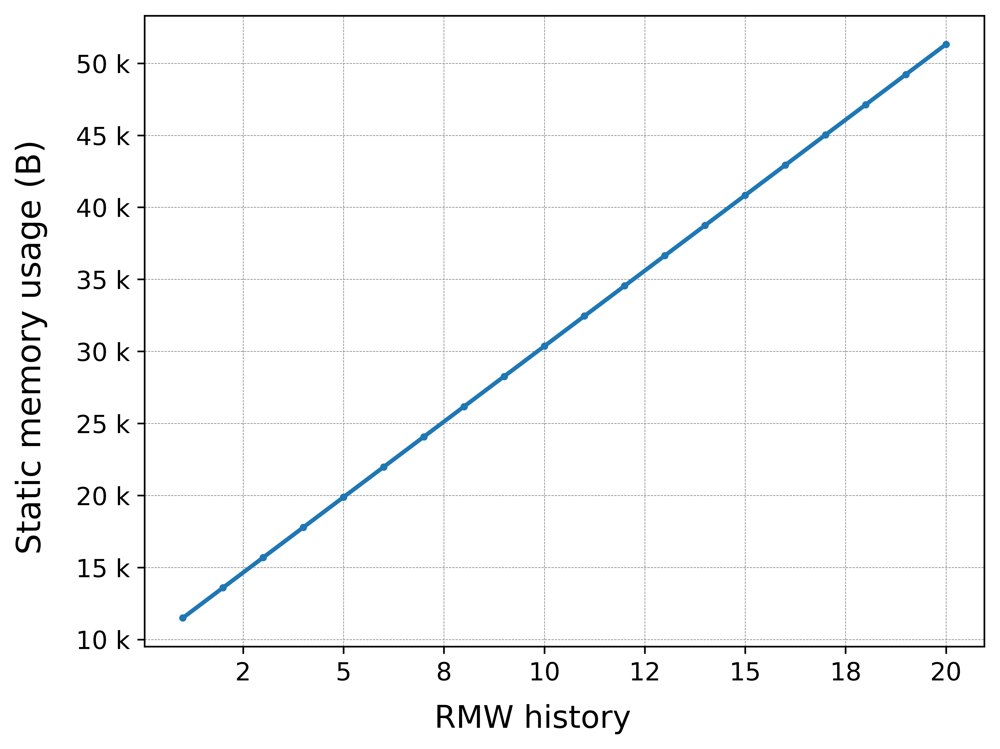
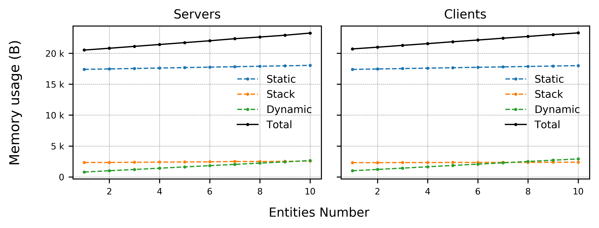

## Abstract

In this section, we analyze the memory footprint of the micro-ROS Client library. To perform the profiling, we have taken into account both applications of publishers/subscribers into/to ROS topics of known size and client/server type applications. We explored several different configurations by tuning key parameters such as message size, entity number, history size and transport protocol. Also, we discriminated between different types of memory. Indeed, while the [XRCE-DDS](https://micro-xrce-dds.docs.eprosima.com/en/latest/) Client is completely dynamic memory free, the micro-ROS Client makes use of both static and dynamic memory. It is therefore key to assess how much of each type of memory micro-ROS consumes, especially for what concerns real-timeness and determinism in the library behaviour. 

We performed the measurements for applications running on [FreeRTOS](https://www.freertos.org/index.html) and on an [ESP32](https://www.espressif.com/en/products/socs/esp32) board connected by UDP (via WiFi) to a micro-ROS Agent running on a Linux machine.

Results show that the total memory consumption of the Client is higher than that of the XRCE-DDS middleware, at least by using the default configuration parameters of the library. However, by opportunely adjusting some of these parameters (e.g., the MTU or the history size) to the needs of the specific application, it is possible to tune the total memory consumption to fit way better the limited resources of the target devices.

## Table of contents

* [Memory management of the micro-ROS stack](#memory-management-of-the-micro-ros-stack)
  * [Memory management of the XRCE-DDS library](#memory-management-of-the-xrce-dds-library)
  * [Memory management of the RMW](#memory-management-of-the-rmw)
  * [Additional considerations](#additional-considerations)
  * [Memory buffers](#memory-buffers)
* [Measurements and methodology](#measurements-and-methodology)
  * [Tested scenarios](#tested-scenarios)
  * [Results](#results)
    * [Pub-Sub apps](#pub-sub-apps)
    * [Client-Server apps](#client-server-apps)
  * [Conclusions](#conclusions)

## Memory management of the micro-ROS stack

micro-ROS’ [target devices](https://micro-ros.github.io/docs/overview/hardware/) are low-to-mid range Microcontroller Units (MCUs) with highly constrained resources, so that it is critical to assess the Client’s memory consumption to help users selecting the optimal library configuration for their application and the adequate platform on which to run it.

Given the limited memory resources of these devices, the possibility to manipulate and tune its memory consumption is key. micro-ROS tries to address the memory management issue by prioritizing the use of static memory instead of dynamic memory as much as possible, and by optimizing the memory footprint of the applications by tuning a set of configuration parameters related with the memory resources at compile-time. 

This tuning can be done by acting on two different memory resources: those handled by the [Micro XRCE-DDS](https://github.com/eProsima/Micro-XRCE-DDS) library and those handled by its RMW implementation [rmw-microxrcedds](https://github.com/micro-ROS/rmw-microxrcedds). In this section, we resume the most relevant parameters that control these resources and how the user can manipulate the micro-ROS memory consumption by acting on each of these layers.

### Memory management of the XRCE-DDS library

The Micro XRCE-DDS Client is completely dynamic and static memory free, implying that all memory footprint depends only on how the stack grows during the execution. Handling of this resource is done at configuration time, when the user can enable or disable several profiles before compiling, thus allowing to fix the executable code size. As part of these profiles, the user can control the memory growth by manipulating the Maximum Transmission Unit (MTU) and the communication streams.

The MTU regulates the size of the communication streams and matches the available memory in the internal buffers of the transport layer, which is the memory block where the messages will be written and stored when exchanged.  It defaults to 512 B for all transports available in micro-ROS.

Communication streams regulate how messages flow between the Clients and the Agent and represent ordered flows of information. There are two kinds of streams, Best-Effort and Reliable. Best-Effort streams consist in a single data buffer where only one message at a time is handled. Because of this, Best-Effort streams send and receive data leaving the reliability to the transport layer, and the message size handled by such a stream must be less or equal than the MTU defined in the transport used. On the other hand, Reliable streams enable lossless communication, regardless of the transport layer and allow message fragmentation to send and receive messages longer than the MTU. The number of chunks allowed to store the fragmented messages is controlled by the XRCE-DDS history (also referred to as XRCE_history in the following sections), which defaults to 4 slots.

### Memory management of the RMW

The `rmw-microxrcedds` layer uses static memory for allocating the resources associated with the ROS client support libraries, such as nodes, publishers, subscribers etc. This memory is managed by static memory pools that are shared among all the entities of a given application. The number of pools is fixed by the RMW message history (also referred to as RMW_history in the rest of the text), a parameter which is chosen by the user as a CMake flag.
These RMW pools act as message queues where to keep the subscription messages before the user reads them. The size of each pool is given by the MTU &#215; XRCE_history.

### Additional considerations

It should be clear by now that the two history buffers involved in the Client-Agent communication are different in nature: the XRCE-DDS history is used to store chunks of fragmented messages if Reliable communication is implemented. Thanks to this, in Reliable mode one can send or receive up to MTU &#215; XRCE_history minus the memory reserved for headers, whereas Best-Effort communication streams can only exchange messages of size smaller or equal to the MTU.  The history of the RMW, in turn, controls the reception of data in the case of subscription and services. In this case, a buffer ring is generated in the RMW to store and cushion the data received from the XRCE-DDS library while handling the `take` calls received from the user’s interface to fetch the data and send them through the higher layers all the way up to the user’s application.

Notice that this reflects the different behaviours of the XRCE-DDS library and of the RMW under subscription. While the XRCE-DDS library functions with callbacks, by warning the user whenever a new message comes in, the RMW functions by polling: this library listens to the topics the user has subscribed to and stores them until they are explicitly requested.

Finally notice that the nature and size of the memory consumed by publications and subscriptions is quite different. The reason is that subscribers stockpile the data in pre-allocated memory buffers. This enables storage of messages in slots (whose number depends on the XRCE-DDS and RMW histories) for a twofold purpose: to avoid loss of data in the case Reliable communication has been opted for, and this is reflected by the XRCE-DDS history, and to allow a flexible message handling and asynchronous message passing between the various layers, which is reflected in the RMW_history. The case of services matches closely that of subscribers, since in a request/response pattern all entities involved need to receive, and thus store and handle, data.

The diagrams shown below address all the features discussed in this section in a graphical way.

  Fig. 1: Illustrative diagram of the memory management of the micro-ROS Client library in publishers and subscribers applications.

  Fig. 2: Illustrative diagram of the memory management of the micro-ROS Client library in service applications.

### Memory buffers

The total memory consumed by a micro-ROS application running on a MCU can be calculated as the direct sum of different chunks of memory, each devoted to a different function: static memory, stack and dynamic memory.

In this section we give a brief description on these kinds of memory used by the micro-ROS library.

*Static Memory*

The static memory has been calculated as the difference between the memory occupied by the .bss and .data sections with a non-zero number of entities, and the memory occupied by the same sections when no micro-ROS application is running, that is, the memory occupied by the rest of components of the RTOS and libraries. This allows discriminating between the memory effectively occupied by micro-ROS and the one that is not specific to it. Notice that we don’t take into consideration neither the constant data stored in flash memory (.text section) nor the data buffer, which is the buffer that stores the data before serialization, since it is specific to the user application and not directly related to the micro-ROS Client operations.

*Stack Memory*

The stack is the memory consumed by the functions used by the program, when executing. Whilst the static memory can be straightforwardly calculated by just analyzing the compiled binary objects, the stack is the chunk of memory one cannot know precisely before running the application. The stack consumed during the program execution is taken into account by means of a FreeRTOS specific function involved in the memory management capabilities offered by this RTOS, the uxTaskGetStackHighWaterMark() function. This function returns the amount of stack that remains unused when the stack consumed by the program is at its greatest value. By subtracting this figure to the total stack available, which is known, one can obtain the stack peak used by the app.

*Dynamic Memory*

This is the memory dynamically allocated by the program by calls to `calloc()` and `malloc()` functions in the C language. To measure it we have hijacked the call to dynamic memory related functions since the ROS 2 stack allows users to feed the program with custom memory allocators. 

To better understand micro-ROS’ use of dynamic memory, we need to differentiate between two stages of the micro-ROS operation. In the first stage micro-ROS is initialized, entities such as nodes, publishers and subscribers are created, and all layers get ready for operation. This is the configuration stage and micro-ROS performs all the dynamic memory operations here. The second is the operation stage, in which the actual publications, subscriptions and all other node operations occur. This stage is dynamic memory free in the whole micro-ROS stack. An optional third stage exists, in which the micro-ROS layers are closed and cleaned and all the dynamic memory allocated in the configuration stage is freed.

## Measurements and methodology

### Tested scenarios

In this section, we summarize the experimental setup and the different scenarios explored in order to provide a comprehensive review on the memory footprint of the micro-ROS library.

In general, our aim is to assess how both the total memory and its independent constituents (static, stack and dynamic) are affected by:

* The topic size (in the form of an array of bytes of variable size)
* The number of ROS entities (pub/sub and service/client)
* The communication stream type used (Reliable vs Best-Effort)

In the first setup, we analyse the total memory consumption of applications that publish or subscribe to topics of variable size while sweeping through the number of entities (publishers and subscribers) and employ UDP transport. We do so for the two different QoS types, Reliable and Best-Effort.

In the second setup, we report on how the total memory is distributed between static, stack and dynamic.

The third set of measurements was taken for one subscription only, for a fixed message size and varying the history cache of the RMW layer from 1 to 20 units.

In the fourth set of measurements we measure the footprint of applications of requesters/repliers that act according to a client/service pattern.

### Results

In this section, we detail the methodology employed for the memory profiling of the experimental configurations described above, and for each of them we present the results obtained.

The measurements are conducted on a micro-ROS Client application with a varying number of entities: either publishers/subscribers (from 1 to 15) or client/server (from 1 to 10).

All the tested apps run on top of FreeRTOS and inside of an ESP32 board. The board is connected by UDP transport (WiFi) to a micro-ROS Agent running on a Linux machine. As explained above, the choice of FreeRTOS has been by virtue of its memory management functionalities, which easily allow to compute the memory used by applications.

In order to provide an assessment as much realistic as possible, the following parameters have been set to their default values: the creation mode employed was by XML in all tested cases, the MTU was held fixed to its default value of 512 B, and the XRCE-DDS library history cache was always kept fixed to 4.

#### Pub-Sub apps

*Total memory as a function of entities number and message size*

In this section, we report the total memory used by either publisher or subscriber applications in both Best-Effort and Reliable modes, using UDP transport, an RMW history of 8 shared slots, an MTU of 512 B and an XRCE-DDS history of 4 slots. The total memory consumption is reported as a function of the entity number and message size.

The number of publishers/subscribers has been varied, which is equivalent to changing the number of topics, since in our design of the set-up we associate each publisher/subscriber with just one topic.

In principle, in the Reliable case one can occupy the generated buffers with message sizes up to MTU &#215; XRCE_history, whereas in the Best-Effort case it can be filled with messages with size up to MTU, which correspond respectively to to 512 B &#215; 4 = 2048 B and 512 B with our default chosen values. This is due to the absence of fragmentation in Best-Effort communication streams, while, thanks to fragmentation, an entity communicating in Reliable mode can send/receive a message opportunely chunked in a number of pieces equal to the XRCE_history, each of the size of the MTU. However, from table 1 one can see the message size only ranges from 0 and 1366 B in the case of Reliable entities, and between 0 and 490 B for entities in Best-Effort mode. This is due to the fact that in both cases some memory is consumed by headers and, most importantly, in the Reliable case, some is consumed by confirmation messages such as heartbeats and acknacks.

  Fig 3: Total memory usage (in Bytes) of micro-ROS publisher and subscription applications in both Best-Effort and Reliable modes with UDP transport, default parameters and as a function of the entities number (x axis) and of the message size (legend).

From these plots, we can draw some conclusions and observe trends.

First of all it appears clear that the total memory consumption varies with the number of entities but not with the message size. The reason for this is that all message sizes explored fit into the static buffers pre-allocated by the program at compile-time. We therefore expect that the memory consumption would only vary with the message size when the total space occupied by the topic plus the confirmation messages (in the reliable case) and the overhead exceeds the buffer size. In the case of increasing the number of entities, instead, the overall memory grows (as we’ll see below, this is driven by an increase in both the static and the dynamic memories, while the stack is not affected).

By performing a simple calculation, we can see that the memory occupied by one publisher under the above experimental conditions is of ~ 400 B, while that occupied by one subscriber is ~ 500 B.
The fact that there is virtually no substantial difference between the memory usage of these two entities, notwithstanding the fact that subscribers have a RMW_history associated, is ascribable to the fact that the memory pools of the RMW are shared among all the entities participating in a given application, and therefore it doesn't mark a difference between subscribers (in need to store messages before they are fetched from the higher layers) and publishers.

Finally, we see that there is no substantial difference between Reliable and Best-Effort modes, exception made for the upper threshold of the message size that can be sent in these two modes, as explained at the beginning of this section.

*Memory breakdown*

To get a better insight on the type of memory consumed by these applications, below we provide the same data but broken down into its constituent memory chunks. We do so for just one message size (1 B), since, as we have seen, this number doesn’t affect the total memory consumed (nor its constituents).

   Fig 4: Static, stack and dynamic memory usage (in Bytes) of micro-ROS publisher and subscription applications in both Best-Effort and Reliable modes with UDP transport, default parameters and fixed message size as a function of the entities number.

From these results we see that both the static and the dynamic memories change with the entity number, while the stack stays constant.

*Role of the RMW history*

In this scenario, we have measured the static memory consumed as a function of the RMW history, when this ranges from 1 to 20 units, for a single subscriber application and with a message of fixed size (again, as seen above this size doesn’t affect the memory consumption as long as it’s smaller than the pre-allocated buffer size), with UDP transport and an XRCE-DDS history of 4, using Reliable communication. The results are summarized in the plot below:

   Fig 5: Static memory usage (in Bytes) of a micro-ROS subscription application in reliable mode with UDP transport, default parameters and fixed message size as a function of the RMW history.

From this plot, we see that the total static memory used changes by MTU &#215; RMW_history (which is equal to 512 &#215; 4 for the parameters employed) for each unit of RMW memory that we add to the application.

#### Client-Server apps

We now pass to investigate our last case-scenario, where in spite of pub/sub apps, we consider a different kind of ROS object, that of services, in which the communication between entities follow a request/reply pattern. See below the results for the memory consumed, for a number of servers and clients ranging from 1 to 10. Notice that we report both the behaviour and values of the individual consituents (static, stack, and dynamic) and of the total memory.

   Fig 6: Total memory usage (in Bytes) of micro-ROS service and clients applications as a function of the number of servers and clients.

As already done in the case of publishers and subscribers, we can calculate the total memory consumed by a single entity. From this calculation it results that the memory occupied by one server or one client is on the order of ~ 300 B. From this figure, we see that the memory occupied by a server and that occupied by a client is virtually identical, and it is on the same order of magnitude as that occupied by a publisher or subscriber application.

### Conclusions

To sum up, we have seen that:

* Memory consumption doesn’t vary with message size as long as the sum of the latter plus the overheads can be accommodated by the static buffer pre-allocated at compile-time.
* Static and Dynamic memories vary with the entity number, while the stack remains constant.
* A single publisher/subscriber app with default configuration parameters and with UDP transport consumes ~ 400-500 B of total memory.
* A single client/server app with default configuration parameters and with UDP transport consumes ~ 300 B of total memory, on the same order of magnitude of pub/sub applications.
* In the case of a single subscription, the total static memory used changes by MTU &#215; XRCE_history for each unit of RMW history that is added to the application.

