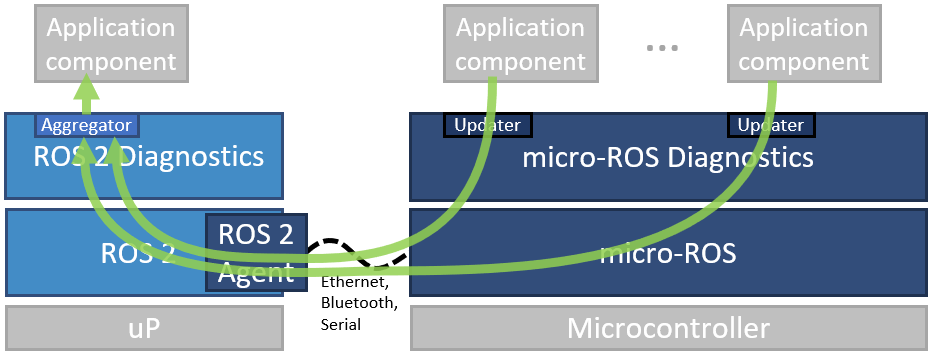

Although diagnostics is not part of the ROS 2 Client Library packages (i.e., rclcpp, rclpy), it definitely can be counted to the extended client library as it provides very generic and application-independent functionalities.

That's why the micro-ROS Client Library comes with basic diagnostics functionalities. These are compatible with ROS 2 diagnostics and comprise three features only:

* Diagnostic message types (optimized for Micro-XRCE-DDS - no dynamic arrays)
* Updater mechanisms for rclc
* Selected basic diagnostic monitors for microcontrollers

The micro-ROS diagnostics packages do not provide any aggregator as we assume that such aggregation takes place on a microprocessor running standard ROS 2. Hence, we assume the following typical architecture:

In order for the standard ROS 2 diagnostic aggregator to aggregate micro-ROS diagnostic message types, the ROS 2 agent has to translate micro-ROS diagnostic messages to standard ROS 2 diagnostic messages (*tbd*).

For more information, please see [https://github.com/micro-ROS/micro_ros_diagnostics/](https://github.com/micro-ROS/micro_ros_diagnostics/). For further information on ROS 2 diagnostics, see [ROS 2 diagnostics](https://github.com/ros/diagnostics/tree/ros2-devel) and [ROS 2 diagnostic_msgs](https://github.com/ros2/common_interfaces/tree/master/diagnostic_msgs).
