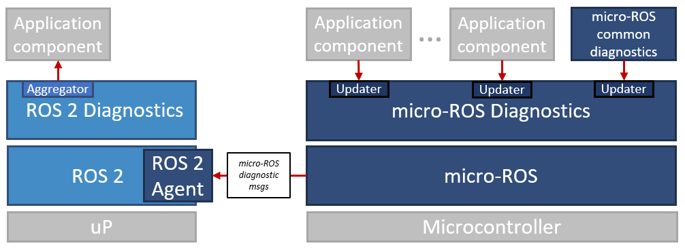

Although diagnostics is not part of the ROS 2 Client Library packages (i.e., rclcpp, rclpy), it definitely can be counted to the extended client library as it provides very generic and application-independent functionalities.

That's why the micro-ROS Client Library also comes with basic diagnostics functionalities. These are compatible with ROS 2 diagnostics, but comprise three features only:

* Diagnostic message types (optimized for Micro-XRCE-DDS - no dynamic arrays)
* Updater mechanisms for rclc
* Selected basic diagnostic monitors

The micro-ROS diagnostics packages do not provide any aggregation mechanisms as we assume that such aggregation takes place on a microprocessor running standard ROS 2. Hence, we assume the following typical architecture:

For more information, please see [https://github.com/micro-ROS/micro_ros_diagnostics/](https://github.com/micro-ROS/micro_ros_diagnostics/).
