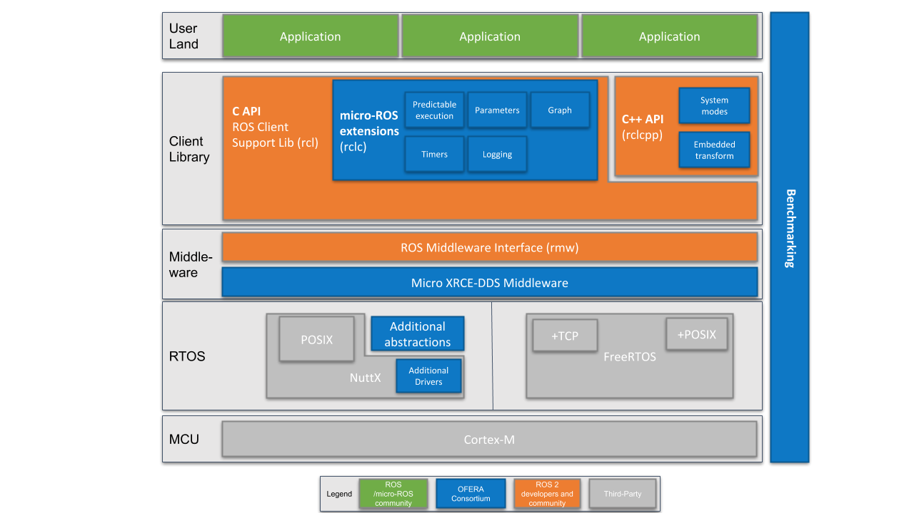

The client library provides the micro-ROS API for the user code, i.e. for application-level micro-ROS nodes. The overall goal is to provide all relevant, major ROS 2 concepts in suitable implementation for microcontrollers. Where possible, API compatibility with ROS 2 shall be achieved for ease of portability.

In this undertaking, to minimize the long-term maintenance cost, we strive to use existing data structures and algorithms from the ROS 2 stack or to bring necessary changes in the mainline stack. This raises a lot of question regarding the applicability of existing ROS 2 layers on microcontrollers in terms of runtime efficiency, portability to different RTOS, dynamic memory management, etc.

## Two-layered API

While C is still the dominating programming language for microcontrollers, there is a clear trend towards the use of higher-level languages, in particular C++. This trend is also driven by modern microcontrollers featuring several hundred kilobytes or even few megabytes of RAM.

Therefore, we plan to offer/support two APIs:

1. A **C API** based on the [ROS 2 Support Client Library (rcl)](https://github.com/ros2/rcl/), enriched with modular packages for execution management, diagnostics, parameters, ...
2. A **C++ API** based on the [ROS 2 rclcpp](https://github.com/ros2/rclcpp/), which at first requires analyzing the fitness of rclcpp for use on microcontrollers, in particular regarding memory and CPU consumption as well as dynamic memory management.

The basis of discussion for this decision is documented in a dedicated [decision paper](decision_paper/).

## Advanced Concepts

Advanced concepts developed in the context of the client library are documented separately. In general, these concepts are developed for the standard rclcpp first, before implementing a tailored C version. These are:

* [Real-Time Executor](real-time_executor/)
* [System Modes](system_modes/)
