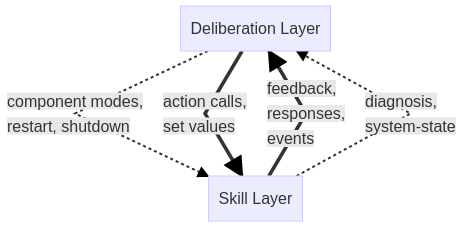
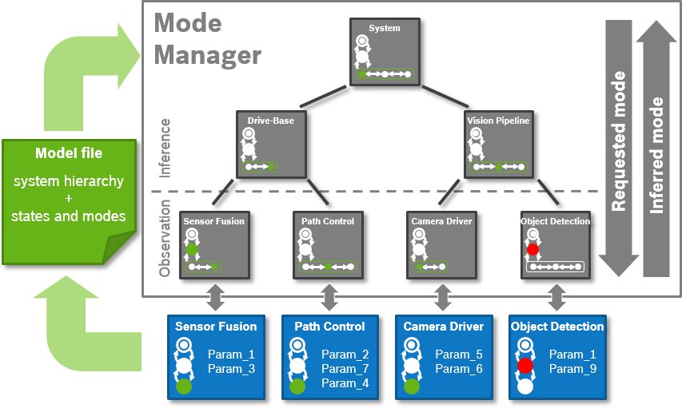

Table of contents
- [Introduction and Goal](#introduction-and-goal)
- [Requirements](#requirements)
- [Background: ROS 2 Lifecycle](#background-ros-2-lifecycle)
- [Main Features](#main-features)
  - [Basic Lifecycle](#basic-lifecycle)
  - [Extended Lifecycle](#extended-lifecycle)
  - [System Hierarchy and Modes](#system-hierarchy-and-modes)
  - [Mode Inference](#mode-inference)
  - [Mode Manager](#mode-manager)
  - [Error Handling and Rules](#error-handling-and-rules)
- [Acknowledgments](#acknowledgments)

## Introduction and Goal

Modern robotic software architectures often follow a layered approach. The layer with the core algorithms for SLAM, vision-based object recognition, motion planning, etc. is often referred to as *skill layer* or *functional layer*. To perform a complex task, these skills are orchestrated by one or more upper layers named *executive layer and planning layer*. Other common names are *task and mission layer* or *deliberation layer(s)*. In the following, we used the latter term.

We observed three different but closely interwoven aspects to be handled on the deliberation layer:

1. **Task Handling**: Orchestration of the actual task, the *straight-forward*, *error-free* flow.
2. **Contingency Handling**: Handling of task-specific contingencies, e.g., expectable retries and failure attempts, obstacles, low battery.
3. **System Error Handling**: Handling of exceptions, e.g., sensor/actuator failures.

The mechanisms being used to orchestrate the skills are service and action calls, re-parameterizations, set values, activating/deactivating of components, etc. We distinguish between *function-oriented calls* to a running skill component (set values, action queries, etc.) and *system-oriented calls* to individual or multiple components (switching between component modes, restart, shutdown, etc.).



Analogously, we distinguish between *function-oriented notifications* from the skill layer in form a feedback on long-running service calls, messages on relevant events in the environment, etc. and *system-oriented notifications* about component failures, hardware errors, etc.

Our observation is that interweaving of task handling, contingency handling, and system error handling generally leads to a high complexity of the control flow on the deliberation layer. Yet, we hypothesize that this complexity can be reduced by introducing appropriate abstractions for system-oriented calls and notifications.

Therefore, our **goal** within this work is to provide suitable abstractions and framework functions for (1.) system runtime configuration and (2.) system error and contingency diagnosis, to reduce the effort for the application developer of designing and implementing the task, contingency and error handling.

This goal is illustrated in the following example architecture, which is described and managed based on a model file:



The main features of the approach are (detailed in the remainder):

1. _Extended Lifecycle_: Extensible concept to specify the runtime states of components, i.e ROS 2 lifecycle nodes.
2. _System Hierarchy and Modes_: Modeling approach for specifying a ROS system in terms of its system hierarchy and _system modes_, i.e. different (sub-)system configurations.
3. _Mode Manager_: A module to manage and change the system runtime configuration.
4. _Mode Inference_: A module for deriving the entire system state and mode from observable system information, i.e. states, modes, and parameters of its components.
5. _Error Handling_: Lightweight concept for specifying an error handling and recovery mechanism.

## Requirements

The list of requirements is maintained in the doc folder of the micro-ROS system modes repository, at:
https://github.com/micro-ROS/system_modes/blob/master/system_modes/doc/requirements.md

## Background: ROS 2 Lifecycle

Our approach is based on the ROS 2 Lifecycle. The primary goal of the ROS 2 lifecycle is to allows greater control over the state of a ROS system. It allows consistent initialization, restart and/or replacing of system parts during runtime. It provides a default lifecycle for managed ROS 2 nodes and a matching set of tools for managing lifecycle nodes.

The description of the concept can be found at:
[http://design.ros2.org/articles/node_lifecycle.html](http://design.ros2.org/articles/node_lifecycle.html)
The implementation of the Lifecycle Node is described at:
[https://design.ros2.org/articles/node_lifecycle.html](https://design.ros2.org/articles/node_lifecycle.html).

## Main Features

### Basic Lifecycle

The ROS 2 Lifecycle has been implemented for micro-ROS as part of the C programming language client library *[rclc](https://github.com/ros2/rclc)*, see [rclc_lifecycle](https://github.com/ros2/rclc/tree/master/rclc_lifecycle) for source-code and documentation.

The rclc_lifecycle package is a ROS 2 package that provides convenience functions to bundle a ROS Client Library (rcl) node with the ROS 2 Node Lifecycle state machine in the C programming language, similar to the [rclcpp Lifecycle Node](https://github.com/ros2/rclcpp/blob/master/rclcpp_lifecycle/include/rclcpp_lifecycle/lifecycle_node.hpp) for C++.

An example, how to use the rclc Lifecycle Node is given in the file `lifecycle_node.c` in the [rclc_examples](https://github.com/ros2/rclc/blob/master/rclc_examples/) package.

### Extended Lifecycle

In micro-ROS, we extend the ROS 2 lifecycle by allowing to specify modes, i.e. substates, specializing the *active* state based on the standard ROS 2 parameters mechanism. We implemented this concept based on rclc_lifecycle and rclcpp_lifecycle for ROS 2 and micro-ROS.

Documentation and code can be found at:
[github.com:system_modes/README.md#lifecycle](https://github.com/micro-ROS/system_modes/blob/master/system_modes/README.md#lifecycle)

### System Hierarchy and Modes

We provide a modeling concept for specifying the hierarchical composition of systems recursively from nodes and for specifying the states and modes of systems and (sub-)systems with the extended lifecycle, analogously to nodes. This system modes and hierarchy (SMH) model also includes an application-specific the mapping of the states and modes along the system hierarchy down to nodes.

The description of this model can be found at:
[github.com:system_modes/README.md#system-modes](https://github.com/micro-ROS/system_modes/blob/master/system_modes/README.md#system-modes)
A simple example is provided at:
[github.com:system_modes_examples/README.md#example-mode-file](https://github.com/micro-ROS/system_modes/blob/master/system_modes_examples/README.md#example-mode-file)

### Mode Inference

The mode inference infers the entire system states (and modes) based on the lifecycle states, modes, and parameter configuration of its components, i.e. the ROS 2 lifecyle nodes. It parses the SMH model and subscribes to lifecycle/mode change requests, lifecycle/mode changes, and parameter events.

Based on the lifecycle change events it knows the _actual_ lifecycle state of all nodes. Based on parameter change events it knows the _actual_ parameter values of all nodes, which allows inference of the _modes_ of all nodes based on the SMH model.
Based on the SMH model and the inferred states and modes of all nodes, states and modes of all (sub-)systems can be _inferred_ bottom-up along the system hierarchy.
This can be compared to the latest _requested_ states and modes to detect a deviation.

The documentation and code can be found at:
[github.com:system_modes/README.md#mode-inference](https://github.com/micro-ROS/system_modes/blob/master/system_modes/README.md#mode-inference)
The mode inference can be best observed in the mode monitor, a console-based debugging tool, see:
[github.com:system_modes/README.md#mode-monitor](https://github.com/micro-ROS/system_modes/blob/master/system_modes/README.md#mode-monitor)

### Mode Manager

Building upon the _Mode Inference_ mechanism, the mode manager provides additional services and topics to _manage and adapt_ system states and modes according to the specification in the SMH model.

The documentation and code can be found at:
[github.com:system_modes/README.md#mode-manager](https://github.com/micro-ROS/system_modes/blob/master/system_modes/README.md#mode-manager)
A simple example is provided at:
[github.com:system_modes_examples/README.md#setup](https://github.com/micro-ROS/system_modes/blob/master/system_modes_examples/README.md#setup)

### Error Handling and Rules

If the _actual_ state/mode of the system or any of its parts diverges from the _target_ state/mode, we define rules that try to bring the system back to a valid _target_ state/mode, e.g., a degraded mode. Rules work in a bottom-up manner, i.e. starting from correcting nodes before sub-systems before systems. Rules are basically defined in the following way:

```pseudo
if:
 system.target == {target state/mode} && system.actual != {target state/mode} && part.actual == {specific state/mode}
then:
 system.target := {specific state/mode}
```

If _actual_ state/mode and _target_ state/mode diverge, but there is no rule for this exact situation, the bottom-up rules will just try to return the system/part to its _target_ state/mode.

*Note:* This feature is suited for simple, well-defined rules according to the depicted syntax. For more complex orchestration, integration of system modes with ontological reasoning (*metacontrol*) has been validated and successfully shown in the [MROS project](https://robmosys.eu/mros/), e.g., within a [navigation sub-system of a mobile robot](https://github.com/MROS-RobMoSys-ITP/Pilot-URJC).

## Acknowledgments

This activity has received funding from the European Research Council (ERC) under the European Union's Horizon 2020 research and innovation programme (grant agreement n° 780785).