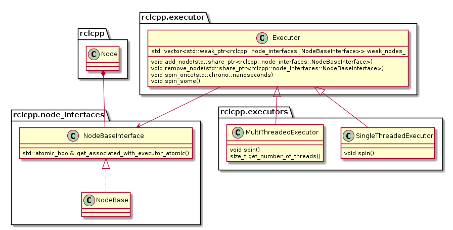
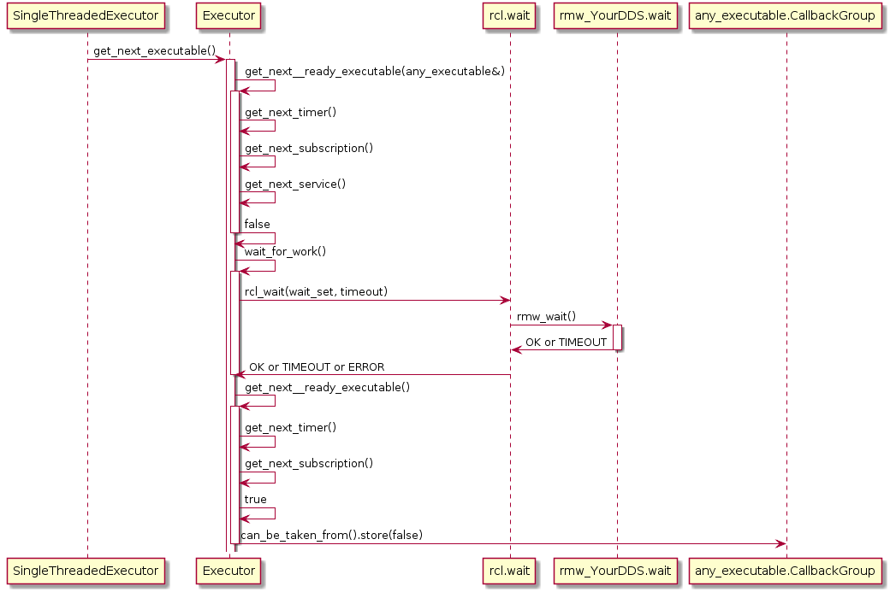
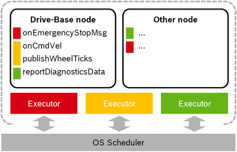
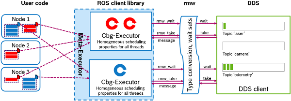
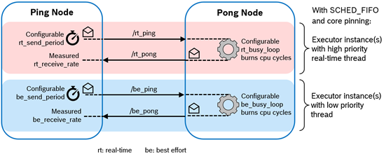
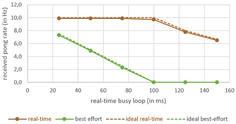
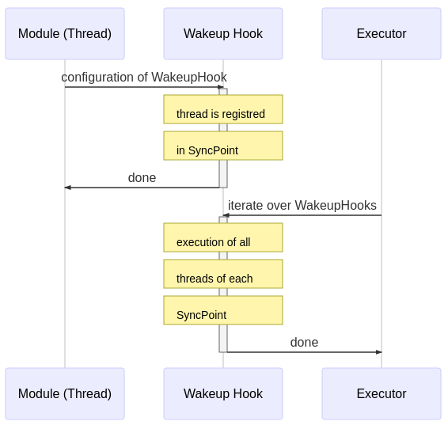

---
title: Real-Time Executor
redirect_from: /real-time_executor/
permalink: /docs/concepts/client_library/real-time_executor/
--- 

 
## Table of contents

*   [Introduction](#introduction)
*   [ROS 2 Executor Concept](#ros-2-executor-concept)
*   [RCL Executor](#rcl-executor)
    * [API Layers](#api-layers)
    * [Concept](#concept)
    * [API](#api)
    * [Tutorial and Download](#tutorial-and-download)
*   [Background](#background)
    * [ROS 2 rclcpp Executor](#ros-2-rclcpp-executor)
    * [Complex semantics of the ROS 2 Executor](#complex-semantics-of-the-ros-2-executor)
    *   [Callback-group-level Executor](#callback-group-level-executor)
*   [Related Work](#related-work)
*   [Roadmap](#roadmap)
*   [References](#references)
*   [Acknowledgments](#acknowledgments)


## Introduction

Predictable execution under given real-time constraints is a crucial requirement for many robotic applications, but is also a complex and time-consuming activity. While the service-based paradigm of ROS allows a fast integration of many different functionalities, it does not provide sufficient control over the execution management. For example, there are no mechanisms to enforce a certain execution order of callbacks within a node, left alone to configure the  execution order of callbacks of different nodes in a ROS 2 system. This is essential for a high quality of control applications, which consist of cause-effect-chains like sensor acquisition, evaluation and actuation control, and operating on old data due to scheduling is not desired. Furthermore, when input data is collected in field tests, saved with ROS-bags and re-played, often results are different due to non-determinism of process scheduling.

Of course, it is possible to manually setup the order of subscribing and publishing topics in the callbacks or by tweaking the priorities of the corresponding Linux processes. However, this approach is error-prune, difficult to extend and requires an in-depth knowledge of the deplyed ROS 2 packages in the system.

Therefore the goal of the Real-Time Executor is to support roboticists with practical and easy-to-use real-time mechanisms which provide solutions for:
- Deterministic execution
- Real-time guarantees
- Integration of real-time and non real-time functionalities on one platform
- Specific support for RTOS and microcontrollers

The challenges to achieve these goals are:
- to develop an adequate and well-defined scheduling mechanisms for the ROS framework and the operating system (RTOS)
- to define an easy-to-use interface for ROS-developers
- to model requirements (like latencies, determinism in subsystems)
- mapping of ROS framework and OS scheduler (semi-automated and optimized mapping is desired as well as generic, well-understood framework mechanisms)

Our approach is to provide a real-time Executor on two layers as described in section [Introduction to Client Library](../). One based on rcl written in C programming language and one based on rclcpp written in C++.

As the first step, we propose the LET-Executor, which implements static order scheduling policy with logic execution time semantics. In this scheduling policy, all processes are executed in a pre-defined order. Logical execution time refers to the concept, that first input data is read before tasks are executed, which has received much attention in automotive domain and multi-core platforms [[BP2017](#BP2017)] [[EK2018](#EK2018)]. Secondly, we developed a Callback-group-level executor, which allows to prioritize a group of callbacks. These approaches are based on the concept of executors, which have been introduced in ROS 2.


## ROS 2 Executor Concept

ROS 2 allows to bundle multiple nodes in one operating system process. To coordinate the execution of the callbacks of the nodes of a process, the Executor concept was introduced in rclcpp (and also in rclpy).

The ROS 2 design defines one Executor (instance of [rclcpp::executor::Executor](https://github.com/ros2/rclcpp/blob/master/rclcpp/include/rclcpp/executor.hpp)) per process, which is typically created either in a custom main function or by the launch system. The Executor coordinates the execution of all callbacks issued by these nodes by checking for available work (timers, services, messages, subscriptions, etc.) from the DDS queue and dispatching it to one or more threads, implemented in [SingleThreadedExecutor](https://github.com/ros2/rclcpp/blob/master/rclcpp/include/rclcpp/executors/single_threaded_executor.hpp) and [MultiThreadedExecutor](https://github.com/ros2/rclcpp/blob/master/rclcpp/include/rclcpp/executors/multi_threaded_executor.hpp), respectively.

The dispatching mechanism resembles the ROS 1 spin thread behavior: the Executor looks up the wait queues, which notifies it of any pending callback in the DDS queue. If there are multiple pending callbacks, the ROS 2 Executor executes them in an in the order as they were registred at the Executor. 

See also section [ROS 2 rclcpp Executor](#ROS-2-rclcpp-Executor) for a more detailed functional desciption and an analysis of its semantics in section [Complex semantic of the ROS 2 Executor](#Complex-semantic-of-the-ROS-2-Executor).

## RCL-Executor
This section describes a let-executor. It is a first step towards deterministic execution by providing static order scheduling with a let semantics. The abbreviation let stands for Logical-Execution-Time (let) and is a well-known concept in automotive domain to simplify synchronization in process scheduling. If refers to the concept to schedule multiple ready tasks in such a way, that first all input data is read for all tasks, and then all tasks are executed. This removes any inter-dependence of input data among these ready tasks and hence input data synchronization is improved. 

In the future, we plan to provide other executors with different deterministic semantics.

### API Layers
As mentioned in the section [Introduction to Client Library](../), we plan to provide micro-ROS support for the C++ API and for the C API. The Real-Time Executor enriches the C API based on the ROS Client Library (rcl).

### Concept
The let-executor implements a static order scheduler with logical-execution-time(let) semantics [[BP2017](#BP2017)] [[EK2018](#EK2018)]. During configuration the execution order of callbacks is defined and at runtime the callbacks are always processed in this order. The let-semantic refers to reading first all input data from the DDS-queue for all callbacks, storing the received messages or storing the event that a timer is ready. Then, in a second step, all callbacks, timers and the corresponding functions are executed in order as they were defined during configuration phase. 

### API

The API of the let-executor provides functions for configuration, defining the execution order of callbacks, running the scheduler and cleaning-up:

**Configuration**
- rcle_let_executor_init(...)
- rcle_let_executor_set_timeout(..)

**Definition of the execution order**
- rcle_let_executor_add_subscription(...)
- rcle_let_executor_add_timer(...)

**Running the executor**
- rcle_let_executor_spin_some(...)
- rcle_let_executor_spin_period(...)
- rcle_let_executor_spin(...)

**Clean-up memory**
- rcle_let_executor_fini(...)


In the function `rcle_let_executor_init`, the user must specify the total number of handles to be executed. The term handle denotes the object to be executed, for example a timer or a subscription.

The function `rcle_let_executor_set_timeout` is an optional configuration function, which defines the timeout in nanoseconds for calling rcl_wait(), i.e. the time to wait for new data from the DDS queue each time spin_some() is executed. The default timeout is 100ms.

The functions `rcle_let_executor_add_subscription` and `rcle_let_executor_add_timer` add the corresponding handle to the executor. The maximum number of handles is defined in `rcle_let_executor_init` and must not be exceeded. The sequential order of these function calls defines the static execution order later at runtime.

The function `rcle_let_executor_spin_some` checks for new data from the DDS queue once. It first saves all incoming messages and, in a second step, executes all handles according the configured order. This implements the let semantics.

The function `rcle_let_executor_spin_period` calls `rcle_let_executor_spin_some` periodically (as defined with the argument period) as long as the ROS system is alive.

The function `rcle_let_executor_spin` calls `rcle_let_executor_spin_some` indefinitely as long as the ROS system is alive. Note, that this function call might create a high performance load on your processor.

The function `rlce_executor_fini` frees the dynamically allocated memory of the executor.


As resources are very constrained on micro-controllers, specific attention has been paid to the memory allocation: Dynamic memory is only allocated during the initialization phase to reserve memory for all handles. This is the reason, why the total number of handles must be configured first. At runtime no memory is allocated by the let-executor.

### Tutorial and Download

The let-executor can be downloaded from the micro-ROS GitHub [rcl_executor repository](https://github.com/micro-ROS/rcl_executor). The package [rcl_executor](https://github.com/micro-ROS/rcl_executor/tree/dashing/rcl_executor) provides the let-executor library with a step-by-step tutorial and the package [rcl_executor_examples](https://github.com/micro-ROS/rcl_executor/tree/dashing/rcl_executor_examples) provides an example, how to use the let-executor.

## Background

In section we provide a detailed description of the ROS 2 rclcpp Executor, point-out its complex semantics and present the Callback-group-level executor.

### ROS 2 rclcpp Executor

Here we provide some more detail about the ROS 2 rclcpp Executor.

The following diagram depicts the relevant classes of the ROS 2 Executor concept:



Note that an Executor instance maintains weak pointers to the NodeBaseInterfaces of the nodes only. Therefore, nodes can be destroyed safely, without notifying the Executor.

Also, the Executor does not maintain an explicit callback queue, but relies on the queue mechanism of the underlying DDS implementation as illustrated in the following sequence diagram:



The Executor concept, however, does not provide means for prioritization or categorization of the incoming callback calls. Moreover, it does not leverage the real-time characteristics of the underlying operating-system scheduler to have finer control on the order of executions. The overall implication of this behavior is that time-critical callbacks could suffer possible deadline misses and a degraded performance since they are serviced later than non-critical callbacks. Additionally, due to the FIFO mechanism, it is difficult to determine usable bounds on the worst-case latency that each callback execution may incur.
  

### Complex semantics of the ROS 2 Executor

 In a recent paper [CB2019](#CB2019), the Executor of ROS 2 has been analyzed in detail and a response time analysis of cause-effect chains has been proposed under reservation-based scheduling. As described in the sub-section [ROS 2 rclcpp Executor](#ROS-2-rclcpp-Executor), the executor distinguishes four categories of callbacks: _timers_, which are triggered by sysetm-level timers, _subscribers_, which are triggered by new messages on a subscribed topic, _services_, which are triggered by service requests, and _clients_, which are triggered by responses to service requests. The executor is responsible for taking messages from the input queues of the DDS layer and executing the corresponding callback. Since it executes callbacks to completion, it is a non-preemptive scheduler, However it does not consider all ready tasks for execution, but only a snapshot, called readySet. This readySet is updated when the executor is idle and in this step it interacts with the DDS layer updating the set of ready tasks. Then for every type of task, there are dedicated queues (timers, subscriptions, services, clients) which are processed sequentially. The following key issues were pointed out: 
  * The executor processes _timers_ always first.  This can lead to the intrinsic effect, that in overload situations messages from the DDS queue are not processed
 
  * Messages arriving during the processing of the readySet are not considered until the next update, which depnds on the execution time of all remaining callbacks. This leads to priority inversion, as lower-priority callbacks may implicitly block higher-priority callbacks by prolonging the current processing of the readySet. 
  *  The readySet contains only one task instance, For example, even if multiple messages of the same topic are available, only one instance is processed until the executor is idle again and the readySet is updated from the DDS layer. This aggreviates priority inversion, as a backlogged callback might have to wait for multiple processsing of readySets until it is considered for scheduling. This means that non-timer callback instances might be blocked by multiple instances of the same lower-priority callback. 
 
Due to these findings, an alternative approach is presented to provide determinism and to apply well-known schedulability analyses to a ROS 2 systems. A response time analysis is described under reservation-based scheduling.

### Callback-group-level Executor
 We propose a callback-group-level Executor, which is based on the Executor concept of the ROS 2 Executor and addresses its afore-mentioned deficits. This new Executor provides fine-grained control of the mapping of callbacks to the scheduling primitives and mechanisms of the underlying RTOS, even across multiple nodes. ROS 2 allows bundling multiple nodes in one operating system process. To coordinate the execution of the callbacks of the nodes of a process, the Executor concept was introduced in rclcpp (and also in rclpy).

#### Description
In order to address the challenges mentioned above, some changes are imminent: Firstly, an API to express real-time requirements on a callback level is needed and secondly, the Executor must be redesigned to respect these real-time requirements in its scheduling decisions. As the current ROS 2 Executor works at a node-level granularity – which is a limitation given that a node may issue different callbacks needing different real-time guarantees - we decided to refine the ROS 2 Executor API for more fine-grained control over the scheduling of callbacks on the granularity of callback groups using. We leverage the callback-group concept existing in rclcpp by introducing real-time profiles such as RT-CRITICAL and BEST-EFFORT in the callback-group API (i.e. rclcpp/callback_group.hpp). Each callback needing specific real-time guarantees, when created, may therefore be associated with a dedicated callback group. With this in place, we enhanced the Executor and depending classes (e.g., for memory allocation) to operate at a finer callback-group granularity. This allows a single node to have callbacks with different real-time profiles assigned to different Executor instances - within one process.

Thus, an Executor instance can be dedicated to specific callback group(s) and the Executor’s thread(s) can be prioritized according to the real-time requirements of these groups. For example, all time-critical callbacks are handled by an "RT-CRITICAL" Executor instance running at the highest scheduler priority.

The following figure illustrates this approach with two nodes served by three Callback-group-level Executors in one process:



The different callbacks of the Drive-Base node are distributed to different Executors (visualized by the color red, yellow and green).  For example the onCmdVel and publishWheelTicks callback are scheduled by the same Executor (yellow). Callbacks from different nodes can be serviced by the same Executor.

#### API Changes
In this section, we describe the necessary changes to the Executor API:
*   [include/rclcpp/callback\_group.hpp](https://github.com/micro-ROS/rclcpp/blob/cbg-executor-0.5.1/rclcpp/include/rclcpp/callback_group.hpp):

    * Introduced an enum to distinguish up to three real-time classes (requirements) per node (RealTimeCritical, SoftRealTime, BestEffort)
    * Changed association with Executor instance from nodes to callback groups.
*   [include/rclcpp/executor.hpp](https://github.com/micro-ROS/rclcpp/blob/cbg-executor-0.5.1/rclcpp/include/rclcpp/executor.hpp)

    * Added functions to add and remove individual callback groups in addition to whole nodes.

    * Replaced private vector of nodes with a map from callback groups to nodes.

*   [include/rclcpp/memory\_strategy.hpp](https://github.com/micro-ROS/rclcpp/blob/cbg-executor-0.5.1/rclcpp/include/rclcpp/memory_strategy.hpp)

    * Changed all functions that expect a vector of nodes to the just mentioned map.
*   [include/rclcpp/node.hpp](https://github.com/micro-ROS/rclcpp/blob/cbg-executor-0.5.1/rclcpp/include/rclcpp/node.hpp) and [include/rclcpp/node_interfaces/node_base.hpp](https://github.com/micro-ROS/rclcpp/blob/cbg-executor-0.5.1/rclcpp/include/rclcpp/node_interfaces/node_base.hpp)

    * Extended arguments of create\_callback\_group function for the real-time class.
    * Removed the get\_associated\_with\_executor\_atomic function.

All the changes can be found in the branches [cbg-executor-0.5.1](https://github.com/micro-ROS/rclcpp/tree/cbg-executor-0.5.1/rclcpp) and [cbg-executor-0.6.1](https://github.com/micro-ROS/rclcpp/tree/cbg-executor-0.6.1/rclcpp) for the corresponding version 0.5.1 and 0.6.1 of the rclcpp in the fork at [github.com/micro-ROS/rclcpp/](https://github.com/micro-ROS/rclcpp/).

#### Meta-Executor Concept

The idea of the Meta Executor is to abstract away the callback-group assignment, thread allocation and other inner workings of the Executors from the user, thereby presenting a simple API that resembles the original Executor interface. Internally, the Meta Executor maintains multiple instances of our Callback-group-level Executor (Cbg-Executor).

The Meta Executor internally binds these Executors to the underlying kernel threads, assigns them a priority, chooses the scheduling mechanism (e.g., SCHED-FIFO policy) and then dispatches them. When adding a node with its list of callback group and real-time profiles to the Meta Executor, it parses the real-time profiles and assigns the node’s callback groups to the relevant internal Executors.



#### Test Bench

As a proof of concept, we implemented a small test bench in the present package cbg-executor_ping-pong_cpp. The test bench comprises a Ping node and a Pong node which exchange real-time and best-effort messages simultaneously with each other. Each class of messages is handled with a dedicated Executor, as illustrated in the following figure.


With the test bench, we validated the functioning of the approach - here on ROS 2 v0.5.1 with the Fast-RTPS DDS implementation - on a typical laptop.



The test bench is provided in the [bg-executor_ping-pong_cpp](https://github.com/microROS/micro-ROS-demos/tree/master/Cpp/cbg-executor_ping-pong) package of the [micro-ROS-demos](https://github.com/microROS/micro-ROS-demos/) repository.


## Related Work

In this section, we provide an overview to related approaches and link to the corresponding APIs.


### Fawkes Framework

[Fawkes](http://www.fawkesrobotics.org/) is a robotic software framework, which supports synchronization points for sense-plan-act like execution. It has been developed by RWTH Aachen since 2006. Source code is available at [github.com/fawkesrobotics](https://github.com/fawkesrobotics).

#### Synchronization
Fawkes provides developers different synchronization points, which are very useful for defining an execution order of a typical sense-plan-act application. These ten synchronization points (wake-up hooks) are the following (cf. [libs/aspect/blocked_timing.h](https://github.com/fawkesrobotics/fawkes/blob/master/src/libs/aspect/blocked_timing.h)):

*   WAKEUP\_HOOK\_PRE\_LOOP
*   WAKEUP\_HOOK\_SENSOR\_ACQUIRE
*   WAKEUP\_HOOK\_SENSOR\_PREPARE
*   WAKEUP\_HOOK\_SENSOR\_PROCESS
*   WAKEUP\_HOOK\_WORLDSTATE
*   WAKEUP\_HOOK\_THINK
*   WAKEUP\_HOOK\_SKILL   
*   WAKEUP\_HOOK\_ACT     
*   WAKEUP\_HOOK\_ACT\_EXEC
*   WAKEUP\_HOOK\_POST\_LOOP  

#### Configuration at compile time
At compile time, a desired synchronization point is defined as a constructor parameter for a module. For example, assuming that `mapLaserGenThread` shall be executed in SENSOR_ACQUIRE, the constructor is implemented as:

```C++
MapLaserGenThread::MapLaserGenThread()
  :: Thread("MapLaserGenThread", Thread::OPMODE_WAITFORWAKEUP),
     BlockedTimingAspect(BlockedTimingAspect::WAKEUP_HOOK_SENSOR_ACQUIRE),
     TransformAspect(TransformAspect::BOTH_DEFER_PUBLISHER, "Map Laser Odometry")
```

Similarly, if `NaoQiButtonThread` shall be executed in the SENSOR_PROCESS hook, the constructor is:

```C++
NaoQiButtonThread::NaoQiButtonThread()
  :: Thread("NaoQiButtonThread", Thread::OPMODE_WAITFORWAKEUP),
     BlockedTimingAspect(BlockedTimingAspect::WAKEUP_HOOK_SENSOR_PROCESS)
```
#### Runtime execution
At runtime, the *executor* iterates through the list of synchronization points and executes all registered threads until completion. Then, the threads of the next synchronization point are called.

A module (thread) can be configured independent of these sense-plan-act synchronization points. This has the effect, that this thread is executed in parallel to this chain.

The high level overview of the Fawkes framework is shown in the next figure. At compile-time the configuration of the sense-plan act wakeup hook is done (upper part), while at run-time the scheduler iterates through this list of wakeup-hooks (lower part):



Hence, at run-time, the hooks are executed as a fixed static schedule without preemption. Multiple threads registered in the same hook are executed in parallel.

Orthogonal to the sequential execution of sense-plan-act like applications, it is possible to define further constraints on the execution order by means of a `Barrier`. A barrier defines a number of threads, which need to have finished before the thread can start, which owns the barrier.

These concepts are implemented by the following main classes:

*   *Wakeup hook* by `SyncPoint` and `SyncPointManager`, which manages a list of synchronization points.
*   *Executor* by the class `FawkesMainThread`, which is the scheduler, responsible for calling the user threads.
*   `ThreadManager`, which is derived from `BlockedTimingExecutor`, provides the necessary API to add and remove threads to wakeup hooks as well as for sequential execution of the wakeup-hooks.
- `Barrier` is an object similar to `condition_variable` in C++.

####Discussion

All threads are executed with the same priority. If multiple sense-plan-act chains shall be executed with different priorities, e.g. to prefer execution of emergency-stop over normal operation, then this framework reaches its limits.

Also, different execution frequencies cannot be modeled by a single instance of this sense-plan-act chain. However, in robotics the fastest sensor will drive the chain and all other hooks are executed with the same frequency.

The option to execute threads independent of the predefined wakeup-hooks is very useful, e.g. for diagnostics. The concept of the Barrier is useful for satisfying functional dependencies which need to be considered in the execution order.


<!--
### Orocos

TODO INSERT DESCRIPTION ON PARTIAL ORDER SCHEDULING.


### CoSiMA

TODO INSERT DESCRIPTION ON MODEL-BASED APPROACH BY COSIMA (ON TOP OF OROCOS) FROM FOLLOWING PAPER:

D. L. Wigand, P. Mohammadi, E. M. Hoffman, N. G. Tsagarakis, J. J. Steil and S. Wrede, "An open-source architecture for simulation, execution and analysis of real-time robotics systems," 2018 IEEE International Conference on Simulation, Modeling, and Programming for Autonomous Robots (SIMPAR), Brisbane, QLD, 2018, pp. 93-100.
doi: 10.1109/SIMPAR.2018.8376277
URL: http://ieeexplore.ieee.org/stamp/stamp.jsp?tp=&arnumber=8376277&isnumber=8376259
-->

## Roadmap

**2018**

*   In-depth analysis of the ROS 2 Executor concept.
*   Designed Callback-group-level Executor and implemented it - at first, prototypically, for ROS 2.
*   Designed the Meta Executor concept.
*   Validated correct functioning with underlying layers and middleware.

**2019**

*   Implementation of the Callback-group-level Executor and Meta Executor for urcl.
*   Research of concepts for model-based optimization of end-to-end latencies.

**2020**

*   Integration with a selected advanced scheduling and resource monitoring mechanisms such as reservation-based scheduling.
*   Integration with selected sleep modes and low-power modes.

## References

*   Ralph Lange: Callback-group-level Executor for ROS 2. Lightning talk at ROSCon 2018. Madrid, Spain. Sep 2018. [[Slides]](https://roscon.ros.org/2018/presentations/ROSCon2018_Lightning1_4.pdf) [[Video]](https://vimeo.com/292707644)

*  [CB2019]<a name="CB2019"> </a> D. Casini, T. Blaß, I. Lütkebohle, B. Brandenburg: Response-Time Analysis of ROS 2 Processing Chains under Reservation-Based Scheduling, in Euromicro-Conference on Real-Time Systems 2019. [[Paper](http://drops.dagstuhl.de/opus/volltexte/2019/10743/)].[[slides]](https://www.ecrts.org/wp-content/uploads/2019/07/casini.pdf)

*  [EK2018]<a name="EK2018"></a> R. Ernst, S. Kuntz, S. Quinton, M. Simons: The Logical Execution Time Paradigm: New Perspectives for Multicore Systems, February 25-28 2018 (Dagstuhl Seminar 18092). [[Paper]](http://drops.dagstuhl.de/opus/volltexte/2018/9293/pdf/dagrep_v008_i002_p122_18092.pdf)

 

 * [BP2017]<a name="BP2017"></a> A. Biondi, P. Pazzaglia, A. Balsini,  M. D. Natale: Logical Execution Time Implementation and Memory Optimization Issues in AUTOSAR Applications for Multicores, International Worshop on Analysis Tools and Methodologies for Embedded and Real-Time Systems (WATERS2017), Dubrovnik, Croatia.[[Paper]](https://pdfs.semanticscholar.org/4a9e/b9a616c25fd0b4a4f7810924e73eee0e7515.pdf)


## Acknowledgments

This activity has received funding from the European Research Council (ERC) under the European Union's Horizon 2020 research and innovation programme (grant agreement n° 780785).
