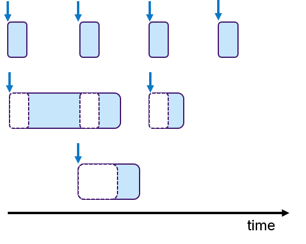
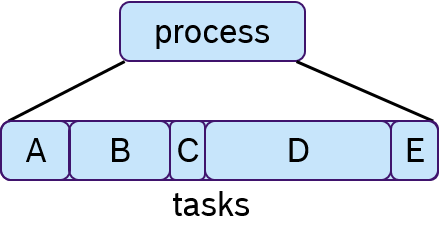
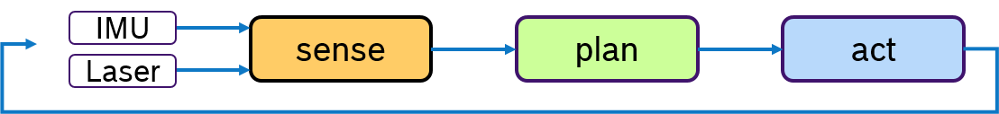

## Table of contents

*   [Introduction](#introduction)

*   [Analysis of rclcpp standard Executor](#analysis-of-rclcpp-standard-executor)
    * [Architecture](#architecture)
    * [Scheduling Semantics](#scheduling-semantics)


*   [Rcl LET-Executor](#rcl-let-executor)
    * [Concept](#concept)
    * [Example](#example)
    * [Download](#download)


*   [Callback-group-level Executor](#callback-group-level-executor)
    *   [API Changes](#api-changes)
    *   [Meta Executor Concept](#meta-executor-concept)
    *   [Test Bench](#test-bench)


*   [Related Work](#related-work)
*   [Roadmap](#roadmap)
*   [References](#references)
*   [Acknowledgments](#acknowledgments)


## Introduction

Predictable execution under given real-time constraints is a crucial requirement for many robotic applications. While the service-based paradigm of ROS allows a fast integration of many different functionalities, it does not provide sufficient control over the execution management. For example, there are no mechanisms to enforce a certain execution order of callbacks within a node. Also the execution order of multiple nodes is essential for control applications in mobile robotics. Cause-effect-chains comprising of sensor acquisition, evaluation of data and actuation control should be mapped to ROS nodes executed in this order, however there are no explicit mechanisms to enforce it. Furthermore, when input data is collected in field tests, saved with ROS-bags and re-played, often results are different due to non-determinism of process scheduling.

Manually setting up a particular execution order of subscribing and publishing topics in the callbacks or by tweaking the priorities of the corresponding Linux processes is always possible. However, this approach is error-prune, difficult to extend and requires an in-depth knowledge of the deplyed ROS 2 packages in the system.

Therefore the goal of the Real-Time Executor is to support roboticists with practical and easy-to-use real-time mechanisms which provide solutions for:
- Deterministic execution
- Real-time guarantees
- Integration of real-time and non real-time functionalities on one platform
- Specific support for RTOS and microcontrollers


In ROS 1 a network thread is responsible for receiving all messages and putting them into a FIFO queue (in roscpp). That is, all callbacks were called in a FIFO manner, without any execution management. With the introduction of DDS (data distribution service) in ROS 2, the messages are buffered in DDS. In ROS 2, an Executor concept was introduced to support execution management, like priorization. At the rcl-layer, a _wait-set_ is configured with handles to be received and in a second step, the handles are taken from the DDS-queue. A handle is a term defined in rcl-layer and summarizes timers, subscriptions, clients and services etc..

The standard implementation of the ROS 2 Executor for the C++ API (rclcpp) has, however, certain unusual features, like precedence of timers over all other DDS handles, non-preemptive round-robin scheduling for non-timer handles and considering only one input data for each handle (even if multiple could be available). These features have the consequence, that in certain situations the standard rclcpp Executor is not deterministic and it makes proving real-time guarantees hard. We have not looked at the ROS 2 Executor implementation for Python frontend (rclpy) because we consider a micro-controllers platform, on which typically C or C++ appliations will run.

Given the goals for a Real-Time Executor and the limitations of the ROS 2 standard rclcpp Executor, the challenges are:
- to develop an adequate and well-defined scheduling mechanisms for the ROS 2 framework and the real-time operating system (RTOS)
- to define an easy-to-use interface for ROS-developers
- to model requirements (like latencies, determinism in subsystems)
- mapping of ROS framework and OS scheduler (semi-automated and optimized mapping is desired as well as generic, well-understood framework mechanisms)

Our approach is to provide Real-Time Executors on two layers as described in section [Introduction to Client Library](../). One based on the rcl-layer written in C programming language and one based on rclcpp written in C++.

As the first step, we propose the LET-Executor for the rcl-layer in C, which implements static order scheduling policy with logic execution time semantics. In this scheduling policy, all callbacks are executed in a pre-defined order. Logical execution time refers to the concept, that first input data is read before tasks are executed.  Secondly, we developed a Callback-group-level Executor, which allows to prioritize a group of callbacks. These approaches are based on the concept of Executors, which have been introduced in ROS 2.

In the future, we plan to provide other Real-Time Executors for the rcl- and rclcpp-layer.

## Analysis of rclcpp standard Executor

ROS 2 allows to bundle multiple nodes in one operating system process. To coordinate the execution of the callbacks of the nodes of a process, the Executor concept was introduced in rclcpp (and also in rclpy).

The ROS 2 design defines one Executor (instance of [rclcpp::executor::Executor](https://github.com/ros2/rclcpp/blob/master/rclcpp/include/rclcpp/executor.hpp)) per process, which is typically created either in a custom main function or by the launch system. The Executor coordinates the execution of all callbacks issued by these nodes by checking for available work (timers, services, messages, subscriptions, etc.) from the DDS queue and dispatching it to one or more threads, implemented in [SingleThreadedExecutor](https://github.com/ros2/rclcpp/blob/master/rclcpp/include/rclcpp/executors/single_threaded_executor.hpp) and [MultiThreadedExecutor](https://github.com/ros2/rclcpp/blob/master/rclcpp/include/rclcpp/executors/multi_threaded_executor.hpp), respectively.

The dispatching mechanism resembles the ROS 1 spin thread behavior: the Executor looks up the wait queues, which notifies it of any pending callback in the DDS queue. If there are multiple pending callbacks, the ROS 2 Executor executes them in an in the order as they were registred at the Executor.

### Architecture

The following diagram depicts the relevant classes of the standard ROS 2 Executor implementation:


Note that an Executor instance maintains weak pointers to the NodeBaseInterfaces of the nodes only. Therefore, nodes can be destroyed safely, without notifying the Executor.

Also, the Executor does not maintain an explicit callback queue, but relies on the queue mechanism of the underlying DDS implementation as illustrated in the following sequence diagram:


The Executor concept, however, does not provide means for prioritization or categorization of the incoming callback calls. Moreover, it does not leverage the real-time characteristics of the underlying operating-system scheduler to have finer control on the order of executions. The overall implication of this behavior is that time-critical callbacks could suffer possible deadline misses and a degraded performance since they are serviced later than non-critical callbacks. Additionally, due to the FIFO mechanism, it is difficult to determine usable bounds on the worst-case latency that each callback execution may incur.

### Scheduling Semantics

In a recent paper [CB2019](#CB2019), the rclcpp Executor has been analyzed in detail and a response time analysis of cause-effect chains has been proposed under reservation-based scheduling. The Executor distinguishes four categories of callbacks: _timers_, which are triggered by system-level timers, _subscribers_, which are triggered by new messages on a subscribed topic, _services_, which are triggered by service requests, and _clients_, which are triggered by responses to service requests. The Executor is responsible for taking messages from the input queues of the DDS layer and executing the corresponding callback. Since it executes callbacks to completion, it is a non-preemptive scheduler, However it does not consider all ready tasks for execution, but only a snapshot, called readySet. This readySet is updated when the Executor is idle and in this step it interacts with the DDS layer updating the set of ready tasks. Then for every type of task, there are dedicated queues (timers, subscriptions, services, clients) which are processed sequentially. The following undesired properties were pointed out:

* Timers have the highest priority. The Executor processes _timers_ always first.  This can lead to the intrinsic effect, that in overload situations messages from the DDS queue are not processed.
* Non-preemptive round-robin scheduling of non-timer handles. Messages arriving during the processing of the readySet are not considered until the next update, which depends on the execution time of all remaining callbacks. This leads to priority inversion, as lower-priority callbacks may implicitly block higher-priority callbacks by prolonging the current processing of the readySet.
* Only one message per handle is considered. The readySet contains only one task instance, For example, even if multiple messages of the same topic are available, only one instance is processed until the Executor is idle again and the readySet is updated from the DDS layer. This aggravates priority inversion, as a backlogged callback might have to wait for multiple processing of readySets until it is considered for scheduling. This means that non-timer callback instances might be blocked by multiple instances of the same lower-priority callback.

Due to these findings, the authors present an alternative approach to provide determinism and to apply well-known schedulability analyses to a ROS 2 systems. A response time analysis is described under reservation-based scheduling.

## RCLC-Executor
In this section we introduce an RCLC-Exeucutor, which is an Executor for C-Applications based on RCL-layer. First the requirements for the RCLC-Executor are motivated, then the features are described and finally examples are provided how to use the RCLC-Executor.

### Requirements for an RCLC-Executor in ROS2
First we discuss a common use-case in embedded systems which uses the time-triggered principle to guarantee deterministic and real-time behavior. Then we analyse several software design patterns which can be used to ensure deterministic behavior. Based on these requirements we introduce an RCLC-Executor.

#### Time-triggered use-case for embedded real-time applications
In embedded systems, real-time behavior is approached by using the time-triggered paradigm, that is all processes are periodically activated. Processes can be assigned priorities to allow pre-emptions. Figure 1 shows an example, in which three processes with fixed periods are shown. The middle and lower process are pre-empted multiple times depicted with dashed boxes.



Figure 1: Fixed periodic preemptive scheduling

To each process one or multiple tasks can be assigned, as shown in Figure 2. These tasks are executed co-operativly.



Figure 2: Processes with sequentially executed tasks.

While there are many possibilities to assign priorities to a given number of processes,
the rate-monotonic scheduling assignment, in which processes with a shorter period get a higher priority has been shown as optimal if the processor utilization is less than 69% [LL1973](#LL1973).

 In the last decades many different approaches have been presented, however fixed-periodic pre-emptive scheduling is still widely used in embedded real-time systems [KZH2015](#KZH2015]). Like Linux, real-time operating systems (like NuttX, Zephyr, FreeRTOS, QNX etc.) support fixed-periodic preemptive scheduling and the assignment of priorities.

Data consistency is often an issue when preemptive scheduling is used, if data is being shared across multiple processes via global variables. Due to scheduling effects and varying execution times of processes, writing to these variables can occur sometimes sooner or later. This results in an latency jitter of update times. Race conditions can occur, when multiple processes access these variables at the same time. So solve this issue, the concept of logical-execution time (LET) was introduced in [HHK2001](#HHK2001), in which communication of data occurs only at periodic time instances: Reading data only at the beginning of the period and writing data only at the end of the period. The cost of an additional latency is traded with data consistency and reduced jitter. This concept has also been applied in real-time embedded systems in the automotive domain [NSP2018](#NSP2018).


Figure 3: Data communication without and with Logical Execution Time paradigm.

An Example of the LET-concept is shown in Figure 2. Two processes are communicating data: the timepoint when this data is written is at the end of the process. In the default case, the process p<sub>3</sub> and already p<sub>4</sub> receive the update. At the right side of the figure, the same scenario is shown with LET-semantics, in which the data is communicated only a period-boundaries. In this case the lower process communicates at the end of the period, so that p<sub>3</sub> and p<sub>5</sub> receive the new data.

The described real-time embedded use case relies on the following conecpts:
- periodic execution
- assginement of fixed priorities
- preemptive scheduling on process level
- co-operative scheduling within a process
- LET for data synchronization

While periodic task activation is possible in ROS2 by using timers as well as using preemptive scheduling and setting priorities on the granularity of threads/processes that correspond to the ROS nodes, it is not possible to sequentially execute tasks. Furthermore data is read from the DDS queue just before it is executed and data is written by using publish-method within the application code. The `spin_period` function of the rclcpp-Executor allows to check for data at a fixed rate and executing those callbacks for which data is available, however, with this spin-function it is not possible to trigger all callbacks irrespective wheter data is available or not.


#### Software design patterns in mobile robotics

In this section we describe common software design patterns in mobile robotics to achieve deterministic behavior. For each design pattern we describe the motivation and the derived requirements for an Executor.

##### Sense-plan-act Pipeline

Motivation:

A common design paradigm is a control loop, consisting of several phases: A sensing phase to aquire sensor data, a plan phase for localization and path planning and act-phase to steer the mobile robot. Of course, more phases are possible, here this shall only serve as an example. Such a processing pipeline is presented in Figure 4.


Figure 4: Multiple sensors driving a Sense-Plan-Act pipeline.

Typically multiple sensors are used for the perception of the environment. For example an IMU and a Laser. The main goal for the localization algorithm is to work always on the latest data. One way to achive this is to execute first all sensor drivers in the sense-phase. Currently this is not possible with ROS2-Executor because the order of execution cannot be determined. One could design such a pipeline with data-driven principle, however if one topic of the sensing phase is subscribed by a callback in a later phase, then the order of processing muliple subscribers for the same topic is arbitrary.

For this sense-plan-act pattern, we could define one executor for each phase. The plan-phase would be triggered e.g. only when the sense-phase has finished, that is both the callbacks for the IMU and Laser have finished.

Derived Requirements:
- triggered execution of callbacks

##### Synchronization of multiple rates

Motivation:

Often multiple sensors are being used to sense the invironment for mobile robotics. While an IMU sensor provides data samples at a very high rate (e.g 500Hz), laser scans are availabe at a much slower frequency (e.g. 10Hz) determined by the revolution time. Then the question is, how to fuse these data samles with different frequencies deterministically.


Figure 5: How to deterministically process multi-frequent sensor data.

Due to scheduling effects, the callback for the laser scan might be called just before or after an IMU data is received. One way of sensor fusion is take this into account in the software itself and write additional synchronization code. Obviously, being an application specific solution.


An Alternative would be to evalute the IMU sample and laser scan by synchronizing their frequency. For example process always 50 IMU samples and one laser scan. This is symbolized in Figure 6, in which a pre-processing callback aggregates the IMU samples and sends a message with ten samples at 10Hz rate as well. With a trigger, that checks for both messages, the aggregates IMU message as well as the laser scan, sensor fusion callback is guaranteed to process at a synchronized sampling rate.


Figure 6: Synchronization of multiple input data with a trigger.


<!--
Gliederung:
- requirements time-triggered use-case
- robotics software architectures
- why it is not possible to use ROS2 Executor for this?
  - erstmal gibt es keinen Executor als C API
  - no general trigger concept
    - message filter concept to order/align messages - but not part of executor (only based on timestamping) general trigger does not exist
    - each callback is called whenever new data is available (kind-of) in case multiple input data is available - order aka priority cannot be defined
    (message filters based on timestamp could be helpful - but that is outside the Executor and a cpp-framework - does not work with RCL layer alone)
  - sequential execution (e.g. to define co-operative task execution) not possible - currently the order of processing is implicit by collection of callbacks in the nodes and in which order the executor processes multiple nodes. user has no say about it.
  - deterministic semantic for time-triggered systems (LET)

- Executor with deterministic Features
  - trigger
  - sequential execution
  - LET semantics, and Round Robin semantics (ROS2 rclcpp executor default)

-  solutions for the given use-cases (als bild - oder textuell? minimal-bsp)
   - time triggered use case
   - sense-plan act
   - sensor fusion
   - high priority path  


ROS2 lacking possiblility to co-relate activation of tasks (without data-dependency)
=> derived requirement: Executor would be to trigger the processing of the laser based on the number of IMU samples
-->

<!--
TODO
- Bilder erweitern mit drei boxen: request IMU, process laser, fusion
  dann wird klarer was mit den Daten wird
- Aus dem Bild die Beschreibung löschen
-->
An other approach is to activly request IMU data each time a laser scan message is received.  This concept is shown in Figure 7. Upon arrival of a laser scan mesage, first a request for the aggregated IMU samples is issued and processed. Secondly, the laser scan is processed and then the sensor fusion. Here we see two design principles, the trigger and sequential execution.:


Figure 7: Sychnronization with trigger and sequential order.


Derived Requirements:
- trigger which executes a callback based on availabilty of input data
- sequential procesing of callbacks

##### High priority path
Motivation:

Often a robot has to fullfill several activities at the same time. For example following a path and avoiding obstacles. While path following is a permanent activity, obstacle avoidance is trigged by the environment and should be immediately reacted upon. Therefore one would like to specify priorities to activities. This is depicted in Figure 8:


Figure 8: Managing high priority path with sequential order.

Assuming a simplified control loop with the activities sense-plan-act, the obstacle avoidance, which might temporarily stop the robot, should be processed before the planning phase. In this example we assume that these activites are processed in one thread.

Derived requirements:
- sequential processing of callbacks


### Features of RCLC-Executor

[Executor Features]
In order address the requirements for the real-time embedded use-case, we have designed an Executor with the following main features:
- user-defined sequential execution of callbacks (aka tasks)
- trigger condition to activate processing
- LET-semantics for data communication

The Executor is based on the RCL library and is written in C.
The lifespan of the Executor can be divided in two phases: Configuration and Running.

in more detail:

Sequential execution:

- Define the order execution order in which the tasks (callbacks, timers, etc. ) are processed


Trigger condition

- Given a set of handles, a trigger condition based on the input data of these handles shall decide all these handles shall be processed

- Avaiable options:
  - AND operation: meaning when all data is available for all handles
  - ANY operation: when one input data is available
  - ONE: one particular handle is ready
  - User-defined function: the user can implement more sophisticated logic

LET-Semantics

- Particularly for periodic systems
- Read input data at the beginning, make a local copy
- Process callbacks
- Write output data at the end of period

Default-Semantics (compatability with ROS2)

- When data becomes available for a handle, process the callback of the corresponding handle

### RCLC-Executor API

#### Configuration phase
During the configuration phase, the user has to define
- the total number of callbacks
- the sequence of the callbacks
- trigger contition (optional)
- data communcation semantics (optional)

As the Executor is intended for embedded controllers, dynamic memory management is crucial. So at initialization of the Executor, the user defines the total number of callbacks. The necessary dynamic memory will be allocated only in this phase and no more memory in the running phase. This makes this Executor static in the sense, that during runtime no additional callbacks can be added.

Then, the user assigns all callbacks (e.g. for subscriptions and timers) to the Executor. The order in which this takes place, defines the sequential order or processing in the running phase. For callbask the user can specify, if the callback shall be executed when new data is available or always (ON_NEW_DATA, ALWAYS). The second case is useful when the callback is expected to be called e.g. in a fixed rate.

A trigger condition defines when the processing of these callbacks begins. For convenience some default conditions have been defined:
- trigger_any(default) : start executing if any callback has new data
- trigger_and : start executing if all callbacks have new data
- trigger_one(&data) : start executing if 'data' has been received
- user_defined_function: the user can also define its own function with more complex logic

With 'trigger_any' being the default, the usual ROS2 semantics is selected.

The data communication semantics can be
- ROS2 (default)
- LET semantics
To be compatible with ROS2 rclcpp Executor, the existing rclcpp semantics is implemented as 'ROS2'. That is, with the spin-function the DDS-queue is constantly monitored for new data (rcl_wait). If new data becomes available, then is fetched from DDS (rcl_take) immediately before the callback is executed. All callbacks are processed in the user-defined order, this is the only difference to the rclcpp Executor, in which no order can be specified.

Secondly, the LET semantics is implemented such that at the beginning of processing all available data is fetched (rcl_take) and buffered and then the callbacks are processed in the pre-defined operating on the buffered copy.

TODO add API calls


#### Running phase

As the main functionality, the Executor has a spin-function which constantly checks for new data at the DDS-queue, like the rclcpp Executor in ROS2. If the trigger condition is satisfied then all available data from the DDS queue is processed according to the specified semantics (ROS or LET) in the user-defined sequential order. After all callbacks have been processed the DDS is checked for new data again.

TODO add API calls

### Examples
#### Embedded use-case

With seqential execution the co-operative scheduling of tasks within a process can be modeled. The trigger condition is used to periodically activate the process which will then execute all callbacks in a pre-defined order. Data will be communicated using the LET-semantics. Every Executor is executed in its own tread, to which an appropriate priority can be assigned.

In the following example, the Executor is setup with 4 handles. We assume a process has three subscriptions `sub1`, `sub2`, `sub3`. The sequential processing order is given by the order as they are added to the Executor. A timer `timer` defines the period.  The `trigger_one` with the paramter `timer` is used, so that whenever the timer is ready, all callbacks are processed. Finally the data communication semantics LET is defined.
```C
#include "rcl_executor/let_executor.h"

// define subscription callback
void my_sub_cb1(const void * msgin)
{
  // ...
}
// define subscription callback
void my_sub_cb2(const void * msgin)
{
  // ...
}
// define subscription callback
void my_sub_cb3(const void * msgin)
{
  // ...
}

// define timer callback
void my_timer_cb(rcl_timer_t * timer, int64_t last_call_time)
{
  // ...
}

// necessary ROS 2 objects
rcl_context_t context;   
rcl_node_t node;
rcl_subscription_t sub1, sub2, sub3;
rcl_timer_t timer;
rcle_let_executor_t exe;

// define ROS context
context = rcl_get_zero_initialized_context();
// initialize ROS node
rcl_node_init(&node, &context,...);
// create subscriptions
rcl_subscription_init(&sub1, &node, ...);
rcl_subscription_init(&sub2, &node, ...);
rcl_subscription_init(&sub3, &node, ...);
// create a timer
rcl_timer_init(&timer, &my_timer_cb, ... );
// initialize executor with four handles
rclc_executor_init(&exe, &context, 4, ...);
// define static execution order of handles
rclc_executor_add_subscription(&exe, &sub1, &my_sub_cb1, ALWAYS);
rclc_executor_add_subscription(&exe, &sub2, &my_sub_cb2, ALWAYS);
rclc_executor_add_subscription(&exe, &sub3, &my_sub_cb3, ALWAYS);
rclc_executor_add_timer(&exe, &timer);
// trigger when handle 'timer' is ready
rclc_executor_trigger_one(&exe, &timer);
// select LET-semantics
rclc_executor_data_comm_semantics(&exe, LET);
// spin forever
rclc_executor_spin(&exe);
```

While these Executor features are well suited for the embedded use-case, we identified also a number of software design patterns in robotics which are improving deterministic execution.

#### Sense-plan-act pipeline

#### Sensor fusion

- Multiple rates
- Co-relating task activation

#### High priorty path


### Summary

C executor with standard ROS2 semantics. If you want more deterministic behavior, you can do that for data-driven or time-driven software architectures.

- Standard ROS2 semantic (react on every DDS event)

- Can define trigger (AND, ANY, ONE, user-defined function)

- Sequential processing order

- LET semantics

### Future work

- Full LET semantic (sending at the end of the period)
  - one publisher that periodically publish
  - if multiple periods are implemented in multiple threads, need to
    make publishing in each phase atomic.
- support client, services, guard conditions as handles


### Download - UPDATE!
The LET-Executor can be downloaded from the micro-ROS GitHub [rcl_executor repository](https://github.com/micro-ROS/rcl_executor). The package [rcl_executor](https://github.com/micro-ROS/rcl_executor/tree/dashing/rcl_executor) provides the LET-Executor library with a step-by-step tutorial and the package [rcl_executor_examples](https://github.com/micro-ROS/rcl_executor/tree/dashing/rcl_executor_examples) provides an example, how to use the LET-Executor.


REMOVE THIS STUFF BELOW HERE

## Rcl LET-Executor
This section describes the rcl-LET-Executor. It is a first step towards deterministic execution by providing static order scheduling with a let semantics. The abbreviation let stands for Logical-Execution-Time (LET) and is a known concept in automotive domain to simplify synchronization in process scheduling. If refers to the concept to schedule multiple ready tasks in such a way, that first all input data is read for all tasks, and then all tasks are executed. This removes any inter-dependence of input data among these ready tasks and hence input data synchronization is not necessary any more[[BP2017](#BP2017)] [[EK2018](#EK2018)].


### Concept
The LET-Executor consists of tho phases, configuration and running phase. First, in configuration phase, the total number of handles are defined. A handle is the term in the rcl-layer to generalize _timers_, _subscriptions_, _services_ etc.. Also in this phase, the execution order of the callbacks is defined. Secondly, in the running phase, the availability of input data for all handles is requested from the DDS-queue, then all received input data is stored and, finally, all callbacks corresponding to the handles are executed in the specified order. With this two-step approach, the LET-Executor guarantees a deterministic callback execution (pre-defined static order) and implements the LET semantics while executing the callbacks.

### Example

We provide an example for using the LET-Executor. First, the callbacks _my\_sub\_cb_ and my_timer\_cb_ are defined for a subscription and a timer, respectivly. Then, the ROS _context_ and the ROS _node_ are defined as well as the subscription object _sub_ and the timer object _timer_.

The Executor is initialized with two handles. Then, the _add_ functions define the static execution order of the handles. In this example, the subscription _sub_ shall be processed before the timer _timer_. Finally, the Executor is activated with the _spin\_period_ function, which is continuously called every 20 ms.
```C
#include "rcl_executor/let_executor.h"

// define subscription callback
void my_sub_cb(const void * msgin)
{
  // ...
}

// define timer callback
void my_timer_cb(rcl_timer_t * timer, int64_t last_call_time)
{
  // ...
}

// necessary ROS 2 objects
rcl_context_t context;   
rcl_node_t node;
rcl_subscription_t sub;
rcl_timer_t timer;
rcle_let_executor_t exe;

// define ROS context
context = rcl_get_zero_initialized_context();
// initialize ROS node
rcl_node_init(&node, &context,...);

// create a subscription
rcl_subscription_init(&sub, &node, ...);

// create a timer
rcl_timer_init(&timer, &my_timer_cb, ... );

// initialize executor with two handles
rcle_let_executor_init(&exe, &context, 2, ...);

// define static execution order of handles
rcle_let_executor_add_subscription(&exe, &sub, &my_sub_cb, ...);
rcle_let_executor_add_timer(&exe, &timer);

// spin with a period of 20ms
rcle_let_executor_spin_period(&exe, 20);
```


## Callback-group-level Executor

The Callback-group-level Executor was an early prototype for a refined rclcpp Executor API developed in micro-ROS. It has been derived from the default rclcpp Executor and addresses some of the aforementioned deficits. Most important, it was used to validate that the underlying layers (rcl, rmw, rmw_adapter, DDS) allow for multiple Executor instances without any negative interferences.

As the default rclcpp Executor works at a node-level granularity – which is a limitation given that a node may issue different callbacks needing different real-time guarantees - we decided to refine the API for more fine-grained control over the scheduling of callbacks on the granularity of callback groups using. We leverage the callback-group concept existing in rclcpp by introducing real-time profiles such as RT-CRITICAL and BEST-EFFORT in the callback-group API (i.e. rclcpp/callback_group.hpp). Each callback needing specific real-time guarantees, when created, may therefore be associated with a dedicated callback group. With this in place, we enhanced the Executor and depending classes (e.g., for memory allocation) to operate at a finer callback-group granularity. This allows a single node to have callbacks with different real-time profiles assigned to different Executor instances - within one process.

Thus, an Executor instance can be dedicated to specific callback group(s) and the Executor’s thread(s) can be prioritized according to the real-time requirements of these groups. For example, all time-critical callbacks are handled by an "RT-CRITICAL" Executor instance running at the highest scheduler priority.

The following figure illustrates this approach with two nodes served by three Callback-group-level Executors in one process:


The different callbacks of the Drive-Base node are distributed to different Executors (visualized by the color red, yellow and green).  For example the onCmdVel and publishWheelTicks callback are scheduled by the same Executor (yellow). Callbacks from different nodes can be serviced by the same Executor.

### API Changes

In this section, we describe the necessary changes to the Executor API:
*   [include/rclcpp/callback\_group.hpp](https://github.com/micro-ROS/rclcpp/blob/cbg-executor-0.5.1/rclcpp/include/rclcpp/callback_group.hpp):

    * Introduced an enum to distinguish up to three real-time classes (requirements) per node (RealTimeCritical, SoftRealTime, BestEffort)
    * Changed association with Executor instance from nodes to callback groups.
*   [include/rclcpp/executor.hpp](https://github.com/micro-ROS/rclcpp/blob/cbg-executor-0.5.1/rclcpp/include/rclcpp/executor.hpp)

    * Added functions to add and remove individual callback groups in addition to whole nodes.

    * Replaced private vector of nodes with a map from callback groups to nodes.

*   [include/rclcpp/memory\_strategy.hpp](https://github.com/micro-ROS/rclcpp/blob/cbg-executor-0.5.1/rclcpp/include/rclcpp/memory_strategy.hpp)

    * Changed all functions that expect a vector of nodes to the just mentioned map.
*   [include/rclcpp/node.hpp](https://github.com/micro-ROS/rclcpp/blob/cbg-executor-0.5.1/rclcpp/include/rclcpp/node.hpp) and [include/rclcpp/node_interfaces/node_base.hpp](https://github.com/micro-ROS/rclcpp/blob/cbg-executor-0.5.1/rclcpp/include/rclcpp/node_interfaces/node_base.hpp)

    * Extended arguments of create\_callback\_group function for the real-time class.
    * Removed the get\_associated\_with\_executor\_atomic function.

All the changes can be found in the branches [cbg-executor-0.5.1](https://github.com/micro-ROS/rclcpp/tree/cbg-executor-0.5.1/rclcpp) and [cbg-executor-0.6.1](https://github.com/micro-ROS/rclcpp/tree/cbg-executor-0.6.1/rclcpp) for the corresponding version 0.5.1 and 0.6.1 of the rclcpp in the fork at [github.com/micro-ROS/rclcpp/](https://github.com/micro-ROS/rclcpp/).

### Meta Executor Concept

The idea of the Meta Executor is to abstract away the callback-group assignment, thread allocation and other inner workings of the Executors from the user, thereby presenting a simple API that resembles the original Executor interface. Internally, the Meta Executor maintains multiple instances of our Callback-group-level Executor (Cbg-Executor).

The Meta Executor internally binds these Executors to the underlying kernel threads, assigns them a priority, chooses the scheduling mechanism (e.g., SCHED-FIFO policy) and then dispatches them. When adding a node with its list of callback group and real-time profiles to the Meta Executor, it parses the real-time profiles and assigns the node’s callback groups to the relevant internal Executors.


### Test Bench

As a proof of concept, we implemented a small test bench in the present package cbg-executor_ping-pong_cpp. The test bench comprises a Ping node and a Pong node which exchange real-time and best-effort messages simultaneously with each other. Each class of messages is handled with a dedicated Executor, as illustrated in the following figure.


With the test bench, we validated the functioning of the approach - here on ROS 2 v0.5.1 with the Fast-RTPS DDS implementation - on a typical laptop.


The test bench is provided in the [bg-executor_ping-pong_cpp](https://github.com/micro-ROS/micro-ROS_experiments/tree/experiment/cbg-executor-0.6.1/cbg-executor_ping-pong) package of the [micro-ROS_experiments](https://github.com/microROS/micro-ROS_experiments/) repository.

## Related Work

In this section, we provide an overview to related approaches and link to the corresponding APIs.

### Fawkes Framework

[Fawkes](http://www.fawkesrobotics.org/) is a robotic software framework, which supports synchronization points for sense-plan-act like execution. It has been developed by RWTH Aachen since 2006. Source code is available at [github.com/fawkesrobotics](https://github.com/fawkesrobotics).

#### Synchronization
Fawkes provides developers different synchronization points, which are very useful for defining an execution order of a typical sense-plan-act application. These ten synchronization points (wake-up hooks) are the following (cf. [libs/aspect/blocked_timing.h](https://github.com/fawkesrobotics/fawkes/blob/master/src/libs/aspect/blocked_timing.h)):

*   WAKEUP\_HOOK\_PRE\_LOOP
*   WAKEUP\_HOOK\_SENSOR\_ACQUIRE
*   WAKEUP\_HOOK\_SENSOR\_PREPARE
*   WAKEUP\_HOOK\_SENSOR\_PROCESS
*   WAKEUP\_HOOK\_WORLDSTATE
*   WAKEUP\_HOOK\_THINK
*   WAKEUP\_HOOK\_SKILL   
*   WAKEUP\_HOOK\_ACT     
*   WAKEUP\_HOOK\_ACT\_EXEC
*   WAKEUP\_HOOK\_POST\_LOOP  

#### Configuration at compile time
At compile time, a desired synchronization point is defined as a constructor parameter for a module. For example, assuming that `mapLaserGenThread` shall be executed in SENSOR_ACQUIRE, the constructor is implemented as:

```C++
MapLaserGenThread::MapLaserGenThread()
  :: Thread("MapLaserGenThread", Thread::OPMODE_WAITFORWAKEUP),
     BlockedTimingAspect(BlockedTimingAspect::WAKEUP_HOOK_SENSOR_ACQUIRE),
     TransformAspect(TransformAspect::BOTH_DEFER_PUBLISHER, "Map Laser Odometry")
```

Similarly, if `NaoQiButtonThread` shall be executed in the SENSOR_PROCESS hook, the constructor is:

```C++
NaoQiButtonThread::NaoQiButtonThread()
  :: Thread("NaoQiButtonThread", Thread::OPMODE_WAITFORWAKEUP),
     BlockedTimingAspect(BlockedTimingAspect::WAKEUP_HOOK_SENSOR_PROCESS)
```

#### Runtime execution
At runtime, the *Executor* iterates through the list of synchronization points and executes all registered threads until completion. Then, the threads of the next synchronization point are called.

A module (thread) can be configured independent of these sense-plan-act synchronization points. This has the effect, that this thread is executed in parallel to this chain.

The high level overview of the Fawkes framework is shown in the next figure. At compile-time the configuration of the sense-plan act wakeup hook is done (upper part), while at run-time the scheduler iterates through this list of wakeup-hooks (lower part):


Hence, at run-time, the hooks are executed as a fixed static schedule without preemption. Multiple threads registered in the same hook are executed in parallel.

Orthogonal to the sequential execution of sense-plan-act like applications, it is possible to define further constraints on the execution order by means of a `Barrier`. A barrier defines a number of threads, which need to have finished before the thread can start, which owns the barrier.

These concepts are implemented by the following main classes:

* *Wakeup hook* by `SyncPoint` and `SyncPointManager`, which manages a list of synchronization points.
* *Executor* by the class `FawkesMainThread`, which is the scheduler, responsible for calling the user threads.
* `ThreadManager`, which is derived from `BlockedTimingExecutor`, provides the necessary API to add and remove threads to wakeup hooks as well as for sequential execution of the wakeup-hooks.
* `Barrier` is an object similar to `condition_variable` in C++.

#### Discussion

All threads are executed with the same priority. If multiple sense-plan-act chains shall be executed with different priorities, e.g. to prefer execution of emergency-stop over normal operation, then this framework reaches its limits.

Also, different execution frequencies cannot be modeled by a single instance of this sense-plan-act chain. However, in robotics the fastest sensor will drive the chain and all other hooks are executed with the same frequency.

The option to execute threads independent of the predefined wakeup-hooks is very useful, e.g. for diagnostics. The concept of the Barrier is useful for satisfying functional dependencies which need to be considered in the execution order.

<!--
### Orocos

TODO INSERT DESCRIPTION ON PARTIAL ORDER SCHEDULING.


### CoSiMA

TODO INSERT DESCRIPTION ON MODEL-BASED APPROACH BY COSIMA (ON TOP OF OROCOS) FROM FOLLOWING PAPER:

D. L. Wigand, P. Mohammadi, E. M. Hoffman, N. G. Tsagarakis, J. J. Steil and S. Wrede, "An open-source architecture for simulation, execution and analysis of real-time robotics systems," 2018 IEEE International Conference on Simulation, Modeling, and Programming for Autonomous Robots (SIMPAR), Brisbane, QLD, 2018, pp. 93-100.
doi: 10.1109/SIMPAR.2018.8376277
URL: http://ieeexplore.ieee.org/stamp/stamp.jsp?tp=&arnumber=8376277&isnumber=8376259
-->

## Roadmap

2018

* In-depth analysis of the ROS 2 Executor concept.
* Design and analysis of Callback-group-level Executor.
* Validated correct functioning of underlying layers and middleware with multiple Executor instances.

2019

* Design and implementation of LET Executor for rcl.
* Design and implementation of domain-specific Executor for rcl, featuring sense-plan-act semantics
* In-depth runtime analysis of default rclcpp Executor using ROS 2 tracetools developed in micro-ROS.
* Design and implementation of static Executor for rclcpp with improved performance.
* Research of concepts for model-based optimization of end-to-end latencies.

2020

* Integration with a selected advanced scheduling and resource monitoring mechanisms such as reservation-based scheduling.
* Integration with selected sleep modes and low-power modes.

## References

* Ralph Lange: Callback-group-level Executor for ROS 2. Lightning talk at ROSCon 2018. Madrid, Spain. Sep 2018. [[Slides]](https://roscon.ros.org/2018/presentations/ROSCon2018_Lightning1_4.pdf) [[Video]](https://vimeo.com/292707644)

* [CB2019]<a name="CB2019"> </a> D. Casini, T. Blaß, I. Lütkebohle, B. Brandenburg: Response-Time Analysis of ROS 2 Processing Chains under Reservation-Based Scheduling, in Euromicro-Conference on Real-Time Systems 2019. [[Paper](http://drops.dagstuhl.de/opus/volltexte/2019/10743/)].[[slides]](https://t-blass.de/talks/ECRTS2019.pdf)

* [EK2018]<a name="EK2018"></a> R. Ernst, S. Kuntz, S. Quinton, M. Simons: The Logical Execution Time Paradigm: New Perspectives for Multicore Systems, February 25-28 2018 (Dagstuhl Seminar 18092). [[Paper]](http://drops.dagstuhl.de/opus/volltexte/2018/9293/pdf/dagrep_v008_i002_p122_18092.pdf)

* [BP2017]<a name="BP2017"></a> A. Biondi, P. Pazzaglia, A. Balsini,  M. D. Natale: Logical Execution Time Implementation and Memory Optimization Issues in AUTOSAR Applications for Multicores, International Worshop on Analysis Tools and Methodologies for Embedded and Real-Time Systems (WATERS2017), Dubrovnik, Croatia.[[Paper]](https://pdfs.semanticscholar.org/4a9e/b9a616c25fd0b4a4f7810924e73eee0e7515.pdf)

* [LL1973]<a name="LL1973"></a> Liu, C. L.; Layland, J.:Scheduling algorithms for multiprogramming in a hard real-time environment, Journal of the ACM, 20 (1): 46–61, 1973.

* [HHK2001]<a name="HHK2001"></a> Henzinger T.A., Horowitz B., Kirsch C.M. (2001) Giotto: A Time-Triggered Language for Embedded Programming. In: Henzinger T.A., Kirsch C.M. (eds) Embedded Software. EMSOFT 2001. Lecture Notes in Computer Science, vol 2211. Springer, Berlin, Heidelberg

* [NSP2018]<a name="NSP2018"></a> A. Naderlinger, S. Resmerita, and W. Pree: LET for Legacy and Model-based Applications,
Proceedings of The Logical Execution Time Paradigm: New Perspectives for Multicore Systems (Dagstuhl Seminar 18092), Wadern, Germany, February 2018.

* [KZH2015]<a name="KZH2015"></a> S. Kramer, D. Ziegenbein, and A. Hamann: Real World Automotive Benchmarks For Free, International Workshop on Analysis Tools and Methodologies for Embedded adn Real-Time Sysems (WATERS), 2015.[[Paper]](https://www.ecrts.org/forum/download/file.php?id=9&sid=efda71c95b6afdd240d72cc1e491bb8b)
## Acknowledgments

This activity has received funding from the European Research Council (ERC) under the European Union's Horizon 2020 research and innovation programme (grant agreement n° 780785).
