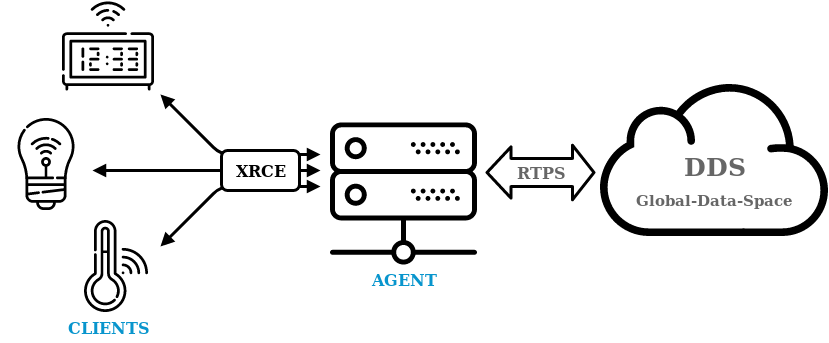

Nowadays almost everybody knows what it is or has heard something about IoT.
An informal definition could be "everything connected with everything".
However, to be a bit more precise, IoT or Internet of Things is extending regular connectivity, traditionally reserved for specific devices, to almost any kind of equipment we can imagine, from small sensors in our fields and farms to life monitors in hospitals.
It is estimated that in 2020, 50 billion of such as devices will be connected to each other ([@evans2011cisco](https://www.cisco.com/c/dam/en_us/about/ac79/docs/innov/IoT_IBSG_0411FINAL.pdf)).
One thing that these 50 billion devices will share is the need to communicate, that is the field where the middleware plays an important role inside this vast technological challenge.
The middleware is in charge of facilitating the network deployment allowing developers to focus on the application implementation.

This article will introduce two standards though and developed with IoT in mind, MQTT and DDS-XRCE.

## MQTT

Message Queuing Telemetry Transport (MQTT) is one of the most used protocols in IoT solutions.
It has been designed as a lightweight message protocol to be used over TCP transports providing a standard and simple publish/subscribe interface for exchanging data.

The communication mechanism of MQTT is based on a client-server architecture.
This means that clients (MQTT Clients) are connected to a server (MQTT Broker) which is in charge of orchestrating the exchange of data using a publish-subscribe messaging pattern.
In other words, clients publish messages associated with a particular Topic in the Broker, and this last redirects these messages to the clients subscribed to the Topic.

So in MQTT, we can speak of some key concepts: Broker, Client, Topic, Message, Publish and Subscribe.
Each of these concepts has its role and meaning:

* The Broker acts as the backbone of the system.
    Dealing with the messages of topics.
* The Clients are the parts in charge of publishing and receiving subscription data from the Broker.
* The Topic is a channel of information.
* Message a piece of information on a defined Topic.
* Publish is the action of sending a Message for a defined Topic to the Broker.
* Subscribe is the action of reflecting an interest in receiving all the Messages of a defined Topic.
It is handled in by the Broker.

{:.img-responsive and style="max-width: 50%; margin-left: auto; margin-right: auto;"}

All this is done over a TCP protocol allowing the connection between Clients and Brokers over WANs and the Internet.
Such a connection is made statically, i.e., the client must know the Broker address before a first connection is made.
These communications could obey three different QoS specifying the delivery behaviour:

| QoS | Guaranteed delivery | Duplicity protection |
|:-:|:-:|:-:|
| QoS0 | No | No |
| QoS1 | Yes | No |
| QoS2 | Yes | Yes |

As mentioned before, there is the concept of Topic in this kind of middleware.
The Topic's type is set by the application as well as its name.
Publications are done using the Topic name and a set of data with a user-defined format.
Analogously, subscriptions are done to Topic names, while the data interpretation is the responsibility of the Clients.
MQTT standard does not mark how this topic-type tuple is related, so the responsibility of topic understanding resides on the user side.

This architecture and communication pattern natively allows the interchange of data between devices (M2M protocol), composing this way a good IoT middleware.

## DDS-XRCE

The DDS for eXtremely Resource-Constrained Environments (DDS-XRCE) is a wire protocol, adopted by the Object Management Group (OMG),
whose aim is to provide access to the DDS (Data Distribution Service) data-space from low resource devices.
As in the MQTT case, the DDS-XRCE follows a client-server architecture where clients (XRCE Clients) are connected to a server (XRCE Agent).
In contrast to MQTT, the XRCE Agent is not in charge of managing the publication/subscription of Topics, but it acts on behalf of the XRCE Clients in the DDS global data-space.
That is, the DDS-XRCE protocol allows the XRCE Clients to act as first-class citizens in a traditional DDS network.

This protocol specified how the XRCE Clients interact with the XRCE Agent.
Basically, there are two ways of interactions between them:

* XRCE Clients can handle proxy entities on the Agent.
    Such proxy entities are the ones acting on the DDS network.
    This allows the Clients to operate as a stateless system, as the state resides in the Agent.
    This, among other things, will enable sleep cycles, and resource-constrained devices to communicate with DDS.
* XRCE Clients can publish/subscribe to/from any DDS Topic as if they were regular DDS participants.
    This makes the separation between resource-constrained devices and DDS networks diffuse, so they can participate as real entities in DDS world.

In a nutshell, DDS-XRCE provides the XRCE Client with a simple publish/subscribe messaging pattern with which to communicate with existing DDS networks.

In the same way as traditional DDS networks, there are some inherited concepts:

* Topic.
    Channels of information
* Message.
    Information pieces.
* Publish.
    The operation which exposes Messages.
* Subscribe.
    The procedure which allows receiving chosen Messages.

Also, added ones:

* XRCE Client.
    These are lightweight actors on resource-constrained devices with a simple publish/subscribe interface.
* XRCE Agent.
    Central part of the protocol providing the required DDS access to the XRCE Clients mentioned above.

The DDS-XRCE wire protocol is specified to be in at least TCP and UDP transport protocol, but there is room to expand to other protocols.
Currently, implementations are supporting Serial links and possible to be extended to any other such Zigbee, 6LoWPAN, and more.
DDS-XRCE allows setting two different delivery QoS:

* Reliable.
* Best-effort.

As part of the DDS family standard, the use of OMG's IDL standard has also been included.
This provides the user with a way to define the types of topics used as well as setting a standard serialisation format.
Doing that ensures interoperability and leverage the application layer of the matter of defining custom serialisation formats and type matching mechanisms.

This protocol brings a new spectrum of possibilities to IoT devices as it brings all the benefits of DDS (Distributed system, configurable QoS, interoperability).

## MQTT vs DDS-XRCE

At this point, you probably are wondering which are the differences between MQTT and DDS-XRCE.
At first glance, they seem to share a lot of the foundations such as similar architecture and communication patterns but differ on some crucial matters, exposed in the following table.

|                           | DDS-XRCE                 | MQTT                   |
|:--------------------------|:------------------------:|:----------------------:|
| **architecture pattern**  | client-server            | client-server          |
| **messaging pattern**     | publish-subscribe        | publish-subscribe      |
| **transport protocol**    | UDP/TCP/Serial/Custom    | TCP                    |
| **security**              | DTLS/TLS (non normative) | TLS (non normative)    |
| **types**                 | Standard IDL             | Opaque, user choice    |
| **QoS**                   | Reliable & best-effort   | 3 Message delivery     |
| **session oriented**      | yes                      | yes                    |
| **minimum overhead**      | 12 B\*\*\*               | 5 B\* \*\*             |
| **maximum overhead**      | 16 B\*\*\*               | 2^16 B\*               |
| **max payload size**      | 64 KB                    | 256 MB                 |
| **topologies**            | 1 to 0, 1 to 1, 1 to n   | 1 to 0, 1 to 1, 1 to n |
| **discovery support**     | yes                      | no                     |

_ \* Scales with the topic name._

_ \*\* For a topic name composed by 8 ASCII characters (8 Bytes) the MQTT overhead will equate to DDS-XRCE overhead.
From that point, the MQTT overhead will scale with the name size.
However, DDS-XRCE will be static_

_ \*\*\* Maximum and minimum DDS-XRCE overhead depends on whether the message using client ID._

The previous tables compare both protocols.
Aside from this protocol differences, we may point out one of the critical concepts of DDS-XRCE, bringing small devices to distributed networks.
This provides this protocol with a great range of use cases as well as prepared to be scaled in a significant amount being far more dynamic in this sense to MQTT alternative.
