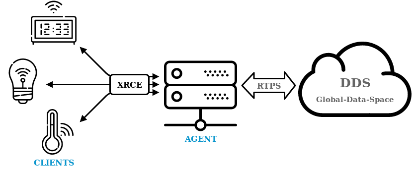

This page is dedicated to describing the most salient features of [**Micro XRCE-DDS**](https://micro-xrce-dds.docs.eprosima.com/en/latest/index.html),
the default middleware implementation for micro-ROS' rmw layer.

**eProsima Micro XRCE-DDS** is an open-source wire protocol that implements the OMG DDS for e**X**tremely **R**esource **C**onstrained **E**nvironment standard ([DDS-XRCE](https://www.omg.org/spec/DDS-XRCE/)).
The aim of the DDS-XRCE protocol is to provide access to the DDS Global-Data-Space from resource-constrained devices.
This is achieved thanks to a **client-server** architecture, where low resource devices, called *XRCE Clients*, are connected to a server, called *XRCE Agent*, which acts on behalf of its clients in the DDS Global-Data-Space.

Micro XRCE-DDS is composed by two main elements:

* [Micro XRCE-DDS Agent](https://github.com/eProsima/Micro-XRCE-DDS-Agent): a **C++11 out-of-the-box application** which implements the XRCE Agent functionality.
* [Micro XRCE-DDS Client](https://github.com/eProsima/Micro-XRCE-DDS-Client): a **C99 library** which implements the XRCE Client side functionality.

In addition, Micro XRCE-DDS uses other two components:

* [Micro CDR](https://github.com/eProsima/Micro-CDR): a **de/serialization engine** used in the Client library.
* [Micro XRCE-DDS Gen](https://github.com/eProsima/Micro-XRCE-DDS-Gen): a **code generator tool** used for generating *Micro CDR* de/serialization functions and Client apps examples from IDL sources.

## Application

Micro XRCE-DDS is focused on microcontroller applications which require to access a publisher/subscriber architecture.
Some examples of this kind of applications are those found in sensor networks, IoT or robotics.
Some companies such as [Renesas](https://www.sensorsmag.com/iot-wireless/mcus-support-dds-xrce-protocol-for-ros-2) and [ROBOTIS](https://xelnetwork.readthedocs.io/en/latest/) are using Micro XRCE-DDS as a middleware solution.
Furthermore, the [micro-ROS](https://microros.github.io) project, whose goal is to put ROS 2 onto microcontroller, has adopted Micro XRCE-DDS as its default middleware layer.

## Main Features

### Low Resource Consumption

As it was mentioned above, Micro XRCE-DDS is focused on microcontroller applications. Therefore, the design and implementation of this middleware have been carried out taking into account the memory constraints of this kind of devices.
A proof of this is the fact that the XRCE Client is completely dynamic memory free.
From the point of view of the memory footprint, the [latest](https://github.com/eProsima/Micro-XRCE-DDS-Client/releases/latest) version of this library has a memory consumption of less than **75 KB of Flash memory** and around **3 KB of RAM** for a complete publisher and subscriber application handling messages sizes on the order of 512 B.
For more detailed information on the memory consumption as a function of message size, entity number and internal memory management of the middleware library, please refer to the [Micro XRCE-DDS memory profiling](/docs/concepts/middleware/memo_prof/) section.
Moreover, this library is highly configurable thanks to a *profile* concept that enables to choose, add or remove some features in configuration time. That allows customizing the XRCE Client library size, if there are features that are not used.
There are several definitions for configuring and building the Client library at compile-time.
These definitions allow to create a version of the library according to the application requirements, and can be modified in the `client.config` file.
For incorporating the desired configuration, it is necessary to run the `cmake` command every time the definitions change.

For more information on how to configure micro-ROS by opportunely tuning parameters either in the Micro XRCE-DDS library
orin its rmw implementation [`rmw_microxrcedds`](https://github.com/micro-ROS/rmw-microxrcedds), consult this [tutorial](/docs/tutorials/advanced/microxrcedds_rmw_configuration/) and the `rmw_microxrcedds` [README](https://github.com/micro-ROS/rmw-microxrcedds#rmw-micro-xrce-dds-implementation).

### Multi-Transport Support

As part of the profiles discussed in the previous section, the user can choose between several transport layers to communicate the Clients with the Agent.
Indeed, in contrast to other IoT middleware such as MQTT and CoaP, which work over only a particular transport layer, XRCE supports multiple transport protocols natively.
In particular, the latest version of Micro XRCE-DDS support: **UDP**, **TCP** and a custom **Serial** transport protocol.

Apart from this, Micro XRCE-DDS has a transport interface for both Agent and Client which allows to implement custom transports in a straightforward manner.
This makes the port of Micro XRCE-DDS to different platforms and the addition of new transports a seamless task that any user can undertake.

### Multi-Platform Support

The XRCE Client supports **FreeRTOS**, **Zephyr** and **NuttX** as embedded RTOS. Moreover, it also runs on **Windows** and **Linux**.
On the other hand, the XRCE Agent supports **Windows** and **Linux**.

### QoS support

The XRCE Client library allows the user to use two different approaches for creating DDS entities in the XRCE Agent:

* By XML (the default option)
* By reference

When using the default option, users are enabled to create entities either in Reliable or Best-Effort mode, with the XML files written and stored on the Client side. But these QoS configurations may not fit some users' requirements.
For these cases, Micro XRCE-DDS allows to create entities directly on the Agent, where the user can write custom XML QoS as in DDS.
Each entity available on the Agent will be associated to a label, so that the Clients can to create the entities they need 
for the communication by just referring to these labels.

Additionally, using references will also reduce the memory consumption of the Client inside the MCU.
This is because the reference approach allows avoiding to build the parts of the code where XMLs are stored.

Notice that this mechanism is inherited by micro-ROS which, as a consequence, will be able to leverage the same full set of QoS as ROS 2.
For a comprehensive review on how to use custom QoS in micro-ROS, please visit this [dedicated page](/docs/tutorials/advanced/create_dds_entities_by_ref/) in the tutorials section.

## Other links

* [Manual at Read the Docs](https://micro-xrce-dds.readthedocs.io/en/latest/)
* [Micro XRCE-DDS on GitHub](https://github.com/eProsima/Micro-XRCE-DDS)
* [XRCE Client on GitHub](https://github.com/eProsima/Micro-XRCE-DDS-Client)
* [XRCE Agent on GitHub](https://github.com/eProsima/Micro-XRCE-DDS-Agent)
* [rmw_microxrcedds on GitHub](https://github.com/micro-ROS/rmw-microxrcedds)
* [Micro XRCE-DDS memory profiling](/docs/concepts/middleware/memo_prof/)
* [Middleware optimization tutorial](/docs/tutorials/advanced/microxrcedds_rmw_configuration/).
* [How to use custom QoS in micro-ROS](/docs/tutorials/advanced/create_dds_entities_by_ref/)
