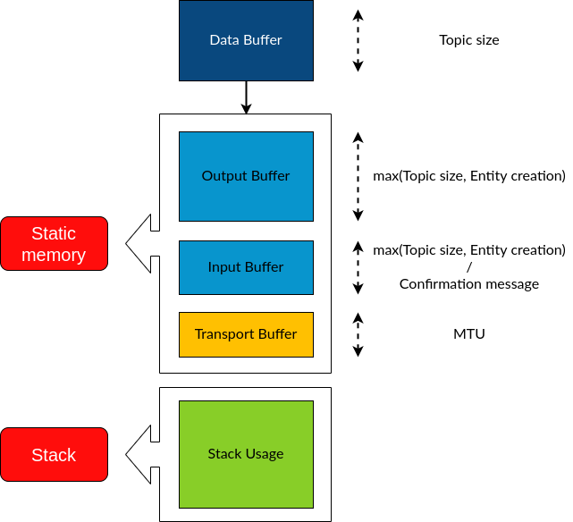
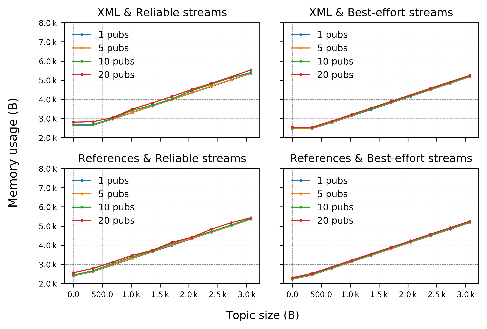
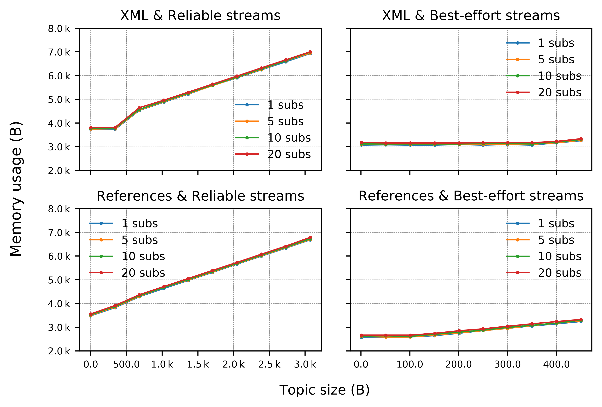
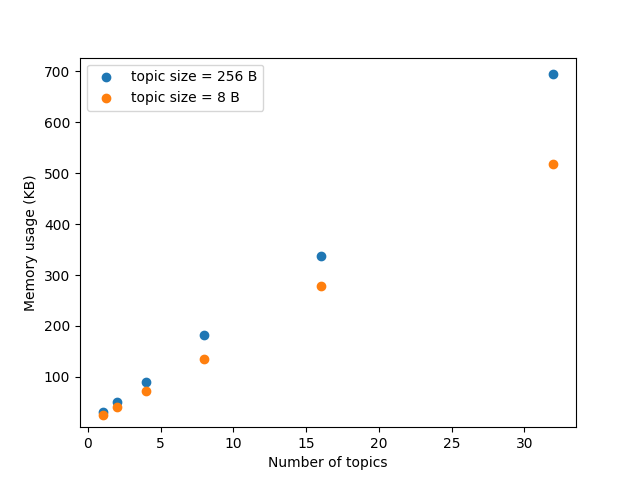

## Abstract

In this section, we analyze the memory footprint of the Micro XRCE-DDS Client and Agent libraries. In both cases, we consider an application of a given number of publishers and/or subscribers into/from topics of known size.

As for the Client, we performed the measurements for an app running on the Real Time Operating System (RTOS) [FreeRTOS](https://www.freertos.org/) and on an [Olimex STM32-E407](https://www.olimex.com/Products/ARM/ST/STM32-E407/open-source-hardware) board, and connected by serial transport (UART) to a Micro XRCE-DDS Agent running on a Linux machine.

As for the Agent, we performed the measurements for a lightweight Agent running on a Linux machine, communicating with a XRCE-DDS Client application running on the same host machine.

Results show that the total memory consumption of the Client makes this library fit for the same class of low-range microcontrollers targeted by the rosserial protocol.
On the other hand, the lightweight version of the Agent is apt for being compiled on more performant systems only.

# Table of contents

* [Memory Profiling of the Micro XRCE-DDS Client on FreeRTOS](#memory-profiling-of-the-micro-xrce-dds-client-on-freertos) 
    * [Memory and Configurability](#memory-and-configurability)
    * [Methodology](#methodology)
    * [Results and Discussion](#results-and-discussion)
* [Memory Profiling of the Micro XRCE-DDS Agent on Linux](#memory-profiling-of-the-micro-xrce-dds-agent-on-linux) 
    * [Available Middleware Implementations for the Agent](#available-middleware-implementations-for-the-agent)
    * [Methodology and Results](#methodology-and-results)

## Memory Profiling of the Micro XRCE-DDS Client on FreeRTOS

[Micro XRCE-DDS](https://micro-xrce-dds.docs.eprosima.com/en/latest/) target applications are low range Microcontroller Units (MCUs) with highly constrained memory resources, so that it becomes critical to assess the XRCE-DDS Client memory consumption with extreme precision to help users selecting the adequate platforms to develop their applications.

In this section, we report on the memory footprint of the Micro XRCE-DDS Client library for two simple applications, one publishing and the other subscribing to topics of known size, running on the Real Time Operating System (RTOS) FreeRTOS and on an Olimex STM32-E407 board. The board running the Client is connected by serial transport (UART) at 115200 baud to a Micro XRCE-DDS Agent running on a Linux machine.

This choice has been made since FreeRTOS provides memory management functionalities that easily allows to compute the stack memory used by a given program as the difference between the total allocated memory, known to the programmer, and the minimum stack left unused during the program execution.

### Memory and Configurability

Given the limited memory resources offered by the systems targeted by the XRCE-DDS library, the possibility to manipulate the memory size of the Client is key. This can be done at two different levels:

* At configuration time: to fix the size of the executable code size, the library can be compiled enabling or disabling several profiles. Indeed, the
Client library follows a profile concept that enables to choose, add or remove some features in configuration time, thus allowing the user to customize its size. As we’ll see below, as part of these profiles one can choose for instance to communicate in reliable or best-effort mode. For more information, please refer to the [Client library documentation](https://micro-xrce-dds.docs.eprosima.com/en/latest/client.html#micro-xrce-dds-client-label).
* At run time: the Client library is both dynamic and static memory free, implying that all memory footprint depends only on how the stack grows during
the execution. The parameters that, together with the library functions, control the stack are the streams and the Maximum Transmission Unit (MTU).
    * The MTU is transport-dependent, and it can be configured by the user. The selected value represents the maximum message size that can be sent received without fragmenting the message. The transport uses the MTU value to create an internal buffer, which is the memory block where the messages will be written and stored when interchanged.
    * As for the streams, the user can define a maximum of 127 best-effort streams and 128 reliable streams, but for the majority of purposes, only one stream in either best effort or reliable mode is used. Moreover, reliable streams have a history associated, whose size can be tailored to fit the specific requirements of the application. In this case, the size of the stream corresponds to the total reserved memory for the stream, equal to the maximum message size times the associated history. In the best-effort case, no history is stored and the memory reserved for the stream equals the maximum message size.

### Methodology

In this section, we detail the methodology employed for the memory profiling.

A Micro XRCE-DDS Client application is created with a varying number of either publishers or subscribers, associated with their own datawriters or datareaders. Moreover, each is associated with a topic of known size and with two streams, one for input and one for output messages. Finally, a minimum history size of 2 is used in the case of reliable communication.

The MTU selected for the serial transport used by these applications has been fixed to 512 B, which in turn sets the size of the transport buffer.

In order to provide a complete characterization of the memory consumption, the following parameters have been varied:

* Creation mode: this is one of the profiles that can be configured at compile time. We have explored both XML and reference modes for the creation of the entities on the Agent on behalf of the Client. In the first case, entities are created according to an XML configuration file defined by the user on the Client app. In the second case, they are created directly on the Agent according to preconfigured reference entities known beforehand by the Agent, to which the Client simply refers.
* Stream types: best-effort vs reliable communication modes between the Client and the Agent. Best-effort streams send and receive data leaving the reliability to the transport layer, and the message size handled by a best-effort stream must be less or equal than the Maximum Transmission Unit (MTU) defined in the transport used. On the other hand, reliable streams perform the communication without loss regardless of the transport layer and allow message fragmentation to send and receive messages longer than the MTU. To avoid a loss of data, the reliable streams use additional messages to confirm the delivery, along with a history of the messages sent and received. As a result, best effort streams will consume fewer resources than reliable streams.
* Size of the topics, ranging between 0 and ~ 3 KB for the publisher (both best-effort and reliable) and for the reliable subscriber, and between 0 and ~ 400 B for the subscriber best-effort. The reason for the latter is that, given the absence of fragmentation in best-effort communication streams, the maximum message size that a best-effort subscriber can support equals the transport buffer size (or MTU), that we have fixed to 512 B. On the other hand, thanks to fragmentation, a reliable subscriber can receive a message of arbitrary size opportunely chunked in pieces of the size of the MTU.
* Number of publishers/subscribers, which is equivalent to changing the number of topics, since in our design of the set-up we have associated each publisher/subscriber with just one topic.

The memory usage of a MCU by means of one such XRCE-DDS application is split into different chunks, each devoted to a different function:

* Data buffer: This buffer stores the topic data before serialization. We don’t include it in our footprint as this memory is application specific and not related to the Micro XRCE-DDS Client operations.
* Output buffer: This buffer is the portion of memory dedicated to the allocation of the entity creation requests, plus that of the serialized topic in the case of publishers. Therefore, in this case its size will be equal to the maximum between these values, whereas in the case of a subscriber application it will equal the size of the created entity. Notice that the entity creation consumption critically depends on the creation mode.
* Input buffer: This buffer is used by subscriber applications to store data coming from the Agent, and by publishers in the case of reliable communication, to receive confirmation that all the information has been correctly received by the Agent.
* Transport buffer: This is equal to the MTU, fixed to 512 B in the present analysis.
* Stack usage: The stack is the memory consumed by the functions used by the program, when executing. Whilst the memory consumed by the buffers above, all stored in static memory, can be straightforwardly calculated by just analyzing the compiled binary objects, the stack is the chunk of memory we cannot know before running our application. In order to measure it, we make use of the FreeRTOS [uxTaskGetStackHighWaterMark()](https://www.freertos.org/uxTaskGetStackHighWaterMark.html) funcion. This function returns the amount of stack that remained unused when the XRCE-DDS task stack was at its greatest value. By subtracting this value to the total stack available (which is known), we thus obtain the stack peak used by our XRCE-DDS app.

  Fig. 1: Illustrative diagram of the memory partition in the XRCE-DDS Client library.

Summarizing, we calculate the total memory usage of our XRCE-DDS app as the sum of the static memory used (which will in general be of the size of the output/input buffers plus the transport buffer) and of the stack used, calculated by means of the uxTaskGetStackHighWaterMark() function provided by FreeRTOS.

## Results and Discussion

* Publishers

  Fig. 2: Memory usage (in Bytes) of the XRCE-DDS Client as a function of topic size (in Bytes) and publishers number.

* Subscribers

  Fig. 3: Memory usage (in Bytes) of the XRCE-DDS Client as a function of topic size (in Bytes) and subscribers number.

As it comes to light from these plots, no significant variability is shown among the instances considered. As for the publishers, all four cases follow the same trend.

Notice that both for publishers and subscribers the curves are flat for small enough topic sizes (< 400 kB) when creation of entities happens by XML. Indeed, in these cases the size of the output buffer is determined by the buffer size needed for entities’ creation, and it only changes when the topic size exceeds that required by entities’ creation.

Publishers/subscribers number is seen to not affect the measurements. This is expected for this specific experimental set-up because just one topic at a time is sent/received, and therefore the number of topics doesn’t enter the overall memory consumption. Notice however that, under a different configuration in which multiple topics are sent or received at the same time, the size of the memory buffer would grow accordingly.

The difference observable between the publishers and subscribers’ memory footprint is due to the fact that a subscriber always needs two static-memory buffers: an output buffer to write and send subscription requests, and an input buffer to store the response to those requests, that is, the data coming from the Agent.

## Memory Profiling of the Micro XRCE-DDS Agent on Linux

The Micro XRCE-DDS Agent is at the moment only supported by standard Operating Systems such as Linux, Windows and Mac. However, more and more users are beginning to show an interest to port the Agent to a MCU, and compiling it on top of an RTOS. Since this task hasn’t been carried out yet, as a first step towards the exploration of such a scenario we have performed an analysis of the memory footprint of a lightweight version of the Agent on Linux.

### Available Middleware Implementations for the Agent

The Agent counts with three middleware implementations: FastMiddleware, FastDDSMiddleware and CedMiddleware (refer to this [link](https://micro-xrce-dds.docs.eprosima.com/en/latest/agent.html#fastmiddleware) in order to learn more).

The FastMiddleware and FastDDSMiddleware use respectively eProsima Fast RTPS and eProsima Fast DDS, Cpp implementations of the RTPS (Real Time Publish Subscribe) protocol and of the DDS standard. These middlewares allow the Client to produce and consume data in the DDS Global Data Space. These Agents have the default behaviour described in the DDS-XRCE standard, that is, for each DDS-XRCE entity a DDS proxy entity is created, and the writing/reading actions produce publishing/subscribing operations in DDS.

On the other hand, the CedMiddleware (Centralized Middleware) makes use of the Agent as a broker, that accepts connections and messages published from Clients, processes subscribe/unsubscribe requests, forwards messages that match other Clients’ subscriptions, and closes Clients’ connections. This Agent is much more lightweight than those with output to DDS, and is therefore the appropriate candidate for assessing the memory consumption of the lightest possible version of an Agent that could mediate a pseudo-p2p communication among Clients.

### Methodology and Results

We have investigated the memory consumption of an Agent communicating with a mock Client application on Linux that is publishing and subscribing to topics of known size.

We have measured on the one hand the binary size of the compiled Agent, and then analyzed its heap and stack usage. For the latter, the number of pub/sub pairs has been varied from 1 to 32, with a single topic associated with each pair, and the topic size has been varied too, from 8 to 256 B.

The binary size of the compiled Agent resulted to be 385 KB.

As for the RAM memory, the tool that has been used for establishing the CedMiddleware memory footprint is [Valgrind](https://valgrind.org/), an instrumentation framework for building dynamic analysis tools. Specifically, we made use of [Massif](https://valgrind.org/docs/manual/ms-manual.html), a memory profiler which measures how much heap and stack memory a program uses. The reported measurements correspond to the memory peak resulting from the analysis provided by this tool.

The total heap + stack consumption is plotted as a function of the topic size and number below.

  Fig. 4: Memory usage (in KiloBytes) of the XRCE-DDS Agent as a function of topic size (in Bytes) and topics number.

We see from these results that for applications that involve around 10-15 pub/sub pairs (and equal number of topics), the memory consumption of the Agent could be compatible with cross-compilation and later execution into a mid-to-high range MCU with RAM memory on the order of ~ 300-400 KB and flash of less than 500 KB. This preliminary analysis therefore paves the way for the possibility to port the Ced Agent to RTOSes such as those already supported by the XRCE-DDS Client (Zephyr, NuttX and FreeRTOS) and thus bringing this component of the library to resource-constrained systems, as well. We mention that, to date, both the FastDDSMiddleware and the CedMiddleware Agents have been successfully ported to Raspberry Pis (RPis) on both Ubuntu and Raspbian and that several micro-ROS use-cases and demos already function with the Agent on a RPi.

