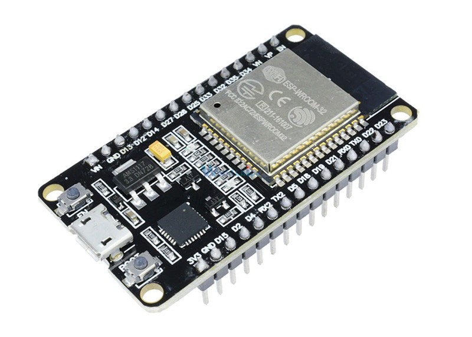

micro-ROS targets mid-range and high-performance 32-bits microcontrollers families.
For the moment, all official ports are based on the [STM32 series](https://www.st.com/en/microcontrollers-microprocessors/stm32-32-bit-arm-cortex-mcus.html) from [ST](https://www.st.com/content/st_com/en.html) and on the [ESP32](https://www.espressif.com/en/products/socs/esp32) from [Espressif](https://www.espressif.com/en).
The former feature ARM Cortex-M processors with many peripherals such as GPIO, communication or coprocessors, and the second are highly-integrated chips with in-built antenna switches, RF balun, power amplifier, low-noise receive amplifier, filters, and power management modules.

By default, micro-ROS uses [NuttX RTOS](https://nuttx.org/), but it also has ports for [FreeRTOS](https://www.freertos.org/) and [Zephyr](https://www.zephyrproject.org/). These RTOSes have a big variety of supported MCUs and development boards. The following list shows some of them:

+ MicroChip PIC32MX Family
+ Atmel SAMA5Dx
+ STM32F1/2/3/4 and STM32L1/4, that includes many Nucleo board support.
+ Renesas M16C/26
+ NXP/Freescale i.MX1/6 and i.MX RT
+ Silicon Labs EFM32 Gecko and Giant Gecko
+ XTENSA board, that includes ESP32
+ RISC-V boards

<!-- TODO (pablogs): Update this paragraph to a more generic porting guide link  -->
Please check [this link](https://cwiki.apache.org/confluence/display/NUTTX/Supported+Platforms) to see the complete list and the status of each board. In case you are interested in porting new boards or MCUs, please check the [next link](https://cwiki.apache.org/confluence/display/NUTTX/Porting+Guide).

Among the many boards that can be used potentially by virtue of the variety of RTOSes supported, for the moment we officially supoort the four boards listed and detailed below. These are the hardware platforms that we use to test and develop micro-ROS, with which we also present accessories that we frequently refer to, such as add-on boards, and JTAG probes.

For the ease of use, micro-ROS provides a ready to use example for some development boards. These out-of-the-box examples aim to show micro-ROS capabilities and they are also a starting point for developing embedded ROS 2 applications.

## Reference Platforms {#evaluation-boards}

This section describes the main characteristic of the boards officially supported by the micro-ROS project.

## Olimex LTD STM32-E407

The [Olimex LTD STM32-E407](https://www.olimex.com/Products/ARM/ST/STM32-E407/open-source-hardware) is an open-hardware low-cost entry board for developing custom applications with the STM32F407ZGT6 Cortex-M4F microcontrollers from STMicroelectronics.

It contains 196KB of RAM and 1MB of Flash. It is a very complete board thanks to the wide variety of communication interfaces it offers: USB OTG, Ethernet, SD Card slot, SPI, CAN or I2C buses are exposed. The board contains various expansion options available: Arduino-like headers for attaching daughter boards, many pins exposed, as well as a UEXT connector. This connector is a custom pin-out bus and is used to attach sensor breakouts that manufacturer sells.

Ports for micro-ROS on all supported RTOS are available for this board. Please see our [**First micro-ROS Application on an RTOS**](/docs/tutorials/core/first_application_rtos/) tutorial for how to start developing with this board.

### Development tools

In order to flash and debug the board, it is required to get a JTAG probe. We recommend getting one of the following JTAG probes:

+ [ARM-USB-OCD-H](https://www.olimex.com/Products/ARM/JTAG/ARM-USB-OCD-H/)
+ [ARM-USB-TINY-H](https://www.olimex.com/Products/ARM/JTAG/ARM-USB-TINY-H/)

### Resources

+ [Vendor main page](https://www.olimex.com/Products/ARM/ST/STM32-E407/open-source-hardware)
+ [Schematics in PDF](https://github.com/OLIMEX/STM32F4/blob/master/HARDWARE/STM32-E407/STM32-E407_Rev_F.pdf)
+ [CAD files](https://github.com/OLIMEX/STM32F4)
+ [User Manual](https://www.olimex.com/Products/ARM/ST/STM32-E407/resources/STM32-E407.pdf)

## STM32L4 Discovery kit IoT

The [ST B-L475E-IOT01A](https://www.st.com/en/evaluation-tools/b-l475e-iot01a.html) evaluation board is a ready to use IoT kit. This board supports an out-of-the-box micro-ROS + Zephyr port.

The STM32L4 Discovery kit IoT enables a wide diversity of applications by exploiting low-power communication, multiway sensing and Arm Cortex M4 core-based STM32L4 Series features.
The support for Arduino and PMOD connectivity provides unlimited expansion capabilities with a large choice of specialized add-on boards.

This board features a STM32L475E MCU with 1 MB of Flash memory and 128 KB of RAM. In addition to the MCU peripherals, the board includes:
 - 64 Mb SPI Flash memory
 - Bluetooth V4.1 module (SPBTLE-RF)
 - 915 MHz low-power RF module (SPSGRF-915)
 - 802.11 b/g/n module (ISM43362-M3G-L44)
 - NFC tag based on M24SR with printed antenna
 - 2 digital microphones (MP34DT01)
 - relative humidity and temperature digital sensor (HTS221)
 - 3-axis magnetometer (LIS3MDL)
 - 3-axis accelerometer and gyroscope (LSM6DSL)
 - digital barometer (LPS22HB)
 - Time-of-Flight and gesture-detection sensor (VL53L0X)
 - programmable push-buttons
 - USB OTG FS with Micro-AB connector
 - on-board ST-LINK/V2 debugger and programmer

Examples on how to start developing with this board are available [here](/docs/tutorials/demos/tof_demo/).

## Crazyflie 2.1 Drone

As an integration example, the open-source [Crazyflie 2.1](https://www.bitcraze.io/products/crazyflie-2-1/) platform has its own micro-ROS + FreeRTOS port.

The Crazyflie 2.1 is a versatile open-source flying development platform that only weighs 27g and fits in the palm of your hand. Crazyflie 2.1 is equipped with multiple inertial sensors and low-latency/long-range radio as well as Bluetooth LE.

This little drone features a STM32F405 ARM Cortex-M4 MCU running up to 168 MHz with 1 MB of Flash and 192 KB of RAM. It also features the following sensors and coprocessors:
 - nRF51822 radio and power management MCU (Cortex-M0, 32Mhz, 16kb SRAM, 128kb flash)
 - USB
 - LiPo battery charger
 - 8KB EEPROM
 - 3-axis accelerometer and gyroscope (BMI088)
 - pressure sensor (BMP388)
 - headers with peripheral access: SPI, I2C, UART, 1-wire and GPIO

Examples on how to start developing with this board are available [here](/docs/tutorials/demos/crazyflie_demo/).

## ESP32-DevKitC

The ESP32-DevKitC is a low-footprint and entry-level development board that is part of the [ESP32 series](https://www.espressif.com/en/products/socs/esp32) from [Espressif](https://www.espressif.com/en). The ESP32 is an ultra-low power consumption dual-core system with two Xtensa LX6 CPUs, exposing a large collection of peripherals and with integrated Wi-Fi and dual-mode Bluetooth. The ESP32-DevKitC has all the ESP32 pins exposed and offers a Flash memory of 4 MB, 448 KB ROM for booting and core functions, 520 KB SRAM for data and instructions and 16 KB SRAM in RTC. The ESP32 comes with a native FreeRTOS support, over which the micro-ROS port has been carried out, both with serial and Wi-Fi transports.

The board specifically supported by the project hosts an [ESP32-WROOM-32E module](https://www.espressif.com/sites/default/files/documentation/esp32-wroom-32e_esp32-wroom-32ue_datasheet_en.pdf), which is an ESP32-based module with integrated flash. 

These modules have a complete set of interfaces and peripherals that makes suitable for micro-ROS wireless applications:
 - Networking interfaces: Ethernet MAC, Wi-Fi 802.11 b/g/n, Bluetooth v4.2 BR/EDR and BLE
 - Communication interfaces: SPI, I2C, I2S, UART, SDIO, CAN
 - Peripherals: GPIO, ADC/DAC, PWM (LED and Motor drivers)
 - Cryptographic hardware acceleration