

Micro-ROS aims to **bring ROS 2 to a wide set of microcontrollers** to allow having first-class ROS 2 entities in the embedded world.

The main targets of micro-ROS are mid-range 32-bits microcontroller families. Usually, the minimum requirements for running micro-ROS in an embedded platform are memory constraints. Since memory usage in micro-ROS is a complex matter we provide a [complete article](/docs/concepts/benchmarking/benchmarking/) describing it and a tutorial on [how to tune the memory consuption](../../tutorials/advanced/microxrcedds_rmw_configuration/) in the micro-ROS middleware.

In general micro-ROS will need MCUs that have tens of kilobytes of RAM memory and communication peripherals that enable the micro-ROS [Client to Agent communication](../features/).

The micro-ROS hardware support is divided into two categories:
- Officially supported boards
- Community supported boards

*In order to check the most recent hardware support visit the [micro_ros_setup repo](https://github.com/micro-ROS/micro_ros_setup)*.

## Officially supported boards

The officially supported boards are those which have been carried out or tested officially, and to which LTS is guaranteed.

  

    <h3><b>Renesas EK RA6M5</b> and <b>e2studio</b></h3>
    

         <b>Key features:</b>
        <ul>
            <li>MCU: ARM Cortex M-33 core @ 200 MHz</li>
            <li>RAM: 512 kB</li>
            <li>Flash: up to 2 MB</li>
            <li>Peripherals: Ethernet, SCI, SPI, I2C, I2S, UART, USB, SDIO, CAN, GPIO, ADC/DAC, PWM</li>
        </ul>
         <b>Resources:</b>
        <ul>
            <li><a href="https://www.renesas.com/us/en/products/microcontrollers-microprocessors/ra-cortex-m-mcus/ek-ra6m5-evaluation-kit-ra6m5-mcu-group">Official website</a></li>
            <li><a href="https://www.renesas.com/us/en/products/microcontrollers-microprocessors/ra-cortex-m-mcus/ra6m5-200mhz-arm-cortex-m33-trustzone-highest-integration-ethernet-and-can-fd">Datasheet</a></li>
            <li><a href="https://www.renesas.com/us/en/application/technologies/robotics">HW support information</a></li>
        </ul>
         <b>Supported platforms:</b>
        <ul>
            <li><b>RTOSes:</b> <a href="https://www.freertos.org/">FreeRTOS</a>, <a href="https://docs.microsoft.com/en-us/azure/rtos/threadx/">ThreadX</a> and Bare-metal</li>
        </ul>
         <b>Supported transports:</b>
        UDP, UART, USB-CDC
    

  

  

    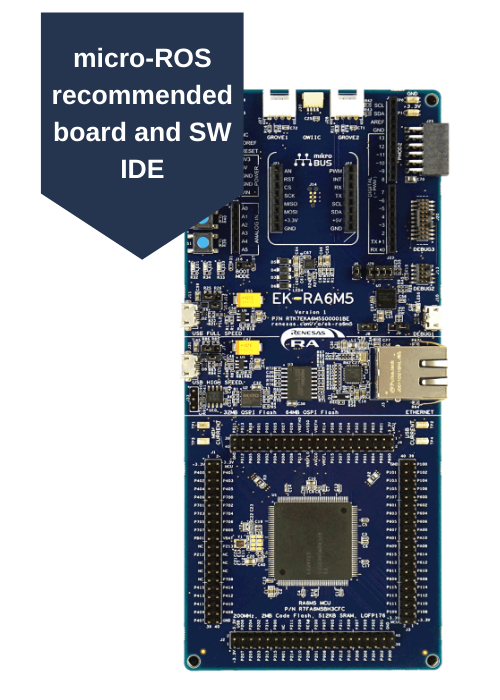
  

  

    <h3><b>Espressif ESP32</b></h3>
    

         <b>Key features:</b>
        <ul>
            <li>MCU: ultra-low power dual-core Xtensa LX6</li>
            <li>RAM: 520 kB</li>
            <li>Flash: 4 MB</li>
            <li>Peripherals: Ethernet MAC, Wi-Fi 802.11 b/g/n, Bluetooth v4.2 BR/EDR, BLE, SPI, I2C, I2S, UART, SDIO, CAN, GPIO, ADC/DAC, PWM  </li>
        </ul>
         <b>Resources:</b>
        <ul>
            <li><a href="https://www.espressif.com/en/products/socs/esp32">Official website</a></li>
            <li><a href="https://www.espressif.com/sites/default/files/documentation/esp32-wroom-32e_esp32-wroom-32ue_datasheet_en.pdf">Datasheet</a></li>
        </ul>
         <b>Supported platforms:</b>
        <ul>
            <li><b>RTOSes:</b> <a href="https://www.freertos.org/">FreeRTOS</a></li>
            <li><b>External tools:</b> <a href="https://docs.espressif.com/projects/esp-idf/en/latest/esp32/get-started/">ESP-IDF</a></li>
        </ul>
         <b>Supported transports:</b>
        UART, WiFi UDP, Ethernet UDP
    

  

  

    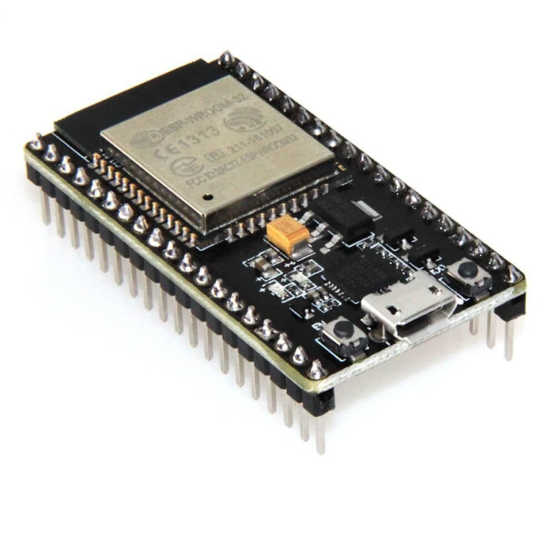
  

  

    <h3><b>Arduino Portenta H7</b></h3>
    

         <b>Key features:</b>
        <ul>
            <li>MCU: Dual-core Arm Cortex-M7 and Cortex-M4</li>
            <li>RAM: 8 MB</li>
            <li>Flash: 16 MB</li>
            <li>Peripherals: USB HS, Ethernet, WiFi/BT...</li>
        </ul>
         <b>Resources:</b>
        <ul>
            <li><a href="https://store.arduino.cc/portenta-h7">Official website</a></li>
        </ul>
         <b>Supported platforms:</b>
        <ul>
            <li><b>RTOSes:</b> &ndash;</li>
            <li><b>External tools:</b> <a href="https://www.arduino.cc/">Arduino</a></li>
        </ul>
         <b>Supported transports:</b>
        USB, WiFi UDP
  

  

    
  

  

    <h3><b>Raspberry Pi Pico RP2040</b></h3>
    

         <b>Key features:</b>
        <ul>
            <li>MCU: Dual-core Arm Cortex-M0+</li>
            <li>RAM: 264 kB</li>
            <li>Flash: up to 16 MB</li>
            <li>Peripherals: I2C, SPI, PIO...</li>
        </ul>
         <b>Resources:</b>
        <ul>
            <li><a href="https://www.raspberrypi.org/products/raspberry-pi-pico/">Official website</a></li>
            <li><a href="https://github.com/micro-ROS/micro_ros_raspberrypi_pico_sdk">micro-ROS support package</a></li>
        </ul>
         <b>Supported platforms:</b>
        <ul>
            <li><b>RTOSes:</b> &ndash;</li>
            <li><b>External tools:</b> <a href="https://github.com/raspberrypi/pico-sdk">Raspberry Pi Pico SDK</a></li>
        </ul>
         <b>Supported transports:</b>
        USB, UART
    

  

  

    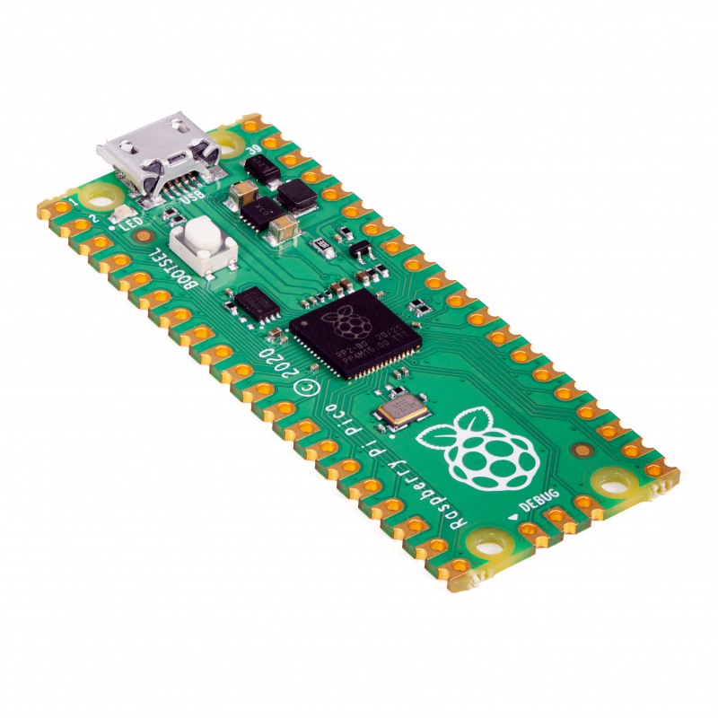
  

  

    <h3><b>ROBOTIS OpenCR 1.0</b></h3>
    

         <b>Key features:</b>
        <ul>
            <li>MCU: ARM Cortex-M7 STM32F746ZGT6</li>
            <li>RAM: 320 kB</li>
            <li>Flash: 1024 kB</li>
            <li>Peripherals: 3-axis IMU, Dynamixel ports, SPI, I2C... </li>
        </ul>
         <b>Resources:</b>
        <ul>
            <li><a href="https://emanual.robotis.com/docs/en/parts/controller/opencr10/">Official website</a></li>
        </ul>
         <b>Supported platforms:</b>
        <ul>
            <li><b>RTOSes:</b> &ndash;</li>
            <li><b>External tools:</b> <a href="https://www.arduino.cc/">Arduino</a></li>
        </ul>
         <b>Supported transports:</b>
        USB, UART
    

  

  

    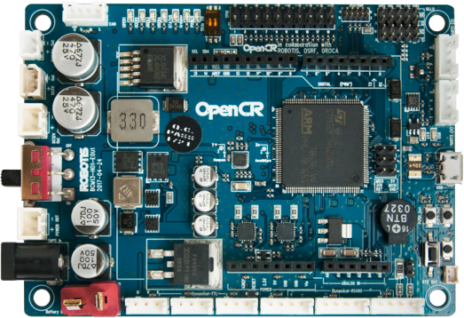
  

  

    <h3><b>Teensy 3.2</b></h3>
    

         <b>Key features:</b>
        <ul>
            <li>MCU: ARM Cortex-M4 MK20DX256VLH7</li>
            <li>RAM: 64 kB</li>
            <li>Flash: 256 kB</li>
            <li>Peripherals: USB, SPI, I2C, CAN, I2S... </li>
        </ul>
         <b>Resources:</b>
        <ul>
            <li><a href="https://www.pjrc.com/teensy/teensy31.html">Official website</a></li>
        </ul>
         <b>Supported platforms:</b>
        <ul>
            <li><b>RTOSes:</b> &ndash;</li>
            <li><b>External tools:</b> <a href="https://www.arduino.cc/">Arduino</a></li>
        </ul>
         <b>Supported transports:</b>
        USB, UART
    

  

  

    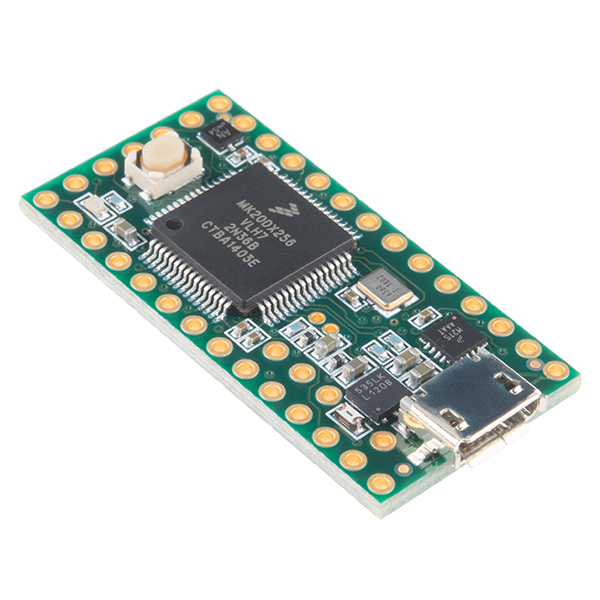
  

  

    <h3><b>Teensy 4.0/4.1</b></h3>
    

         <b>Key features:</b>
        <ul>
            <li>MCU: ARM Cortex-M7 iMXRT1062</li>
            <li>RAM: 1024 kB</li>
            <li>Flash: 2048 kB</li>
            <li>Peripherals: USB, PWM, SPI, I2C, CAN, I2S, SDIO,... </li>
        </ul>
         <b>Resources:</b>
        <ul>
            <li><a href="https://www.pjrc.com/store/teensy40.html">Official website</a></li>
        </ul>
         <b>Supported platforms:</b>
        <ul>
            <li><b>RTOSes:</b> &ndash;</li>
            <li><b>External tools:</b> <a href="https://www.arduino.cc/">Arduino</a></li>
        </ul>
         <b>Supported transports:</b>
        USB, UART, Ethernet UDP (4.1)
    

  

  

    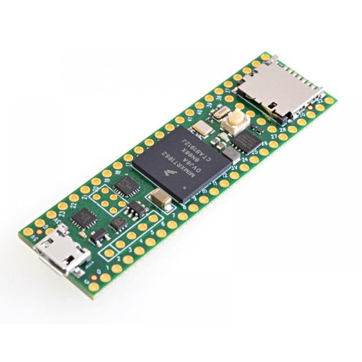
  

  

    <h3><b>Crazyflie 2.1 Drone</b></h3>
    

         <b>Key features:</b>
        <ul>
            <li>MCU: ARM Cortex-M4 STM32F405</li>
            <li>RAM: 192 kB</li>
            <li>Flash: 1 MB</li>
            <li>Peripherals: 3 axis IMU, pressure sensor, SPI, I2C, UART, nRF51822 radio...</li>
        </ul>
         <b>Resources:</b>
        <ul>
            <li><a href="https://www.bitcraze.io/products/crazyflie-2-1/">Official website</a></li>
        </ul>
         <b>Supported platforms:</b>
        <ul>
            <li><b>RTOSes:</b> <a href="https://www.freertos.org/">FreeRTOS</a></li>
            <li><b>External tools:</b> &ndash;</li>
        </ul>
         <b>Supported transports:</b>
        Custom Radio Link
    

  

  

    
  

  

    <h3><b>STM32L4 Discovery kit IoT</b></h3>
    

         <b>Key features:</b>
        <ul>
            <li>MCU: ARM Cortex-M4 STM32L4</li>
            <li>RAM: 128 kB</li>
            <li>Flash: 1 MB</li>
            <li>Peripherals: Bluetooth, low-power RF module, 802.11 b/g/n, NFC, 2 digital microphone, temperature/humidity sensor, 3 axis IMU, ToF sensor...</li>
        </ul>
         <b>Resources:</b>
        <ul>
            <li><a href="https://www.st.com/en/evaluation-tools/b-l475e-iot01a.html">Official website</a></li>
        </ul>
         <b>Supported platforms:</b>
        <ul>
            <li><b>RTOSes:</b> <a href="https://www.zephyrproject.org/">Zephyr</a></li>
            <li><b>External tools:</b> <a href="https://www.zephyrproject.org/">Zephyr</a> build system</li>
        </ul>
         <b>Supported transports:</b>
        USB, UART, Ethernet UDP
    

  

  

    
  

  

    <h3><b>Olimex LTD STM32-E407</b></h3>
    

         <b>Key features:</b>
        <ul>
            <li>MCU: STM32F407ZGT6 Cortex-M4F</li>
            <li>RAM: 196 kB</li>
            <li>Flash: 1 MB</li>
            <li>Peripherals:  USB OTG, Ethernet, SD Card slot, SPI, CAN, I2C... </li>
        </ul>
         <b>Resources:</b>
        <ul>
            <li><a href="https://www.olimex.com/Products/ARM/ST/STM32-E407/open-source-hardware">Official website</a></li>
            <li><a href="https://github.com/OLIMEX/STM32F4/blob/master/HARDWARE/STM32-E407/STM32-E407_Rev_F.pdf">Schematics</a></li>
            <li><a href="https://www.olimex.com/Products/ARM/ST/STM32-E407/resources/STM32-E407.pdf">User Manual</a></li>
        </ul>
         <b>Supported platforms:</b>
        <ul>
            <li><b>RTOSes:</b> <a href="https://www.zephyrproject.org/">Zephyr</a>, <a href="https://www.freertos.org/">FreeRTOS</a>, <a href="https://nuttx.apache.org/">NuttX</a></li>
            <li><b>External tools:</b> <a href="https://www.zephyrproject.org/">Zephyr</a> build system</li>
        </ul>
         <b>Supported transports:</b>
        USB (Z, N), UART (Z, F, N), Ethernet UDP (F, N)
         <i><b>Note:</b> Only RTOS initials used for convenience.</i>
    

  

  

    
  

## Community supported boards

The micro-ROS community supported boards are contributions of micro-ROS' users and community, and are not guaranteed to be officially supported.

  

    <h3><b>Arduino Due</b></h3>
    

         <b>Key features:</b>
        <ul>
            <li>MCU: ARM Cortex-M3 AT91SAM3X8E</li>
            <li>RAM: 96 kB</li>
            <li>Flash: 512 kB</li>
        </ul>
         <b>Resources:</b>
        <ul>
            <li><a href="https://store.arduino.cc/arduino-due">Official website</a></li>
        </ul>
         <b>Supported platforms:</b>
        <ul>
            <li><b>RTOSes:</b> &ndash;</li>
            <li><b>External tools:</b> <a href="https://www.arduino.cc/">Arduino</a></li>
        </ul>
         <b>Supported transports:</b>
        USB, UART
    

  

  

    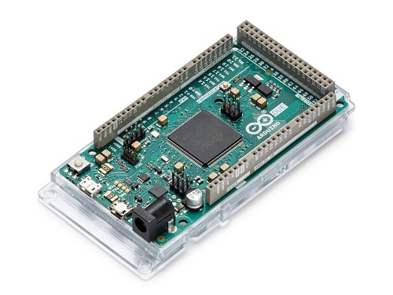
  

  

    <h3><b>Arduino Zero</b></h3>
    

         <b>Key features:</b>
        <ul>
            <li>MCU: ARM Cortex-M0+ ATSAMD21G18</li>
            <li>RAM: 32 kB</li>
            <li>Flash: 256 kB</li>
        </ul>
         <b>Resources:</b>
        <ul>
            <li><a href="https://store.arduino.cc/arduino-zero">Official website</a></li>
        </ul>
         <b>Supported platforms:</b>
        <ul>
            <li><b>RTOSes:</b> &ndash;</li>
            <li><b>External tools:</b> <a href="https://www.arduino.cc/">Arduino</a></li>
        </ul>
         <b>Supported transports:</b>
        USB, UART
    

  

  

    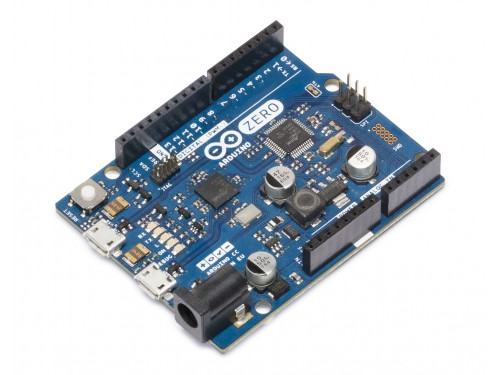
  

  

    <h3><b>ST NUCLEO-F446ZE</b></h3>
    

         <b>Resources:</b>
        <ul>
            <li><a href="https://www.st.com/en/evaluation-tools/nucleo-f446ze.html">Official website</a></li>
        </ul>
         <b>Supported platforms:</b>
        <ul>
            <li><b>RTOSes:</b> <a href="https://www.freertos.org/">FreeRTOS</a></li>
            <li><b>External tools:</b> <a ref="https://www.st.com/en/development-tools/stm32cubemx.html">STM32CubeMX</a></li>
        </ul>
         <b>Supported transports:</b>
        UART
    

  

  

    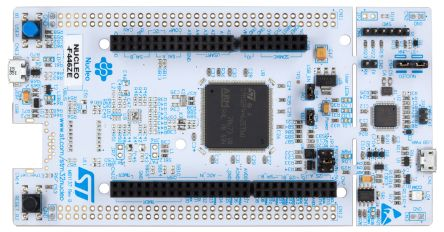
  

  

    <h3><b>ST NUCLEO-F746ZG</b></h3>
    

         <b>Resources:</b>
        <ul>
            <li><a href="https://www.st.com/en/evaluation-tools/nucleo-f746zg.html">Official website</a></li>
        </ul>
         <b>Supported platforms:</b>
        <ul>
            <li><b>RTOSes:</b> <a href="https://www.freertos.org/">FreeRTOS</a></li>
            <li><b>External tools:</b> <a ref="https://www.st.com/en/development-tools/stm32cubemx.html">STM32CubeMX</a></li>
        </ul>
         <b>Supported transports:</b>
        UART
    

  

  

    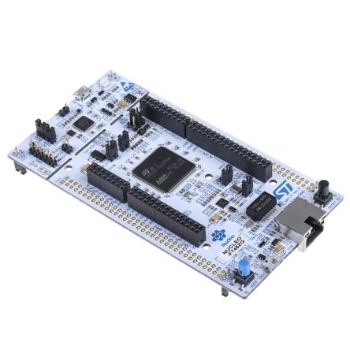
  

  

    <h3><b>ST NUCLEO-H743ZI</b></h3>
    

         <b>Resources:</b>
        <ul>
            <li><a href="https://www.st.com/en/evaluation-tools/nucleo-h743zi.html">Official website</a></li>
        </ul>
         <b>Supported platforms:</b>
        <ul>
            <li><b>RTOSes:</b> <a href="https://www.freertos.org/">FreeRTOS</a></li>
            <li><b>External tools:</b> <a ref="https://www.st.com/en/development-tools/stm32cubemx.html">STM32CubeMX</a></li>
        </ul>
         <b>Supported transports:</b>
        UART
    

  

  

    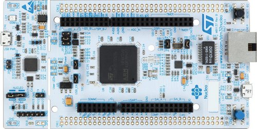
  

