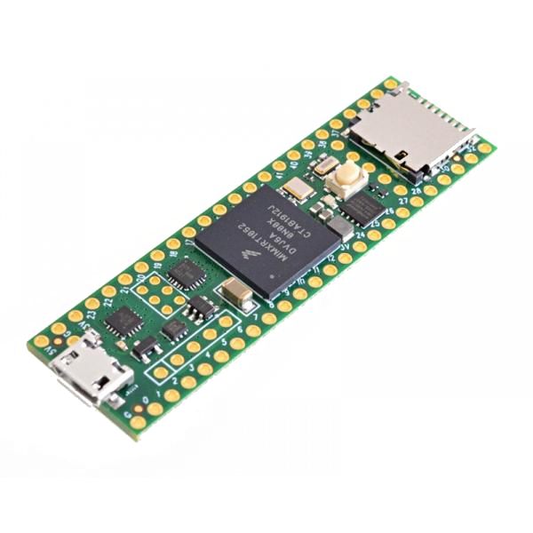

Micro-ROS aims to **bring ROS 2 to a wide set of microcontrollers** to allow having first-class ROS 2 entities in the embedded world.

The main targets of micro-ROS are mid-range 32-bits microcontroller families. Usually, the minimum requirements for running micro-ROS in an embedded platform are memory constrains. Since memory usage in micro-ROS is a complex matter we provide a [complete article](https://micro-ros.github.io/docs/concepts/memo_prof/) describing it and a tutorial on [how to tune the memory consuption](https://micro-ros.github.io/docs/tutorials/core/microxrcedds_rmw_configuration/) in the micro-ROS middleware. 

In general micro-ROS will need MCUs that have tens of kilobytes of RAM memory and communication peripherals that enable the micro-ROS [Client to Agent communication](https://micro-ros.github.io//docs/overview/features/).

The micro-ROS hardware support is divided in three categories: 
- reference micro-ROS board, 
- tier 2 boards and, 
- community supported boards.

*In order to check the most recent hardware support visit the [micro_ros_setup repo](https://github.com/micro-ROS/micro_ros_setup)*

## Reference micro-ROS board

The micro-ROS reference boards are the ones officially supported for all RTOSes and with complete support for all available transports.

  

    <h3><b>Olimex LTD STM32-E407</b></h3>
    

        <b>Key features:</b>
        <ul>
            <li>MCU: STM32F407ZGT6 Cortex-M4F</li>
            <li>RAM: 196 kB</li>
            <li>Flash: 1 MB</li>
            <li>Peripherals:  USB OTG, Ethernet, SD Card slot, SPI, CAN, I2C... </li>
        </ul>  
        
        <b>Resources:</b>
        <ul>
            <li><a href="https://www.olimex.com/Products/ARM/ST/STM32-E407/open-source-hardware">Official website</a></li>
            <li><a href="https://github.com/OLIMEX/STM32F4/blob/master/HARDWARE/STM32-E407/STM32-E407_Rev_F.pdf">Schematics</a></li>
            <li><a href="https://www.olimex.com/Products/ARM/ST/STM32-E407/resources/STM32-E407.pdf">User Manual</a></li>
        </ul>    
    

  

  

    
  

## Tier 2 micro-ROS boards

The micro-ROS Tier 2 boards are officially supported for one or more RTOSes and transports.

  

    <h3><b>Espressif ESP32 DevKitC</b></h3>
    

        <b>Key features:</b>
        <ul>
            <li>MCU: ultra-low power dual-core Xtensa LX6</li>
            <li>RAM: 520 kB</li>
            <li>Flash: 4 MB</li>
            <li>Peripherals: Ethernet MAC, Wi-Fi 802.11 b/g/n, Bluetooth v4.2 BR/EDR, BLE, SPI, I2C, I2S, UART, SDIO, CAN, GPIO, ADC/DAC, PWM  </li>
        </ul>  
        <b>Resources:</b>
        <ul>
            <li><a href="https://www.espressif.com/en/products/socs/esp32">Official website</a></li>
            <li><a href="https://www.espressif.com/sites/default/files/documentation/esp32-wroom-32e_esp32-wroom-32ue_datasheet_en.pdf">Datasheet</a></li>
        </ul>    
    

  

  

    
  

  

    <h3><b>Teensy 3.2</b></h3>
    

        <b>Key features:</b>
        <ul>
            <li>MCU: ARM Cortex-M4 MK20DX256VLH7</li>
            <li>RAM: 64 kB</li>
            <li>Flash: 256 kB</li>
            <li>Peripherals: USB, SPI, I2C, CAN, I2S... </li>
        </ul>  
        <b>Resources:</b>
        <ul>
            <li><a href="https://www.pjrc.com/teensy/teensy31.html">Official website</a></li>
        </ul>
        <i> This board is supported under <a href="https://github.com/micro-ROS/micro_ros_arduino">micro-ROS for Arduino</a></i>    
    

  

  

    
  

  

    <h3><b>Teensy 4.0/4.1</b></h3>
    

        <b>Key features:</b>
        <ul>
            <li>MCU: ARM Cortex-M7 iMXRT1062</li>
            <li>RAM: 1024 kB</li>
            <li>Flash: 2048 kB</li>
            <li>Peripherals: USB, PWM, SPI, I2C, CAN, I2S, SDIO,... </li>
        </ul>  
        <b>Resources:</b>
        <ul>
            <li><a href="https://www.pjrc.com/store/teensy40.html">Official website</a></li>
        </ul>
        <i> This board is supported under <a href="https://github.com/micro-ROS/micro_ros_arduino">micro-ROS for Arduino</a></i>    
    

  

  

    
  

  

    <h3><b>ROBOTIS OpenCR 1.0</b></h3>
    

        <b>Key features:</b>
        <ul>
            <li>MCU: ARM Cortex-M7 STM32F746ZGT6</li>
            <li>RAM: 320 kB</li>
            <li>Flash: 1024 kB</li>
            <li>Peripherals: 3-axis IMU, Dynamixel ports, SPI, I2C... </li>
        </ul>  
        <b>Resources:</b>
        <ul>
            <li><a href="https://emanual.robotis.com/docs/en/parts/controller/opencr10/">Official website</a></li>
        </ul>
        <i> This board is supported under <a href="https://github.com/micro-ROS/micro_ros_arduino">micro-ROS for Arduino</a></i>    
    

  

  

    
  

  

    <h3><b>STM32L4 Discovery kit IoT</b></h3>
    

        <b>Key features:</b>
        <ul>
            <li>MCU: ARM Cortex-M4 STM32L4</li>
            <li>RAM: 128 kB</li>
            <li>Flash: 1 MB</li>
            <li>Peripherals: Bluetooth, low-power RF module, 802.11 b/g/n, NFC, 2 digital microphone, temperature/humidity sensor, 3 axis IMU, ToF sensor...</li>
        </ul>  
        
        <b>Resources:</b>
        <ul>
            <li><a href="https://www.st.com/en/evaluation-tools/b-l475e-iot01a.html">Official website</a></li>
        </ul>    
    

  

  

    
  

  

    <h3><b>Crazyflie 2.1 Drone</b></h3>
    

        <b>Key features:</b>
        <ul>
            <li>MCU: ARM Cortex-M4 STM32F405</li>
            <li>RAM: 192 kB</li>
            <li>Flash: 1 MB</li>
            <li>Peripherals: 3 axis IMU, pressure sensor, SPI, I2C, UART, nRF51822 radio....</li>
        </ul>  
        
        <b>Resources:</b>
        <ul>
            <li><a href="https://www.bitcraze.io/products/crazyflie-2-1/">Official website</a></li>
        </ul>    
    

  

  

    
  

## Community supported boards

The micro-ROS community supported boards are contributions of micro-ROS' users and community, and are not guaranteed to be officially supported.

  

    <h3><b>Arduino Due</b></h3>
    

        <b>Key features:</b>
        <ul>
            <li>MCU: ARM Cortex-M3 AT91SAM3X8E</li>
            <li>RAM: 96 kB</li>
            <li>Flash: 512 kB</li>
        </ul>  
        <b>Resources:</b>
        <ul>
            <li><a href="https://store.arduino.cc/arduino-due">Official website</a></li>
        </ul>
        <i> This board is supported under <a href="https://github.com/micro-ROS/micro_ros_arduino">micro-ROS for Arduino</a></i>    
    

  

  

    
  

  

    <h3><b>Arduino Zero</b></h3>
    

        <b>Key features:</b>
        <ul>
            <li>MCU: ARM Cortex-M0+ ATSAMD21G18</li>
            <li>RAM: 32 kB</li>
            <li>Flash: 256 kB</li>
        </ul>  
        <b>Resources:</b>
        <ul>
            <li><a href="https://store.arduino.cc/arduino-zero">Official website</a></li>
        </ul>
        <i> This board is supported under <a href="https://github.com/micro-ROS/micro_ros_arduino">micro-ROS for Arduino</a></i>    
    

  

  

    
  

  

    <h3><b>ST NUCLEO-F446ZE</b></h3>
    

        <b>Resources:</b>
        <ul>
            <li><a href="https://www.st.com/en/evaluation-tools/nucleo-f446ze.html">Official website</a></li>
        </ul>    
    

  

  

    
  

  

    <h3><b>ST NUCLEO-F746ZG</b></h3>
    

        <b>Resources:</b>
        <ul>
            <li><a href="https://www.st.com/en/evaluation-tools/nucleo-f746zg.html">Official website</a></li>
        </ul>    
    

  

  

    
  

  

    <h3><b>ST NUCLEO-H743ZI</b></h3>
    

        <b>Resources:</b>
        <ul>
            <li><a href="https://www.st.com/en/evaluation-tools/nucleo-h743zi.html">Official website</a></li>
        </ul>    
    

  

  

    
  

