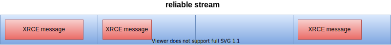
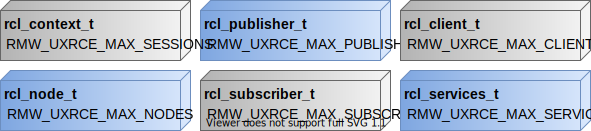

micro-ROS targets microcontroller, devices with low memory resources.
With that in mind, micro-ROS try to address the memory management issue prioritizing the use of static memory instead of dynamic memory and optimizing the memory footprint of the applications.
This, of course, has a cost that the users must agree to pay, a precompile tunning.

This tutorial explains which are the memory resources managed by micro-ROS and how to tune them for a particular application.
It also addresses the RMW run-time configuration API where the user can configure the micro-ROS Agent endpoints or the Micro XRCE-DDS session `client_key`.

## Memory resources optimization

micro-ROS deals with two different memory resources related with the Micro XRCE-DDS library and its RMW implementation named rmw-microxrcedds.

### Micro XRCE-DDS

Micro XRCE-DDS messages flow between Client and Agent through **streams**.
A stream represents an independently ordered flow of information, so it is a sort of messaging queue.
There are two kinds of streams, **best-effort** and **reliable**.
Both best-effort and reliable streams have a raw buffer (`uint8_t` array) associated with them, but the layout is different.

On the one hand, best-effort streams could be interpreted as a single message queue.
Therefore, the raw buffer is a single data buffer where only one message is popped/pushed.


On the other hand, reliable streams contain multiple messages which are popped/pushed according to the reliable communication protocol described in the DDS-XRCE specification.
It is achieved by splitting the raw buffer into chunks, each of which contains a single message.



The size of the best-effort and reliable stream can be configured by two sets of CMake flags.

* `UCLIENT_UDP_TRANSPORT_MTU`, `UCLIENT_TCP_TRANSPORT_MTU` and `UCLIENT_SERIAL_TRANSPORT_MTU` (depending on the transport selected): these flags control the size of the best-effort stream buffer which matches with the size of each chunk of the reliable stream.
* `RMW_UXRCE_STREAM_HISTORY`: sets the number of slots for the reliable streams.

The size of the stream sets indirectly the maximum message size (MMS) of the micro-ROS application.
This MMS is (`UCLIENT_<XXX>_TRANSPORT_MTU` - 12 B) for best-effort messages and (`UCLIENT_<XXX>_TRANSPORT_MTU` * (`RMW_UXRCE_STREAM_HISTORY` - 12 B)) in the case of reliable messages.

The use of best-effort or reliable stream is handled by the `rmw_qos_reliability_policy_t` set in the `rmw_qos_profile_t` for a particular publisher or subscription.
In the case of `RMW_QOS_POLICY_RELIABILITY_BEST_EFFORT` best-effort streams are used and for `RMW_QOS_POLICY_RELIABILITY_RELIABLE` reliable streams are used instead.

More details about the micro-ROS middleware can be found in the [Micro XRCE-DDS documentation](https://micro-xrce-dds.docs.eprosima.com/).

### rmw-microxrcedds

rmw-microxrcedds uses static memory for allocating the resources associated with the `rcl` and `rclc` entities.
This static memory is managed thanks to independent memory pools for each kind of entity.
The size of these memory pools could be set through CMake flags,
for example, the `RMW_UXRCE_MAX_PUBLISHERS` sets the size of the `rcl_publisher_t`'s pool memory.
It should be noted that the size of these memory pools restricts the maximum number of entities that a micro-ROS application could use.

The figure below summarizes the relation between the `rcl` entities and the CMake flags, which set the size of the memory pool associated with such entities.



Another important memory resource managed by the rmw-microxrcedds is the message history.
The rmw-microxrcedds uses a static-memory message queue where to to keep the subscription messages before the user reads them.
The size of this message queue could be set by the `RMW_UXRCE_MAX_HISTORY`.

It is worth noting that all the aforementioned CMake flags shall be set in a `.meta` for each platform supported in [micro_ros_setup](https://github.com/micro-ROS/micro_ros_setup).
For example, in the [ping-pong application](https://micro-ros.github.io//docs/tutorials/core/first_application_linux/) the host [configuration file](https://github.com/micro-ROS/micro_ros_setup/blob/humble/config/host/generic/client-host-colcon.meta) can be optimized with the following modifications:

```
{
  "name": {
    "rmw_microxrcedds":{
      "cmake-args":[
        ....
        "-DRMW_UXRCE_MAX_NODES=1",          // 3 --> 1
        "-DRMW_UXRCE_MAX_PUBLISHERS=2",     // 5 --> 2
        "-DRMW_UXRCE_MAX_SUBSCRIPTIONS=2",  // 5 --> 2
        "-DRMW_UXRCE_MAX_SERVICES=0",       // 5 --> 0
        "-DRMW_UXRCE_MAX_CLIENTS=0",        // 5 --> 0
        "-DRMW_UXRCE_STREAM_HISTORY=5",     // 20 --> 5
        "-DRMW_UXRCE_MAX_HISTORY=5",        // 20 --> 5
        ....
      ]
    }
  }
}
```

## Run-time configuration

There are some build time parameters related to Client-to-Agent connection (such as **CONFIG_RMW_DEFAULT_UDP_PORT**, **CONFIG_RMW_DEFAULT_UDP_IP** and **CONFIG_RMW_DEFAULT_SERIAL_DEVICE**) that can be configured either at build time or at run-time.
This means that you can set them in the [configuration file](https://github.com/micro-ROS/micro_ros_setup/blob/humble/config/host/generic/client-host-colcon.meta) mentioned above and that micro-ROS provides a user configuration API for setting some RMW and middleware parameters at run-time.

The following example code shows the [API](https://github.com/micro-ROS/rmw_microxrcedds/blob/iron/rmw_microxrcedds_c/include/rmw_microros/init_options.h) calls needed to set the agent's IP address, port or serial device:

```c
#include <rmw_microros/rmw_microros.h>

// Init RCL options and context
rcl_init_options_t init_options = rcl_get_zero_initialized_init_options();
rcl_context_t context = rcl_get_zero_initialized_context();
rcl_init_options_init(&init_options, rcl_get_default_allocator());

// Take RMW options from RCL options
rmw_init_options_t* rmw_options = rcl_init_options_get_rmw_init_options(&init_options);

// TCP/UDP case: Set RMW IP parameters
rmw_uros_options_set_udp_address("127.0.0.1", "8888", rmw_options);

// Serial case: Set RMW serial device parameters
rmw_uros_options_set_serial_device("/dev/ttyAMA0", rmw_options)

// Set RMW client key
rmw_uros_options_set_client_key(0xBA5EBA11, rmw_options);

// Init RCL
rcl_init(0, NULL, &init_options, &context);

// ... micro-ROS code ...
```

Notice that it is also possible to set the Micro XRCE-DDS `client_key`, which would otherwise be set randomly. This feature is useful for reusing DDS entities already created on the agent side. Further information can be found [here](https://micro-xrce-dds.docs.eprosima.com/en/latest/getting_started.html#publisher-configuration) and [here](https://github.com/micro-ROS/rmw-microxrcedds#rmw-micro-xrce-dds-implementation).
