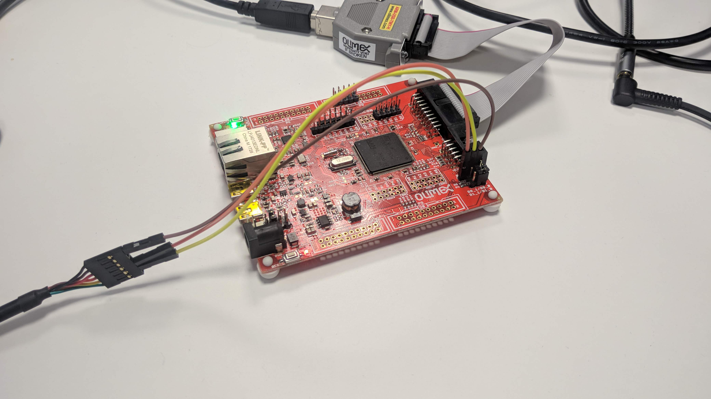

|  RTOS |  Board Compatible |
|:-----:|:-----------------:|
| NuttX | Olimex-STM32-E407 |

NSH is a system console that can be used through different interfaces. On this tutorial, we will show how to use it over the UART peripheral. The UART (Universal Asynchronous Receiver-Transmitter) is a communication peripheral implemented on a micro-controller, which allows bidirectional serial communication.

## Hardware requirements:
- [Olimex-STM32-E407 board](https://www.olimex.com/Products/ARM/ST/STM32-E407/open-source-hardware)
- [JTAG Flasher device](https://www.olimex.com/Products/ARM/JTAG/ARM-USB-TINY/)
- USB-TTL232 cable.

## Create the firmware

For this tutorial we're going to execute the next configuration on the Micro-ROS build system:
```bash
ros2 run micro_ros_setup create_firmware_ws.sh nuttx olimex-stm32-e407
ros2 run micro_ros_setup configure_firmware.sh nsh_uart
```

Once the board is configured, we need to build it by typing the next command:
```bash
ros2 run micro_ros_setup build_firmware.sh
```

If the compilation succed, it should return the next output:
```bash
CP: nuttx.hex
CP: nuttx.bin
```
## Flash the firmware

The firmware is ready, is just necessary to upload it. Now you need to do the next connection:
- Connect the JTAG flasher device.
- Connect the USB TTL-232 with the next pin out:
    - `USART3 TX` -> `TTL232 RX`
    - `USART3 RX` -> `TTL232 TX`
    - `GND Board` -> `TTL232 GND`

It should look like this:


Note: You can find multiple USB-TTL232 devices available. But despite the Olimex board is 5V tolerant, we recommend to use a 3V3 USB-TTL232 cable. The [Olimex Official cable](https://www.olimex.com/Products/Components/Cables/USB-Serial-Cable/USB-Serial-Cable-F/) is our recommendation but any is compatible.

Now flash the board by typing the next command:
```bash
ros2 run micro_ros_setup flash_firmware.sh
```

This should return this output once the process is finished:
```bash
wrote 49152 bytes from file nuttx.bin in 6.279262s (7.644 KiB/s)
Info : Listening on port 6666 for tcl connections
Info : Listening on port 4444 for telnet connections
```
## Connect to the console

Finally, connect the USB cable to the PC and open a terminal. Type the command ``dmesg`` to know the direction of the device. It should return something like this:
```bash
[17154.225244] usb 1-2: new full-speed USB device number 6 using xhci_hcd
[17154.380060] usb 1-2: New USB device found, idVendor=0403, idProduct=6001, bcdDevice= 6.00
[17154.380066] usb 1-2: New USB device strings: Mfr=1, Product=2, SerialNumber=3
[17154.380069] usb 1-2: Product: USB <-> Serial Cable
[17154.380072] usb 1-2: Manufacturer: FTDI
[17154.380075] usb 1-2: SerialNumber: 12TBZ31
[17154.400389] usbcore: registered new interface driver usbserial_generic
[17154.400395] usbserial: USB Serial support registered for generic
[17154.402690] usbcore: registered new interface driver ftdi_sio
[17154.402699] usbserial: USB Serial support registered for FTDI USB Serial Device
[17154.402745] ftdi_sio 1-2:1.0: FTDI USB Serial Device converter detected
[17154.402762] usb 1-2: Detected FT232RL
[17154.403058] usb 1-2: FTDI USB Serial Device converter now attached to ttyUSB0

```

In this specific situation, the device is assigned to ``dev/ttyUSB0`` but it could be a different number.

Finally, execute the next command to open the NSH console:
```
sudo minicom -D /dev/ttyUSB0
```

Once the application is executed, push enter and it should return the next menu:
```bash
nsh> ?
help usage:  help [-v] [<cmd>]

  ?           exec        hexdump     mb          sleep       
  cat         exit        kill        mh          usleep      
  echo        help        ls          mw          xd          

Builtin Apps:
nsh>
```

Note: If you don't succeed with theses steps, check if you set a baud rate of 115200 bps and the configuration is set to 8N1 with no hardware and software flow control.