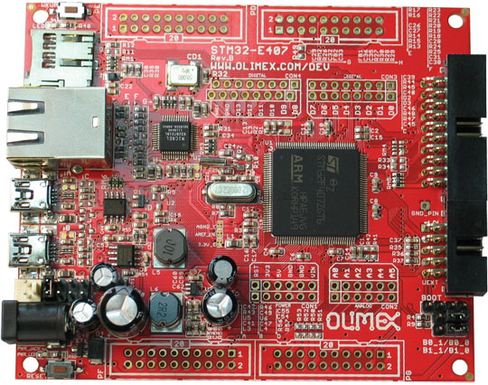
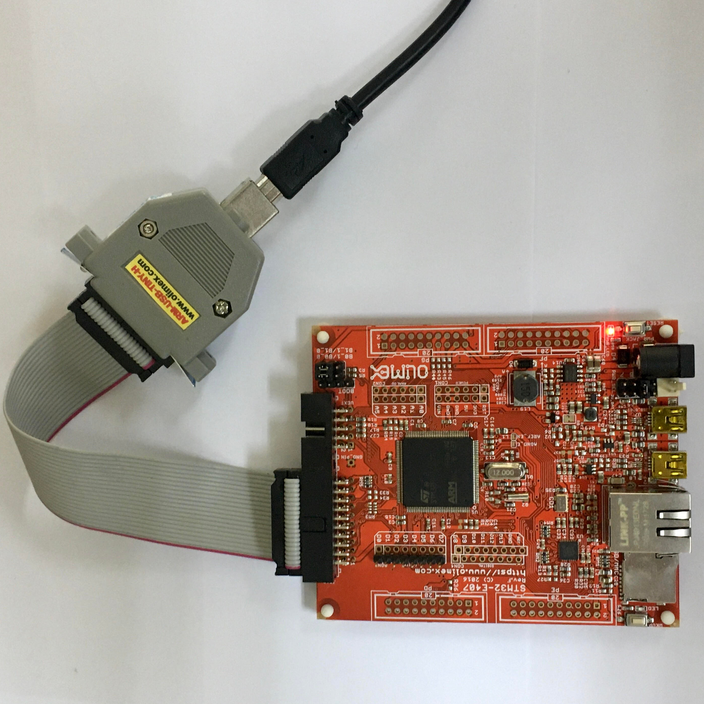

This tutorial aims to create a new micro-ROS application on **[Olimex STM32-E407](https://www.olimex.com/Products/ARM/ST/STM32-E407/open-source-hardware)** evaluation board with **[Zephyr RTOS](https://www.zephyrproject.org/)**

<div>



</div>

## Required hardware

This tutorial uses the following hardware:

| Item | |
|---------------|----------------------------------------------------------|
| Olimex STM32-E407 | [Link](https://www.olimex.com/Products/ARM/ST/STM32-E407/open-source-hardware) |
| Olimex ARM-USB-TINY-H | [Link](https://www.olimex.com/Products/ARM/JTAG/ARM-USB-TINY-H/) |
| USB-Serial Cable Female | [Link](https://www.olimex.com/Products/Components/Cables/USB-Serial-Cable/USB-Serial-Cable-F/) |


## Adding a new micro-ROS app

First of all make sure that you have a **ROS 2** installation.

***TIP:** if you are familiar with Docker containers, this image may be useful: [ros:dashing](https://hub.docker.com/layers/ros/library/ros/dashing/images/sha256-b796c14ea663537129897769aa6c715a851ca08dffd4875ef2ecaa31a4dbd431?context=explore)*

On the **ROS 2** installation open a command line and follow these steps:

```bash
# Source the ROS 2 installation
source /opt/ros/$ROS_DISTRO/setup.bash

# Create a workspace and download the micro-ROS tools
mkdir microros_ws 
cd microros_ws
git clone -b $ROS_DISTRO https://github.com/micro-ROS/micro-ros-build.git src/micro-ros-build

# Update dependencies using rosdep
rosdep update
rosdep install --from-path src --ignore-src -y

# Build micro-ROS tools and source them
colcon build
source install/local_setup.bash
```


Now, let's create a firmware workspace that targets all the required code and tools for Olimex development board and Zephyr:

```bash
# Create step
ros2 run micro_ros_setup create_firmware_ws.sh zephyr olimex-stm32-e407
```

Now you have all the required tools to crosscompile micro-ROS and Zephyr for Olimex STM32-E407 development board. At this point, you must know that the micro-ROS build system is a four-step workflow:

<!-- TODO (pablogs9): Remove and link to build-system tutorial when done -->
1. **Create**: retrieves all the required packages for a specific RTOS and hardware platform.
2. **Configure**: configures the downloaded packages with options such as the micro-ROS application, the selected transport layer or the micro-ROS agent IP address (in network transports).
3. **Build**: generates a binary file ready for being loaded in the hardware.
4. **Flash**: load the micro-ROS software in the hardware.

micro-ROS apps for Olimex + Zephyr are located at `firmware/zephyr_apps/apps`. In order to create a new application, create a new folder containing two files: the app code (inside a `src` folder) and the RMW configuration.

```bash
# Creating a new app
cd firmware/zephyr_apps/apps
mkdir my_brand_new_app
cd my_brand_new_app
mkdir src
touch src/app.c app-colcon.meta
```

You will also need some other Zephyr related files: a `CMakeLists.txt` in order to define the building process and a `prj.conf` where Zephyr is configured. You have these two files [here](https://github.com/micro-ROS/zephyr_apps/tree/dashing/apps/ping_pong), for now it is ok to copy them.

For this example we are going to create a ping pong app where a node sends a ping package with a unique identifier using a publisher and the same package is received by a pong subscriber. The node will also answer to:


To start creating this app, lets configure the RMW with the required static memory. You can read more about RMW and Micro XRCE-DDS Configuration [here](/docs/tutorials/core/microxrcedds_rmw_configuration/). The `app-colcon.meta` should look like:

```
{
    "names": {
        "rmw_microxrcedds": {
            "cmake-args": [
                "-DRMW_UXRCE_MAX_NODES=1",
                "-DRMW_UXRCE_MAX_PUBLISHERS=2",
                "-DRMW_UXRCE_MAX_SUBSCRIPTIONS=2",
                "-DRMW_UXRCE_MAX_SERVICES=0",
                "-DRMW_UXRCE_MAX_CLIENTS=0",
                "-DRMW_UXRCE_MAX_HISTORY=4",
            ]
        }
    }
}
```

Meanwhile `src/app.c` should look like the following code:

```c
#include <rcl/rcl.h>
#include <rcl_action/rcl_action.h>
#include <rcl/error_handling.h>
#include "rosidl_generator_c/string_functions.h"
#include <std_msgs/msg/header.h>

#include <rmw_uros/options.h>

#include <stdio.h>
#include <unistd.h>

#include <zephyr.h>

#define STRING_BUFFER_LEN 100

// App main function
void main(void)
{
  //Init RCL options
  rcl_init_options_t options = rcl_get_zero_initialized_init_options();
  rcl_init_options_init(&options, rcl_get_default_allocator());
  
  // Init RCL context
  rcl_context_t context = rcl_get_zero_initialized_context();
  rcl_init(0, NULL, &options, &context);

  // Create a node
  rcl_node_options_t node_ops = rcl_node_get_default_options();
  rcl_node_t node = rcl_get_zero_initialized_node();
  rcl_node_init(&node, "pingpong_node", "", &context, &node_ops);

  // Create a reliable ping publisher
  rcl_publisher_options_t ping_publisher_ops = rcl_publisher_get_default_options();
  rcl_publisher_t ping_publisher = rcl_get_zero_initialized_publisher();
  rcl_publisher_init(&ping_publisher, &node, ROSIDL_GET_MSG_TYPE_SUPPORT(std_msgs, msg, Header), "/microROS/ping", &ping_publisher_ops);

  // Create a best effort pong publisher
  rcl_publisher_options_t pong_publisher_ops = rcl_publisher_get_default_options();
  pong_publisher_ops.qos.reliability = RMW_QOS_POLICY_RELIABILITY_BEST_EFFORT;
  rcl_publisher_t pong_publisher = rcl_get_zero_initialized_publisher();
  rcl_publisher_init(&pong_publisher, &node, ROSIDL_GET_MSG_TYPE_SUPPORT(std_msgs, msg, Header), "/microROS/pong", &pong_publisher_ops);

  // Create a reliable pong subscriber
  rcl_subscription_options_t pong_subscription_ops = rcl_subscription_get_default_options();
  rcl_subscription_t pong_subscription = rcl_get_zero_initialized_subscription();
  rcl_subscription_init(&pong_subscription, &node, ROSIDL_GET_MSG_TYPE_SUPPORT(std_msgs, msg, Header), "/microROS/pong", &pong_subscription_ops);

  // Create a best effort ping subscriber
  rcl_subscription_options_t ping_subscription_ops = rcl_subscription_get_default_options();
  ping_subscription_ops.qos.reliability = RMW_QOS_POLICY_RELIABILITY_BEST_EFFORT;
  rcl_subscription_t ping_subscription = rcl_get_zero_initialized_subscription();
  rcl_subscription_init(&ping_subscription, &node, ROSIDL_GET_MSG_TYPE_SUPPORT(std_msgs, msg, Header), "/microROS/ping", &ping_subscription_ops);

  // Create a wait set
  rcl_wait_set_t wait_set = rcl_get_zero_initialized_wait_set();
  rcl_wait_set_init(&wait_set, 2, 0, 0, 0, 0, 0, &context, rcl_get_default_allocator());

  // Create and allocate the pingpong publication message
  std_msgs__msg__Header msg;
  char msg_buffer[STRING_BUFFER_LEN];
  msg.frame_id.data = msg_buffer;
  msg.frame_id.capacity = STRING_BUFFER_LEN;

  // Create and allocate the pingpong subscription message
  std_msgs__msg__Header rcv_msg;
  char rcv_buffer[STRING_BUFFER_LEN];
  rcv_msg.frame_id.data = rcv_buffer;
  rcv_msg.frame_id.capacity = STRING_BUFFER_LEN;

  // Set device id and sequence number;
  int device_id = rand();
  int seq_no;
  
  int pong_count = 0;
  struct timespec ts;
  rcl_ret_t rc;

  uint32_t iterations = 0;

  do {
    // Clear and set the waitset
    rcl_wait_set_clear(&wait_set);
    
    size_t index_pong_subscription;
    rcl_wait_set_add_subscription(&wait_set, &pong_subscription, &index_pong_subscription);

    size_t index_ping_subscription;
    rcl_wait_set_add_subscription(&wait_set, &ping_subscription, &index_ping_subscription);
    
    // Run session for 100 ms
    rcl_wait(&wait_set, RCL_MS_TO_NS(100));

    // Check if it is time to send a ping
    if (iterations++ % 50 == 0) {
      // Generate a new random sequence number
      seq_no = rand();
      sprintf(msg.frame_id.data, "%d_%d", seq_no, device_id);
      msg.frame_id.size = strlen(msg.frame_id.data);
      
      // Fill the message timestamp
      clock_gettime(CLOCK_REALTIME, &ts);
      msg.stamp.sec = ts.tv_sec;
      msg.stamp.nanosec = ts.tv_nsec;

      // Reset the pong count and publish the ping message
      pong_count = 0;
      rcl_publish(&ping_publisher, (const void*)&msg, NULL);
      printf("Ping send seq %s\n", msg.frame_id.data);  
    }
    
    // Check if some pong message is received
    if (wait_set.subscriptions[index_pong_subscription]) {
      rc = rcl_take(wait_set.subscriptions[index_pong_subscription], &rcv_msg, NULL, NULL);

      if(rc == RCL_RET_OK && strcmp(msg.frame_id.data,rcv_msg.frame_id.data) == 0) {
          pong_count++;
          printf("Pong for seq %s (%d)\n", rcv_msg.frame_id.data, pong_count);
      }
    }

    // Check if some ping message is received and pong it
    if (wait_set.subscriptions[index_ping_subscription]) {
      rc = rcl_take(wait_set.subscriptions[index_ping_subscription], &rcv_msg, NULL, NULL);

      // Dont pong my own pings
      if(rc == RCL_RET_OK && strcmp(msg.frame_id.data,rcv_msg.frame_id.data) != 0){
        printf("Ping received with seq %s. Answering.\n", rcv_msg.frame_id.data);
        rcl_publish(&pong_publisher, (const void*)&rcv_msg, NULL);
      }
    }
    
    usleep(10000);
  } while (true);
}
```

Once the new folder is created, let's configure our new app with a serial transport on the USB:

```bash
# Configure step
ros2 run micro_ros_setup configure_firmware.sh my_brand_new_app --transport serial-usb
```

When the configuring step ends, just build the firmware:

```bash
# Build step
ros2 run micro_ros_setup build_firmware.sh
```

Once the build has successfully ended, let's power and connect the board.  First, connect Olimex ARM-USB-TINY-H JTAG programmer to the board's JTAG port:



Make sure that the board power supply jumper (PWR_SEL) is in the 3-4 position in order to power the board from the JTAG connector:


You should see the red LED lighting. It is time to flash the board:

```bash
# Flash step
ros2 run micro_ros_setup flash_firmware.sh
```
## Running the micro-ROS app

The micro-ROS app is ready to connect to a micro-ROS-Agent and start talking with the rest of the ROS 2 world.

First of all, create and build a micro-ROS agent:

```bash
# Download micro-ROS-Agent packages
ros2 run micro_ros_setup create_agent_ws.sh

# Build micro-ROS-Agent packages, this may take a while.
colcon build
```

Then connect the Olimex development board to the computer using the USB OTG 2 connector (the miniUSB connector that is furthest from the Ethernet port).

***TIP:** Color codes are applicable to [this cable](https://www.olimex.com/Products/Components/Cables/USB-Serial-Cable/USB-Serial-Cable-F/). Make sure to match Olimex Rx with Cable Tx and vice-versa. Remember GND!*

Then run the agent:

```bash
# Run a micro-ROS agent
ros2 run micro_ros_agent micro_ros_agent serial --dev [device]
```

***TIP:** you can use this command to find your serial device name: `ls /dev/serial/by-id/*`. Probably it will be something like `/dev/serial/by-id/usb-ZEPHYR_Zephyr_microROS_3536510100290035-if00`*

And finally, let's check that everything is working. We are going to listen to ping topic to check whether the Ping Pong node is publishing its own pings

```bash
# Subscribe to micro-ROS ping topic
ros2 topic echo /microROS/ping
```

You should see the topic messages published by the Ping Pong node every 5 seconds:

```
pgarrido@pgarrido:~$ ros2 topic echo /microROS/ping
stamp:
  sec: 20
  nanosec: 867000000
frame_id: '1344887256_1085377743'
---
stamp:
  sec: 25
  nanosec: 942000000
frame_id: '730417256_1085377743'
---
```

On another command line, let's subscribe to the pong topic

```bash
# Subscribe to micro-ROS pong topic
ros2 topic echo /microROS/pong
```

At this point, we know that our app is publishing pings. Let's check if it also answers to someone else pings:

```bash
# Send a fake ping
ros2 topic pub --once /microROS/ping std_msgs/msg/Header '{frame_id: "fake_ping"}'
```

Now, we should see on the ping subscriber our fake ping along with the board pings:

```
pgarrido@pgarrido:~$ ros2 topic echo /microROS/ping
stamp:
  sec: 0
  nanosec: 0
frame_id: fake_ping
---
stamp:
  sec: 305
  nanosec: 973000000
frame_id: '451230256_1085377743'
---
stamp:
  sec: 310
  nanosec: 957000000
frame_id: '2084670932_1085377743'
---
```

And in the pong subscriber, we should see the board's answer to our fake ping:

```
pgarrido@pgarrido:~$ ros2 topic echo /microROS/pong
stamp:
  sec: 0
  nanosec: 0
frame_id: fake_ping
---
```
