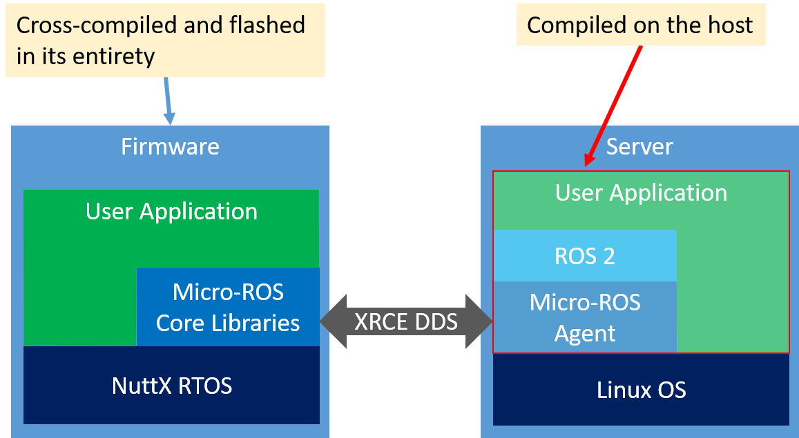

> Note for those in a hurry: There are also (short but complete) build instructions in the [micro-ros-setup README](https://github.com/micro-ROS/micro-ros-build/blob/master/micro_ros_setup/README.md). 

As shown in the [overview](/docs/overview/), a typical micro-ROS application has a client -- located on the microcontroller -- and a server side. Software on a microcontroller is usually called "firmware" and is normally cross-compiled on the host and then flashed onto the microcontroller. The following structure image shows the individual parts:


Correspondingly, in the micro-ROS build, we distinguish the firmware and the "regular" workspace for the server side. Since the regular workspace contains the agent, in other documentation it also sometimes called "agent workspace".


### Installation Overview

The initial procedure is as follows
  
  1. Check out `micro-ros-setup` to a colcon workspace
  1. Build and source it
  1. Run scripts to add micro-ROS workspace
  1. Configure Nuttx (we have example configurations)
  1. Build it
  1. Flash the firmware
  1. Run the agent on the host
  1. Reset the micro-controller (necessary while in beta)

After the initial setup, you can develop using a simplified procedure like so:

  1. (optional) reconfigure NuttX
  1. Build
  1. Flash
  1. Reset

In the last step, the microcontroller will establish a connection to the agent and you can inspect the topics and other data then. Right now, we only do that at startup. In the future, micro-ROS will also handle connection establishment during runtime.

Now we'll explain these steps in more details.

### Install `micro-ros-build`

Assuming you have a colcon workspace with a `src` folder:

```shell
$ git clone --recursive https://github.com/micro-ROS/micro-ros-build.git src/micro-ros-build
$ colcon build
$ source install/local_setup.bash
```

### Creating and building the agent

The following will add all packages related to the agent to the current workspace (in the `src` folder) and then build it.

```shell
$ ros2 run micro_ros_setup create_agent_ws.sh
$ colcon build
$ source install/local_setup.sh
```

### Create and building the firmware workspace

```shell
$ ros2 run micro_ros_setup create_firmeware_ws.sh
$ cd firmware/NuttX
$ tools/configure.sh configs/olimex-stm32-e407/drive_base # FOR EXAMPLE!
$ cd ../..
$ ros2 run micro_ros_setup build_firmware.sh
```
