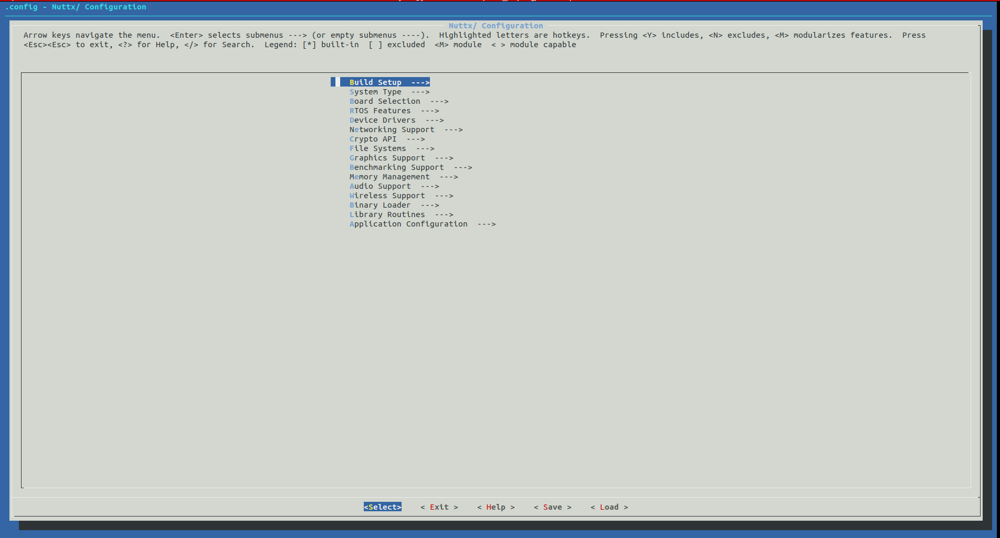
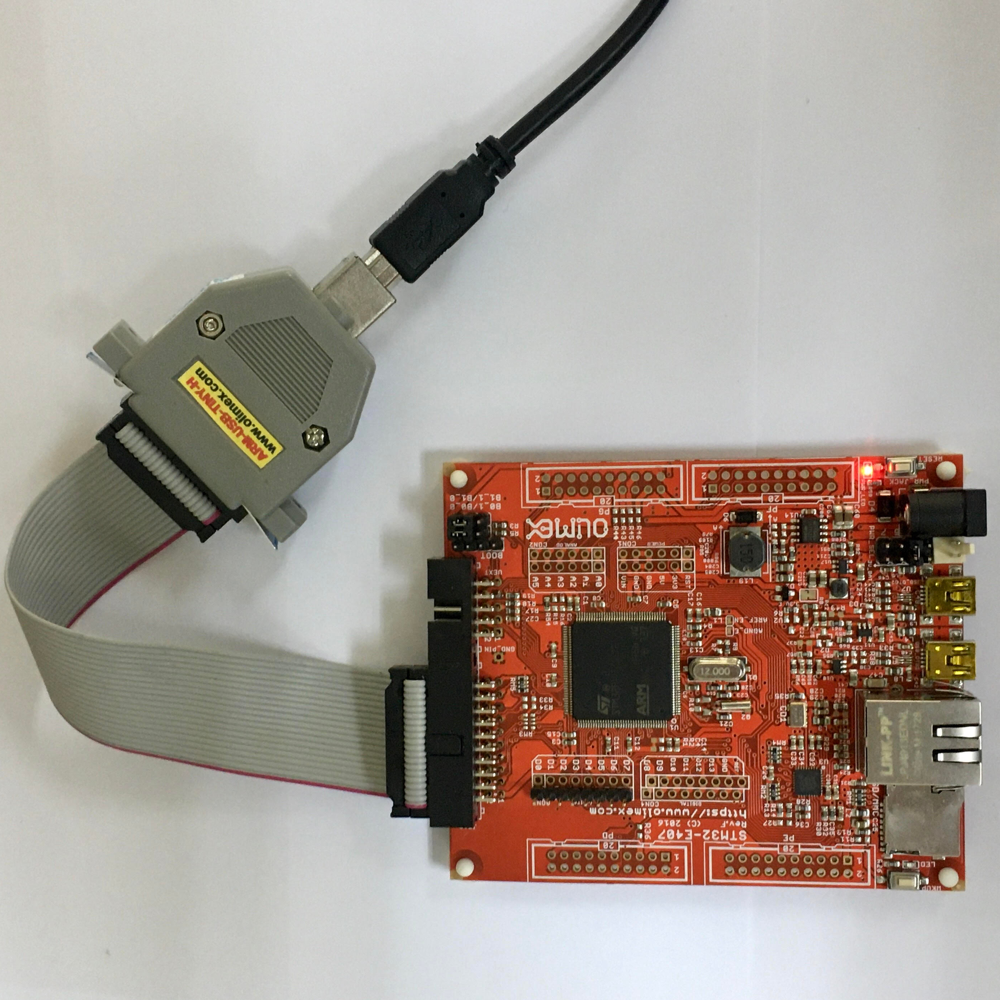
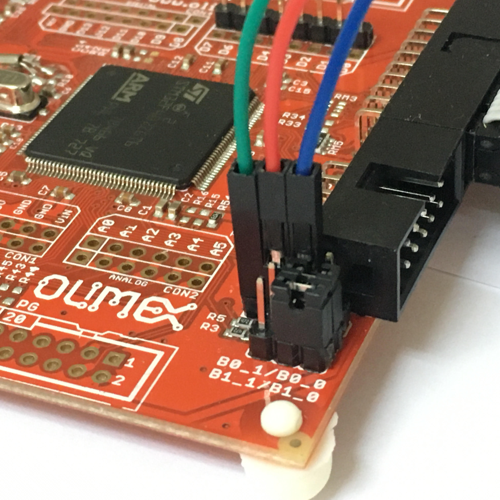

|  RTOS | Board Compatible  | ROS2 Version |
|:-----:|-------------------|:------------:|
| NuttX | Olimex-STM32-E407 |    Dashing   |

In this tutorial, we will follow a guide of how to **add a first micro-ROS application** on the NuttX RTOS. During this guide, we will start with how to create a configuration profile for our application, following of how to create a micro-ROS pingpong application and finalizing of how we can add our new application to NuttX.

## Build the Micro-ROS build system

```bash
source /opt/ros/$ROS_DISTRO/setup.bash

mkdir uros_ws && cd uros_ws

git clone -b $ROS_DISTRO https://github.com/micro-ROS/micro-ros-build.git src/micro-ros-build

sudo apt update && rosdep update
rosdep install --from-path src --ignore-src -y

colcon build

source install/local_setup.bash
```
## Create micro-ROS firmware

This step will download all the required software.
```bash
ros2 run micro_ros_setup create_firmware_ws.sh nuttx olimex-stm32-e407
```
At this point we have everything ready in our workspace to develop a new application. With the next steps, we will start the development of the app itself.

## Aplication development

- Go to: ``uros_ws/firmware/apps/examples``
- Create a folder called ``uros_pingpong``

Now we're going to considerer the folder application the next folder: ``uros_ws/firmware/apps/examples/uros_ws/firmware/apps/examples``

### Create Kconfig file

For this step, you need to create an empty file called **Kconfig**, inside the application folder. These files contain the configuration menu to configure the application and add it to the build system list of NuttX.

In the next lines you can see an example of a basic generic implementation:
```bash
config UROS_PINGPONG_EXAMPLE
	bool "micro-ROS Ping Pong"
	default n
	depends on UROS
	---help---
		<Brief description of the application>

if UROS_PINGPONG_EXAMPLE

config UROS_PINGPONG_EXAMPLE_PROGNAME
	string "Program name"
	default "uros_ping_pong"
	depends on BUILD_KERNEL
	---help---
		This is the name of the program that will be use when the NSH ELF
		program is installed.

endif
```

### Create Makefile 

Create an empty file called **Makefile**, inside of the application folder.
Below, you can see an example of a generic implementation:
```Makefile
-include $(TOPDIR)/Make.defs

#Set the scheduler priority for the app.
CONFIG_UROS_PINGPONG_EXAMPLE_PRIORITY ?= SCHED_PRIORITY_DEFAULT
#Set the stack size to the app. The minimum stack size on NuttX for a micro-ROS App is 65000 bytes
CONFIG_UROS_PINGPONG_EXAMPLE_STACKSIZE ?= 65000

#This is the name of the app on the NSH console
APPNAME = uros_pingpong
PRIORITY = $(CONFIG_UROS_PINGPONG_EXAMPLE_PRIORITY)
STACKSIZE = $(CONFIG_UROS_PINGPONG_EXAMPLE_STACKSIZE)

#Add the source files.
ASRCS =
CSRCS =
MAINSRC = uros_pingpong_main.c 

CONFIG_UROS_PINGPONG_EXAMPLE_PROGNAME ?= uros_pingpong$(EXEEXT)
PROGNAME = $(CONFIG_UROS_PINGPONG_EXAMPLE_PROGNAME)
UROS_PINGPONG_INCLUDES = $(shell find $(APPDIR)/$(CONFIG_UROS_DIR)/install -type d -name include)
CFLAGS += ${shell $(INCDIR) $(INCDIROPT) "$(CC)" "$(UROS_PINGPONG_INCLUDES)"} -std=c99

MODULE = CONFIG_UROS_PINGPONG_EXAMPLE

include $(APPDIR)/Application.mk
```

### Create Make.defs file
Create an empty file called **Make.defs**, inside of the application folder.
You need to add the following lines:
```Makefile
ifeq ($(CONFIG_UROS_PINGPONG_EXAMPLE),y)
    CONFIGURED_APPS += examples/uros_pingpong
endif
```

This file will add the folder as an application if you set the option on the configuration menu of NuttX. 

### Create the main file

Create a file named ``uros_pingpong_main.c``.
In the box below, we will show a pinpong example:
```c
//Nuttx specific library
#include <nuttx/config.h>

// Micro-ROS specific library
#include <rcl/rcl.h>
#include <rcl/error_handling.h>
#include "rosidl_generator_c/string_functions.h"
#include <std_msgs/msg/header.h>
#include <rmw_uros/options.h>

// C standard library
#include <stdio.h>
#include <unistd.h>
#include <string.h>
#include <stdlib.h>

#define STRING_BUFFER_LEN 100

// Thread to trigger a publication guard condition
void * trigger_guard_condition(void *args){
  rcl_guard_condition_t * guard_condition = (rcl_guard_condition_t *)args;

  while(true){
    rcl_trigger_guard_condition(guard_condition);
    sleep(5);
  }
}

#if defined(BUILD_MODULE)
int main(int argc, char *argv[])
#else
int uros_pingpong_main(int argc, char* argv[])
#endif
{
    //Init RCL options
  rcl_init_options_t options = rcl_get_zero_initialized_init_options();
  rcl_init_options_init(&options, rcl_get_default_allocator());
  
  // Init RCL context
  rcl_context_t context = rcl_get_zero_initialized_context();
  rcl_init(0, NULL, &options, &context);

  // Create a node
  rcl_node_options_t node_ops = rcl_node_get_default_options();
  rcl_node_t node = rcl_get_zero_initialized_node();
  rcl_node_init(&node, "pingpong_node", "", &context, &node_ops);

  // Create a reliable ping publisher
  rcl_publisher_options_t ping_publisher_ops = rcl_publisher_get_default_options();
  rcl_publisher_t ping_publisher = rcl_get_zero_initialized_publisher();
  rcl_publisher_init(&ping_publisher, &node, ROSIDL_GET_MSG_TYPE_SUPPORT(std_msgs, msg, Header), "/microROS/ping", &ping_publisher_ops);

  // Create a best effort pong publisher
  rcl_publisher_options_t pong_publisher_ops = rcl_publisher_get_default_options();
  pong_publisher_ops.qos.reliability = RMW_QOS_POLICY_RELIABILITY_BEST_EFFORT;
  rcl_publisher_t pong_publisher = rcl_get_zero_initialized_publisher();
  rcl_publisher_init(&pong_publisher, &node, ROSIDL_GET_MSG_TYPE_SUPPORT(std_msgs, msg, Header), "/microROS/pong", &pong_publisher_ops);

  // Create a reliable pong subscriber
  rcl_subscription_options_t pong_subscription_ops = rcl_subscription_get_default_options();
  rcl_subscription_t pong_subscription = rcl_get_zero_initialized_subscription();
  rcl_subscription_init(&pong_subscription, &node, ROSIDL_GET_MSG_TYPE_SUPPORT(std_msgs, msg, Header), "/microROS/pong", &pong_subscription_ops);

  // Create a best effort ping subscriber
  rcl_subscription_options_t ping_subscription_ops = rcl_subscription_get_default_options();
  ping_subscription_ops.qos.reliability = RMW_QOS_POLICY_RELIABILITY_BEST_EFFORT;
  rcl_subscription_t ping_subscription = rcl_get_zero_initialized_subscription();
  rcl_subscription_init(&ping_subscription, &node, ROSIDL_GET_MSG_TYPE_SUPPORT(std_msgs, msg, Header), "/microROS/ping", &ping_subscription_ops);

  // Create a guard condition
  rcl_guard_condition_t guard_condition = rcl_get_zero_initialized_guard_condition();
  rcl_guard_condition_options_t guard_condition_options = rcl_guard_condition_get_default_options();
  rcl_guard_condition_init(&guard_condition, &context, guard_condition_options);
  
  // Create a thread that triggers the guard condition
  pthread_t guard_condition_thread;
  pthread_create(&guard_condition_thread, NULL, trigger_guard_condition, &guard_condition);

  // Create a wait set
  rcl_wait_set_t wait_set = rcl_get_zero_initialized_wait_set();
  rcl_wait_set_init(&wait_set, 2, 1, 0, 0, 0, 0, &context, rcl_get_default_allocator());

  // Create and allocate the pingpong publication message
  std_msgs__msg__Header msg;
  char msg_buffer[STRING_BUFFER_LEN];
  msg.frame_id.data = msg_buffer;
  msg.frame_id.capacity = STRING_BUFFER_LEN;

  // Create and allocate the pingpong subscription message
  std_msgs__msg__Header rcv_msg;
  char rcv_buffer[STRING_BUFFER_LEN];
  rcv_msg.frame_id.data = rcv_buffer;
  rcv_msg.frame_id.capacity = STRING_BUFFER_LEN;

  // Set device id and sequence number;
  int device_id = rand();
  int seq_no;
  
  int pong_count = 0;
  struct timespec ts;
  rcl_ret_t rc;

  do {
    // Clear and set the waitset
    rcl_wait_set_clear(&wait_set);
    
    size_t index_pong_subscription;
    rcl_wait_set_add_subscription(&wait_set, &pong_subscription, &index_pong_subscription);

    size_t index_ping_subscription;
    rcl_wait_set_add_subscription(&wait_set, &ping_subscription, &index_ping_subscription);
    
    size_t index_guardcondition;
    rcl_wait_set_add_guard_condition(&wait_set, &guard_condition, &index_guardcondition);
    
    // Run session for 100 ms
    rcl_wait(&wait_set, RCL_MS_TO_NS(100));

    // Check if it is time to send a ping
    if (wait_set.guard_conditions[index_guardcondition]) {
      // Generate a new random sequence number
      seq_no = rand();
      sprintf(msg.frame_id.data, "%d_%d", seq_no, device_id);
      msg.frame_id.size = strlen(msg.frame_id.data);
      
      // Fill the message timestamp
      clock_gettime(CLOCK_REALTIME, &ts);
      msg.stamp.sec = ts.tv_sec;
      msg.stamp.nanosec = ts.tv_nsec;

      // Reset the pong count and publish the ping message
      pong_count = 0;
      rcl_publish(&ping_publisher, (const void*)&msg, NULL);
      // printf("Ping send seq 0x%x\n", seq_no);
    }
    
    // Check if some pong message is received
    if (wait_set.subscriptions[index_pong_subscription]) {
      rc = rcl_take(wait_set.subscriptions[index_pong_subscription], &rcv_msg, NULL, NULL);

      if(rc == RCL_RET_OK && strcmp(msg.frame_id.data,rcv_msg.frame_id.data) == 0) {
          pong_count++;
          // printf("Pong for seq 0x%x (%d)\n", seq_no, pong_count);
      }
    }

    // Check if some ping message is received and pong it
    if (wait_set.subscriptions[index_ping_subscription]) {
      rc = rcl_take(wait_set.subscriptions[index_ping_subscription], &rcv_msg, NULL, NULL);

      // Dont pong my own pings
      if(rc == RCL_RET_OK && strcmp(msg.frame_id.data,rcv_msg.frame_id.data) != 0){
        // printf("Ping received with seq 0x%x (%d). Answering.\n", seq_no);
        rcl_publish(&pong_publisher, (const void*)&rcv_msg, NULL);
      }
    }
    
    usleep(10000);
  } while (true);
}
```

Once the application is ready, the only thing left to do is to create the right configuration.

## Create a config profile

Create a specific configuration from scratch can be a challenging task, so we're going to start from an already existing one and modify it for our new application.

Execute the next command:
```bash
cd ~/uros_ws
ros2 run micro_ros_setup configure_firmware.sh uros
```

This sets the Ethernet and Micro-ROS required configuration. However, in order to add our application, we're going to modify it.

### Modify the configuration
Now type the following commands:
```bash
cd uros_ws/firmware/NuttX
make menuconfig
```

This will open the NuttX menu config, which allows you to modify the configuration of the RTOS, including adding a new application.


- On the menu, you need to follow the next path:
``Application Configuration -> Examples ``


- This will show a list of the available applications. You need to find: ``micro-ROS Ping-Pong`` and click ``y`` to add it.


- Now push three times the key ``ESC`` to close the menu. You will be asked if you want to save the save your new configuration, and you need to click ``Yes``.


### Add your configuration

Execute the following commands:
```bash
cd uros_ws/firmware/NuttX
make savedefconfig
```

This will generate a file called ``defconfig`` inside of ``uros_ws/firmware/NuttX``. This file is a config profile with all the required configuration to run your specific configuration which includes your application.

Finally create a folder called ``uros_pingpong`` into ``uros_ws/firmware/NuttX/configs/olimex-stm32-e407`` and move the defconfig file to uros_pingpong folder.

## Build your application

Now that everything is ready, the only thing left to do is to continue with the build system instructions. Execute the next command on the build system to start the build process:
```bash
cd ~/uros_ws
ros2 run micro_ros_setup configure_firmware.sh uros_pingpong
ros2 run micro_ros_setup build_firmware.sh
```

If it returns the next output, your build step succeded and your application was implemented properly.

```bash
AR:   stm32_boot.o stm32_bringup.o stm32_spi.o libatomic.o stm32_autoleds.o stm32_buttons.o stm32_appinit.o stm32_usb.o 
make[2]: Leaving directory '/home/juan/uros_pinpong/firmware/NuttX/configs/olimex-stm32-e407/src'
LD: nuttx
arm-none-eabi-ld --entry=__start -nostartfiles -nodefaultlibs -g -T/home/juan/uros_pinpong/firmware/NuttX/configs/olimex-stm32-e407/scripts/ld.script -L"/home/juan/uros_pinpong/firmware/NuttX/staging" -L"/home/juan/uros_pinpong/firmware/NuttX/arch/arm/src/board" -L "/usr/lib/gcc/arm-none-eabi/6.3.1/../../../arm-none-eabi/lib/thumb/v7e-m" \
	-o "/home/juan/uros_pinpong/firmware/NuttX/nuttx"   \
	--start-group -lsched -ldrivers -lconfigs -lc -lmm -larch -lxx -lapps -lnet -lfs -lbinfmt -lxx -lboard -lsupc++ "/usr/lib/gcc/arm-none-eabi/6.3.1/thumb/v7e-m/libgcc.a" --end-group
make[1]: Leaving directory '/home/juan/uros_pinpong/firmware/NuttX/arch/arm/src'
CP: nuttx.hex
CP: nuttx.bin

```
Now the firmware is ready, is just necessary to flash the board. First, connect Olimex ARM-USB-TINY-H JTAG programmer to the board's JTAG port:



Make sure that the board power supply jumper (PWR_SEL) is in the 3-4 position in order to power the board from the JTAG connector:


You should see the red LED lighting. It is time to flash the board:

```bash
# Flash step
ros2 run micro_ros_setup flash_firmware.sh
```
## Running the micro-ROS app

The micro-ROS app is ready to connect to a micro-ROS-Agent and start talking with the rest of the ROS 2 world.

First of all, create and build a micro-ROS agent:

```bash
# Download micro-ROS-Agent packages
ros2 run micro_ros_setup create_agent_ws.sh

# Build micro-ROS-Agent packages, this may take a while.
colcon build --metas src
source install/local_setup.bash
```

Then connect the Olimex development board to the computer using the usb to serial cable:



***TIP:** Color codes are applicable to [this cable](https://www.olimex.com/Products/Components/Cables/USB-Serial-Cable/USB-Serial-Cable-F/). Make sure to match Olimex Rx with Cable Tx and vice-versa. Remember GND!*

Then run the agent:

```bash
# Run a micro-ROS agent
ros2 run micro_ros_agent micro_ros_agent serial --dev [device]
```

***TIP:** you can use this command to find your serial device name: `ls /dev/serial/by-id/*`*

And finally, let's check that everything is working in a new command line. We are going to listen to ping topic to check whether the Ping Pong node is publishing its own pings

```bash
source /opt/ros/$ROS_DISTRO/setup.bash

# Subscribe to micro-ROS ping topic
ros2 topic echo /microROS/ping
```

You should see the topic messages published by the Ping Pong node every 5 seconds:

```
user@user:~$ ros2 topic echo /microROS/ping
stamp:
  sec: 20
  nanosec: 867000000
frame_id: '1344887256_1085377743'
---
stamp:
  sec: 25
  nanosec: 942000000
frame_id: '730417256_1085377743'
---
```

On another command line, let's subscribe to the pong topic

```bash
source /opt/ros/$ROS_DISTRO/setup.bash

# Subscribe to micro-ROS pong topic
ros2 topic echo /microROS/pong
```

At this point, we know that our app is publishing pings. Let's check if it also answers to someone else pings in a new command line:

```bash
source /opt/ros/$ROS_DISTRO/setup.bash

# Send a fake ping
ros2 topic pub --once /microROS/ping std_msgs/msg/Header '{frame_id: "fake_ping"}'
```

Now, we should see on the ping subscriber our fake ping along with the board pings:

```
user@user:~$ ros2 topic echo /microROS/ping
stamp:
  sec: 0
  nanosec: 0
frame_id: fake_ping
---
stamp:
  sec: 305
  nanosec: 973000000
frame_id: '451230256_1085377743'
---
stamp:
  sec: 310
  nanosec: 957000000
frame_id: '2084670932_1085377743'
---
```

And in the pong subscriber, we should see the board's answer to our fake ping:

```
user@user:~$ ros2 topic echo /microROS/pong
stamp:
  sec: 0
  nanosec: 0
frame_id: fake_ping
---
```