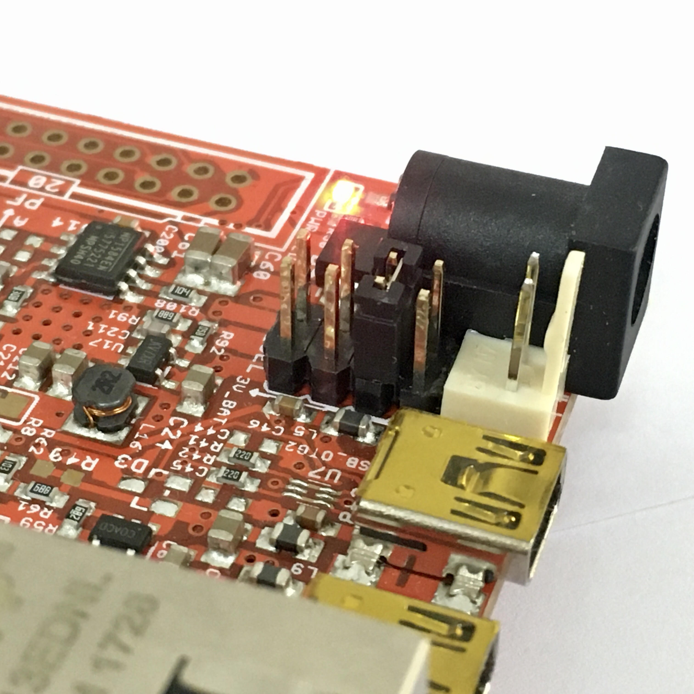

|   RTOS   | Board Compatible  | ROS2 Version |
| :------: | ----------------- | :----------: |
|  NuttX   | Olimex-STM32-E407 |   Dashing    |
| FreeRTOS | Olimex-STM32-E407 |   Dashing    |
|  Zephyr  | Olimex-STM32-E407 |   Dashing    |

This tutorial is an entry point for using micro-ROS in one of the supported RTOS: Nuttx, FreeRTOS or Zephyr. The target hardware for this tutorial is **[Olimex STM32-E407](https://www.olimex.com/Products/ARM/ST/STM32-E407/open-source-hardware)** evaluation board.

## Required hardware

The following hardware will be used:

| Item                                                                                                              |
| ----------------------------------------------------------------------------------------------------------------- |
| [Olimex STM32-E407](https://www.olimex.com/Products/ARM/ST/STM32-E407/open-source-hardware)                       |
| [Olimex ARM-USB-TINY-H](https://www.olimex.com/Products/ARM/JTAG/ARM-USB-TINY-H/)                                 |
| [USB-Serial Cable Female](https://www.olimex.com/Products/Components/Cables/USB-Serial-Cable/USB-Serial-Cable-F/) |

## Installing the micro-ROS build system

First of all, make sure that you have a **ROS 2** installation in the computer. On the **ROS 2** installation open a command line and follow these steps:

```bash
# Source the ROS 2 installation
source /opt/ros/$ROS_DISTRO/setup.bash

# Create a workspace and download the micro-ROS tools
mkdir microros_ws 
cd microros_ws
git clone -b $ROS_DISTRO https://github.com/micro-ROS/micro-ros-build.git src/micro-ros-build

# Update dependencies using rosdep
sudo apt update && rosdep update
rosdep install --from-path src --ignore-src -y

# Build micro-ROS tools and source them
colcon build
source install/local_setup.bash
```

***TIP:** if you are familiar with Docker containers, this image may be useful: [ros:dashing](https://hub.docker.com/layers/ros/library/ros/dashing/images/sha256-b796c14ea663537129897769aa6c715a851ca08dffd4875ef2ecaa31a4dbd431?context=explore)*

These instructions will setup a workspace with a ready to use micro-ROS build system. This build system is in charge of downloading the required cross-compilation tools and building the apps for the required platforms. 

The build system's workflow is a four-step procedure:

* **Create step:** downloads all required code repositories and cross-compilation toolchains for the specific hardware platform. Among these repositories, it will also download a collection of ready to use micro-ROS apps.
* **Configure step:** user can select in this step which app is going to be crosscompiled by the toolchain. Some other options, such as transport, agent address or port will be also selected in this step.
* **Build step:** here is where cross-compilation takes place and platform-specific binaries are generated.
* **Flash step:** generated binaries are flashed onto hardware platform memory so micro-ROS app can be executed.

Further information about micro-ROS build system can be found [here](https://github.com/micro-ROS/micro-ros-build/tree/dashing/micro_ros_setup)

## Creating a new firmware workspace

In order to accomplish the first step, a new firmware workspace can be created using the following command. The created workspace is platform and RTOS specific.

```bash
# Create step
ros2 run micro_ros_setup create_firmware_ws.sh [RTOS] olimex-stm32-e407
```
Available options here are:

|          | RTOS       |
| :------: | ---------- |
|  NuttX   | `nuttx`    |
| FreeRTOS | `freertos` |
|  Zephyr  | `zephyr`   |

Once the command finished, a folder named `firmware` must be present in your workspace.

## Configuring the firmware

The configuration step will set up the main micro-ROS options and will select the required application. It can be executed with the following command:

```bash
# Configure step
ros2 run micro_ros_setup configure_firmware.sh [APP] [OPTIONS]
```
Ooptions available at this configuration step are:
  - `--transport` or `-t`: `udp`, `tcp`, `serial` or any hardware-specific transport label
  - `--dev` or `-d`: agent string descriptor in a serial-like transport
  - `--ip` or `-i`: agent IP in a network-like transport
  - `--port` or `-p`: agent port in a network-like transport

At this point, in order to build your first micro-ROS application you can take one of these examples as reference:

|          | APP         | OPTIONS                      |                                  Configured app                                  |
| :------: | ----------- | ---------------------------- | :------------------------------------------------------------------------------: |
|  NuttX   | `ping_pong` | `???`                        |                                                                                  |
| FreeRTOS | `ping_pong` | `--transport serial --dev 3` | [Source](https://github.com/micro-ROS/freertos_apps/tree/dashing/apps/ping_pong) |
|  Zephyr  | `ping_pong` | `--transport serial-usb`     |  [Source](https://github.com/micro-ROS/zephyr_apps/tree/dashing/apps/ping_pong)  |


These reference example consists on a ping pong app where a micro-ROS node sends a ping package with a unique identifier using a publisher and the same package is received by pong subscribers (in another ROS 2 o micro-ROS node). Ping pong node will also answer to pings received from other nodes with a pong message:


The files contained in a micro-ROS app is slightly RTOS specific. The following table aims to clarify which files are required for creating a new app:

<table >
    <thead>
        <tr>
            <th></th>
            <th>File</th>
            <th>Description</th>
            <th></th>
        </tr>
    </thead>
  <tr>
    <td rowspan="2">FreeRTOS</td>
    <td >app.c</td>
    <td >micro-ROS app code.</td>
    <td rowspan="2"><a href="https://github.com/micro-ROS/freertos_apps/tree/dashing/apps/ping_pong">Sample app</a></td>

  </tr>
  <tr>
    <td >app-colcon.meta</td>
    <td >micro-ROS app specific colcon configuration. Detailed info <a href="https://micro-ros.github.io/docs/tutorials/core/microxrcedds_rmw_configuration/">here</a>.</td>
  </tr>
  <tr>
    <td rowspan="4">Zephyr</td>
    <td >src/app.c</td>
    <td >micro-ROS app code.</span></td>
    <td rowspan="4"><a href="https://github.com/micro-ROS/zephyr_apps/tree/dashing/apps/ping_pong">Sample app</a></td>
  </tr>
  <tr>
    <td >app-colcon.meta</span></a></td>
    <td >micro-ROS app specific colcon configuration. Detailed info <a href="https://micro-ros.github.io/docs/tutorials/core/microxrcedds_rmw_configuration/">here</a>.</td>
  </tr>
  <tr>
    <td>CMakeLists.txt</span></a></td>
    <td>CMake file for Zephyr app building</td>
  </tr>
  <tr>
    <td >prj.conf</span></a></td>
    <td >Zephyr specific app configuration</td>
  </tr>
</table>

## Building the firmware

When the configuring step ends, just build the firmware:

```bash
# Build step
ros2 run micro_ros_setup build_firmware.sh
```

## Flashing the firmware

Flashing the firmware into the platform may vary across hardware platforms. Regarding this tutorial's target platform (**[Olimex STM32-E407](https://www.olimex.com/Products/ARM/ST/STM32-E407/open-source-hardware)**), JTAG interface is going to be used to flash the firmware.

Connect [Olimex ARM-USB-TINY-H](https://www.olimex.com/Products/ARM/JTAG/ARM-USB-TINY-H/) to the board:


Make sure that the board power supply jumper (PWR_SEL) is in the 3-4 position in order to power the board from the JTAG connector:



Once you have your computer connected to the Olimex board through the JTAG adapter, run the flash step:

```bash
# Flash step
ros2 run micro_ros_setup flash_firmware.sh
```
## Running the micro-ROS app

The micro-ROS app is ready to connect to a micro-ROS-Agent and start talking with the rest of the ROS 2 world.

First of all, create and build a micro-ROS agent:

```bash
# Download micro-ROS-Agent packages
ros2 run micro_ros_setup create_agent_ws.sh

# Build micro-ROS-Agent packages, this may take a while.
colcon build
source install/local_setup.bash
```

Then, depending on the selected transport the board connection to the agent may differ:

|          | micro-ROS Client to Agent |
| :------: | ------------------------- |
|  NuttX   | Serial                    |
| FreeRTOS | Serial                    |
|  Zephyr  | USB                       |

---

### Olimex STM32-E407 Serial connection

Olimex development board is connected to the computer using the usb to serial cable:


***TIP:** Color codes are applicable to [this cable](https://www.olimex.com/Products/Components/Cables/USB-Serial-Cable/USB-Serial-Cable-F/). Make sure to match Olimex Rx with Cable Tx and vice-versa. Remember GND!*

---

### Olimex STM32-E407 USB connection

Olimex development board is connected to the computer using the USB OTG 2 connector (the miniUSB connector that is furthest from the Ethernet port).

---

Then run the agent:

```bash
# Run a micro-ROS agent
ros2 run micro_ros_agent micro_ros_agent serial --dev [device]
```

***TIP:** you can use this command to find your serial device name: `ls /dev/serial/by-id/*`*

## Test the sample micro-ROS app behaviour

Once the micro-ROS app is built and flashed, and the board is connected to a micro-ROS agent, let's check that everything is working in a new command line. 
We are going to listen to ping topic to check whether the Ping Pong node is publishing its own pings:

```bash
source /opt/ros/$ROS_DISTRO/setup.bash

# Subscribe to micro-ROS ping topic
ros2 topic echo /microROS/ping
```

You should see the topic messages published by the Ping Pong node every 5 seconds:

```
user@user:~$ ros2 topic echo /microROS/ping
stamp:
  sec: 20
  nanosec: 867000000
frame_id: '1344887256_1085377743'
---
stamp:
  sec: 25
  nanosec: 942000000
frame_id: '730417256_1085377743'
---
```

On another command line, let's subscribe to the pong topic

```bash
source /opt/ros/$ROS_DISTRO/setup.bash

# Subscribe to micro-ROS pong topic
ros2 topic echo /microROS/pong
```

At this point, we know that our app is publishing pings. Let's check if it also answers to someone else pings in a new command line:

```bash
source /opt/ros/$ROS_DISTRO/setup.bash

# Send a fake ping
ros2 topic pub --once /microROS/ping std_msgs/msg/Header '{frame_id: "fake_ping"}'
```

Now, we should see on the ping subscriber our fake ping along with the board pings:

```
user@user:~$ ros2 topic echo /microROS/ping
stamp:
  sec: 0
  nanosec: 0
frame_id: fake_ping
---
stamp:
  sec: 305
  nanosec: 973000000
frame_id: '451230256_1085377743'
---
stamp:
  sec: 310
  nanosec: 957000000
frame_id: '2084670932_1085377743'
---
```

And in the pong subscriber, we should see the board's answer to our fake ping:

```
user@user:~$ ros2 topic echo /microROS/pong
stamp:
  sec: 0
  nanosec: 0
frame_id: fake_ping
---
```
