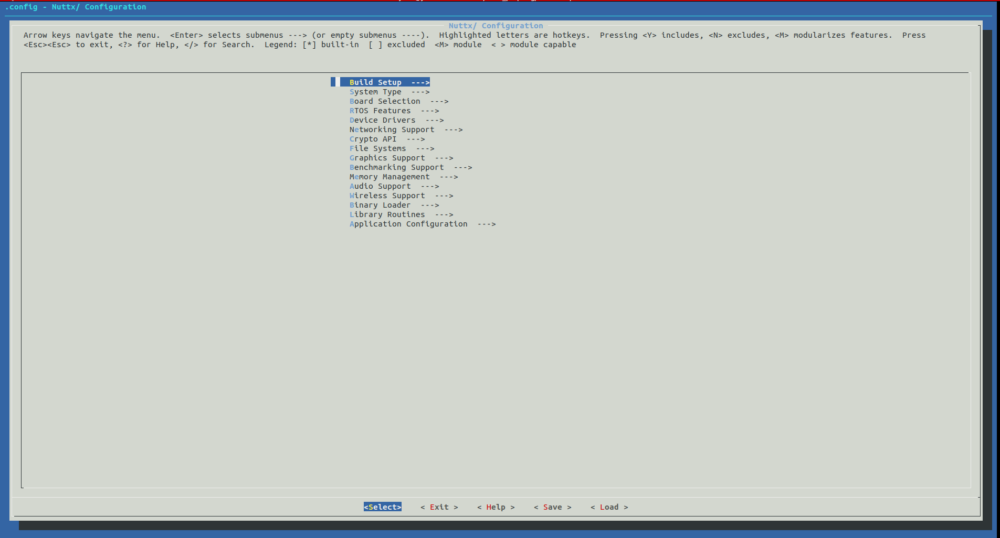
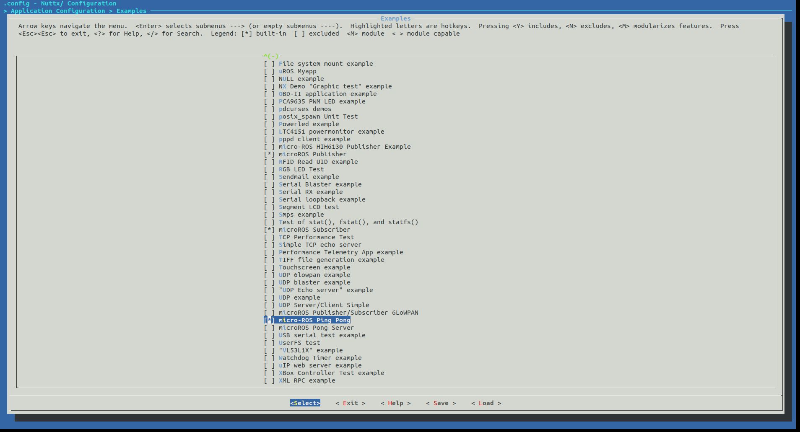
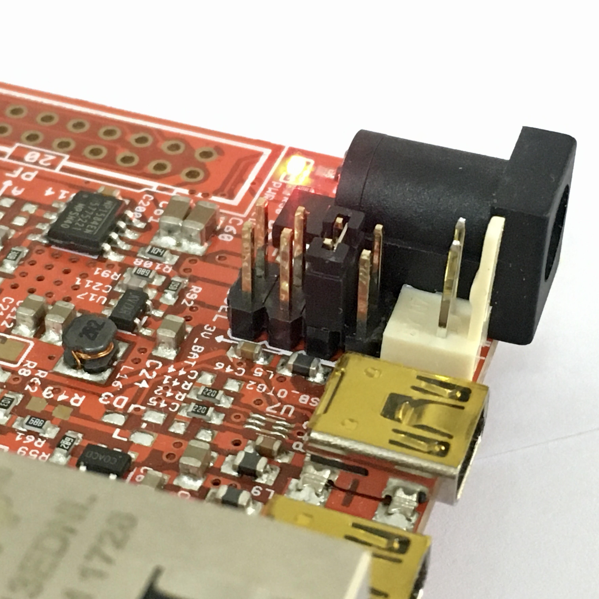
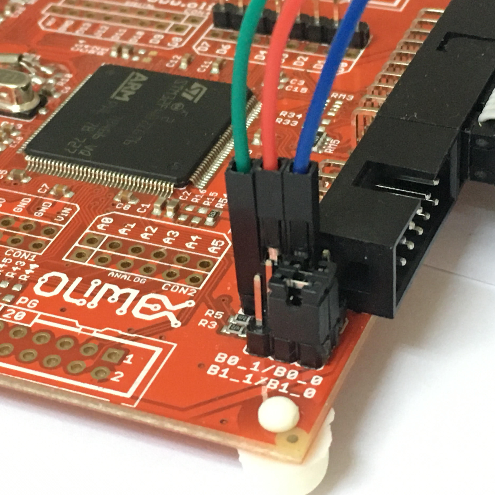



In this tutorial, you'll learn the use of micro-ROS with NuttX.



First of all, make sure that you have a **ROS 2** environment and the **micro-ROS build system** installed in the computer. If not, please check the [**First micro-ROS application on Linux**](../first_application_linux/) tutorial in order to learn how to start with micro-ROS.

The build system's workflow in the case of embedded systems is a four-step procedure:

* **Create step:** This step is in charge of downloading all the required code repositories and cross-compilation toolchains for the specific hardware platform. Among these repositories, it will also download a collection of ready to use micro-ROS apps.
* **Configure step:** In this step, the user can select which app is going to be cross-compiled by the toolchain. Some other options, such as transport, agent address or port will be also selected in this step.
* **Build step:** Here is where the cross-compilation takes place and the platform-specific binaries are generated.
* **Flash step:** The binaries generated in the previous step are flashed onto the hardware platform memory, in order to allow the execution of the micro-ROS app.

Further information about micro-ROS build system can be found [here](https://github.com/micro-ROS/micro-ros-build/tree/dashing/micro_ros_setup).

## Required hardware

The following hardware will be used:

 
* [Olimex STM32-E407](https://www.olimex.com/Products/ARM/ST/STM32-E407/open-source-hardware)
* [Olimex ARM-USB-TINY-H](https://www.olimex.com/Products/ARM/JTAG/ARM-USB-TINY-H/)
* [USB-Serial Cable Female](https://www.olimex.com/Products/Components/Cables/USB-Serial-Cable/USB-Serial-Cable-F/)

## Step 1: Creating a new firmware workspace

In order to accomplish the first step, a new firmware workspace can be created using the command:

```bash
# Create step
ros2 run micro_ros_setup create_firmware_ws.sh [RTOS] olimex-stm32-e407
```
Note that the created workspace is platform and RTOS specific.
The options available here are:

|   RTOS   | `[RTOS]`   |
| :------: | ---------- |
|  NuttX   | `nuttx`    |
| FreeRTOS | `freertos` |
|  Zephyr  | `zephyr`   |

Once the command is executed, a folder named `firmware` must be present in your workspace.

***NOTE:** if you are targetting Zephyr, make sure you have the latest version of CMake:*

```bash
sudo apt install wget
wget -O - https://apt.kitware.com/keys/kitware-archive-latest.asc 2>/dev/null | sudo apt-key add -
sudo apt install software-properties-common
sudo apt-add-repository 'deb https://apt.kitware.com/ubuntu/ bionic main'
sudo apt update
sudo apt install cmake
```

## Step 2: Configuring the firmware

The configuration step will set up the main micro-ROS options and will select the required application. It can be executed with the following command:

```bash
# Configure step
ros2 run micro_ros_setup configure_firmware.sh [APP] [OPTIONS]
```

The options available for this configuration step are:
  - `--transport` or `-t`: `udp`, `tcp`, `serial` or any hardware-specific transport label
  - `--dev` or `-d`: agent string descriptor in a serial-like transport
  - `--ip` or `-i`: agent IP in a network-like transport
  - `--port` or `-p`: agent port in a network-like transport

At this point, in order to build your first micro-ROS application you can use one of these examples as a reference:

|  RTOS        | `[APP]`         | `[OPTIONS]`                  |                                  Configured app                                  |
| :------: | --------------- | ---------------------------- | :------------------------------------------------------------------------------: |
|  NuttX   | `uros_pingpong` |                              | [Source](https://github.com/micro-ROS/apps/tree/dashing/examples/uros_pingpong)  |
| FreeRTOS | `ping_pong`     | `--transport serial --dev 3` | [Source](https://github.com/micro-ROS/freertos_apps/tree/dashing/apps/ping_pong) |
|  Zephyr  | `ping_pong`     | `--transport serial-usb`     |  [Source](https://github.com/micro-ROS/zephyr_apps/tree/dashing/apps/ping_pong)  |


These reference examples consist in the ping-pong app, from the [First micro-ROS application on Linux](../first_application_linux/) tutorial. In this app, a micro-ROS node sends a ping message with a unique identifier using a publisher. The message is received by pong subscribers (in another ROS 2 or micro-ROS node). The ping-pong node will also answer to pings received from other nodes with a pong message, as elucidated by the diagram below:


The files that a micro-ROS app needs are RTOS-dependent, but they differ only in the includes and signature of the main function. The remaining lines are RTOS-independent micro-ROS code. The table below clarifies which files are required for creating a new app in the three RTOSes supported:

<table >
    <thead>
        <tr>
            <th></th>
            <th>File</th>
            <th>Description</th>
            <th></th>
        </tr>
    </thead>
   <tr>
    <td rowspan="4">Nuttx</td>
    <td >app.c</td>
    <td >micro-ROS app code.</td>
    <td rowspan="4"><a href="https://github.com/micro-ROS/apps/tree/dashing/examples/uros_pingpong">Sample app</a></td>
  </tr>
  <tr>
    <td >Kconfig</td>
    <td >Nuttx Kconfig configuration</td>
  </tr>
  <tr>
    <td>Make.defs</td>
    <td>Nuttx build system definitios</td>
  </tr>
  <tr>
    <td >Makefile</td>
    <td >Nuttx specific app build script</td>
  </tr>
  <tr>
    <td rowspan="2">FreeRTOS</td>
    <td >app.c</td>
    <td >micro-ROS app code.</td>
    <td rowspan="2"><a href="https://github.com/micro-ROS/freertos_apps/tree/dashing/apps/ping_pong">Sample app</a></td>

  </tr>
  <tr>
    <td >app-colcon.meta</td>
    <td >micro-ROS app specific colcon configuration. Detailed info <a href="https://micro-ros.github.io/docs/tutorials/core/microxrcedds_rmw_configuration/">here</a>.</td>
  </tr>
  <tr>
    <td rowspan="4">Zephyr</td>
    <td >src/app.c</td>
    <td >micro-ROS app code.</td>
    <td rowspan="4"><a href="https://github.com/micro-ROS/zephyr_apps/tree/dashing/apps/ping_pong">Sample app</a></td>
  </tr>
  <tr>
    <td >app-colcon.meta</td>
    <td >micro-ROS app specific colcon configuration. Detailed info <a href="https://micro-ros.github.io/docs/tutorials/core/microxrcedds_rmw_configuration/">here</a>.</td>
  </tr>
  <tr>
    <td>CMakeLists.txt</td>
    <td>CMake file for Zephyr app building</td>
  </tr>
  <tr>
    <td >prj.conf</td>
    <td >Zephyr specific app configuration</td>
  </tr>
</table>

The following steps are RTOS-specific commands for creating a new app once the firmware folder is created inside `microros_ws`. Please refer to the table above in order to get an idea of the content that the RTOS-specific files described below needed to create your own app should contain.

### Nuttx

Create a new app:

```bash
# Go to app folder inside firmware
cd firmware/apps/examples

# Create your app folder and required files. Contents of these file can be found in column Sample app in table above
mkdir uros_pingpong
cd uros_pingpong
touch Kconfig
touch Makefile
touch app.c
touch Make.defs
```

Create a specific configuration. We're going to start from an already existing one and modify it for our new application.

Execute the following command:
```bash
cd microros_ws
ros2 run micro_ros_setup configure_firmware.sh uros
```

Install required `kconfig-frontends`:

```bash
git clone https://bitbucket.org/nuttx/tools.git firmware/tools

pushd firmware/tools/kconfig-frontends
./configure --enable-mconf --disable-nconf --disable-gconf --disable-qconf 
LD_RUN_PATH=/usr/local/lib && make && sudo make install && sudo ldconfig
popd
```

This sets the Ethernet and micro-ROS required configuration. However, in order to add our application, we're going to modify it:

```bash
cd firmware/NuttX
make menuconfig
```

This will open the NuttX menu config, which allows you to modify the configuration of the RTOS, including adding a new application.


- On the menu, follow the path:
``Application Configuration -> Examples ``


- A list of the available applications will appear. You need to find: ``micro-ROS Ping-Pong`` and click ``y`` to add it.


- Now push three times the key ``ESC`` to close the menu. You will be asked if you want to save your new configuration, and you need to click ``Yes``.


To save your configuration execute the following commands:

```bash
cd uros_ws/firmware/NuttX
make savedefconfig
```

This will generate a file called ``defconfig`` inside of ``uros_ws/firmware/NuttX``. This file is a config profile with all the configuration required to run your specific application.

Finally create a folder called ``uros_pingpong`` into ``uros_ws/firmware/NuttX/configs/olimex-stm32-e407`` and move the defconfig file to uros_pingpong folder so you can execute:

```bash
# Configure step
ros2 run micro_ros_setup configure_firmware.sh uros_pingpong
```

### FreeRTOS

Create a new app:

```bash
# Create your app folder and required files. Contents of these file can be found in column Sample app in table above
pushd firmware/freertos_apps/apps
mkdir ping_pong
cd ping_pong
touch app.c app-colcon.meta
popd
```

Now you are ready to call:

```bash
# Configure step
ros2 run micro_ros_setup configure_firmware.sh ping_pong [OPTIONS]
```

### Zephyr 

Create a new app:

```bash
# Create your app folder and required files. Contents of these file can be found in column Sample app in table above
pushd firmware/zephyr_apps/apps
mkdir my_brand_new_app
cd my_brand_new_app
mkdir src
touch src/app.c app-colcon.meta
touch CMakeLists.txt prj.conf
popd
```

Now you are ready to call:

```bash
# Configure step
ros2 run micro_ros_setup configure_firmware.sh ping_pong [OPTIONS]
```

## Step 3: Building the firmware

When the configuring step ends, just build the firmware:

```bash
# Build step
ros2 run micro_ros_setup build_firmware.sh
```

## Step 4: Flashing the firmware

Flashing the firmware into the platform may vary across hardware platforms. Regarding this tutorial's target platform (**[Olimex STM32-E407](https://www.olimex.com/Products/ARM/ST/STM32-E407/open-source-hardware)**), JTAG interface is going to be used to flash the firmware.

Connect [Olimex ARM-USB-TINY-H](https://www.olimex.com/Products/ARM/JTAG/ARM-USB-TINY-H/) to the board:


Make sure that the board power supply jumper (PWR_SEL) is in the 3-4 position in order to power the board from the JTAG connector:



Once you have your computer connected to the Olimex board through the JTAG adapter, run the flash step:

```bash
# Flash step
ros2 run micro_ros_setup flash_firmware.sh
```
## Running the micro-ROS app

The micro-ROS app is ready to connect to a micro-ROS-Agent and start talking with the rest of the ROS 2 world.

First of all, create and build a micro-ROS agent:

```bash
# Download micro-ROS-Agent packages
ros2 run micro_ros_setup create_agent_ws.sh

# Build micro-ROS-Agent packages, this may take a while.
colcon build
source install/local_setup.bash
```

Then, depending on the selected transport and RTOS, the board connection to the agent may differ:

|   RTOS   | micro-ROS Client to Agent |
| :------: | ------------------------- |
|  NuttX   | Serial                    |
| FreeRTOS | Serial                    |
|  Zephyr  | USB                       |

---

### Olimex STM32-E407 Serial connection

Olimex development board is connected to the computer using the usb to serial cable:



***TIP:** Color codes are applicable to [this cable](https://www.olimex.com/Products/Components/Cables/USB-Serial-Cable/USB-Serial-Cable-F/). Make sure to match Olimex Rx with Cable Tx and vice-versa. Remember GND!*

---

### Olimex STM32-E407 USB connection

Olimex development board is connected to the computer using the USB OTG 2 connector (the miniUSB connector that is furthest from the Ethernet port).

---

Then run the agent:

```bash
# Run a micro-ROS agent
ros2 run micro_ros_agent micro_ros_agent serial --dev [device]
```

***TIP:** you can use this command to find your serial device name: `ls /dev/serial/by-id/*`*

## Test the sample micro-ROS app behaviour

Once the micro-ROS app is built and flashed, and the board is connected to a micro-ROS agent, let's check that everything is working in a new command line. 
We are going to listen to ping topic to check whether the Ping Pong node is publishing its own ping messages:

```bash
source /opt/ros/$ROS_DISTRO/setup.bash

# Subscribe to micro-ROS ping topic
ros2 topic echo /microROS/ping
```

You should see the topic messages published by the Ping Pong node every 5 seconds:

```
user@user:~$ ros2 topic echo /microROS/ping
stamp:
  sec: 20
  nanosec: 867000000
frame_id: '1344887256_1085377743'
---
stamp:
  sec: 25
  nanosec: 942000000
frame_id: '730417256_1085377743'
---
```

On another command line, let's subscribe to the pong topic

```bash
source /opt/ros/$ROS_DISTRO/setup.bash

# Subscribe to micro-ROS pong topic
ros2 topic echo /microROS/pong
```

At this point, we know that our app is publishing pings. Let's check if it also answers to someone else pings in a new command line:

```bash
source /opt/ros/$ROS_DISTRO/setup.bash

# Send a fake ping
ros2 topic pub --once /microROS/ping std_msgs/msg/Header '{frame_id: "fake_ping"}'
```

Now, we should see on the ping subscriber our fake ping along with the board pings:

```
user@user:~$ ros2 topic echo /microROS/ping
stamp:
  sec: 0
  nanosec: 0
frame_id: fake_ping
---
stamp:
  sec: 305
  nanosec: 973000000
frame_id: '451230256_1085377743'
---
stamp:
  sec: 310
  nanosec: 957000000
frame_id: '2084670932_1085377743'
---
```

And in the pong subscriber, we should see the board's answer to our fake ping:

```
user@user:~$ ros2 topic echo /microROS/pong
stamp:
  sec: 0
  nanosec: 0
frame_id: fake_ping
---
```
