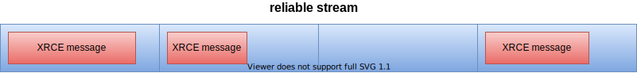
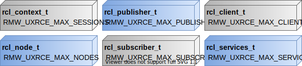

micro-ROS targets microcontroller, devices with low memory resources.
With that in mind, micro-ROS try to address the memory management issue prioritizing the use of static memory instead of dynamic memory and optimizing the memory footprint of the applications. This, of course, has a cost that the users must agree to pay, a precompile tunning.

This tutorial explains which are the memory resources managed by micro-ROS and how to tune them for a particular application.

## Memory resources

micro-ROS deal with two different memory resources related with Micro XRCE-DDS library and its RMW implementation named rmw-microxrcedds.

### Micro XRCE-DDS

Micro XRCE-DDS messages flows between Client and Agent throw **streams**.
A stream represents an independent ordered flow of information, that is, it is a sort of messaging queue.
There are two kinds of streams, **best-effort** and **reliable**.
Both, best-effort and reliable streams, have a raw buffer (`uint8_t` array) associated with them, but the layout is different.

On the one hand, best-effort streams could be interpreted as a single message queue.
Therefore, the raw buffer a single data buffer where only one message is popped/pushed.


On the other hand, reliable streams contains multiple messages which are popped/pushed according to the reliable communication protocol described in the DDS-XRCE specification.
It is achieved splitting the raw buffer into chucks, each one of those could contain a single message.



The size of the best-effort and reliable stream can be set by two sets of CMake flags.

* `UCLIENT_UDP_TRANSPORT_MTU`, `UCLIENT_TCP_TRANSPORT_MTU` and `UCLIENT_SERIAL_TRANSPORT_MTU` (depending of the transport selected): control the size of the best-effort stream buffer which matches with the size of each chunk of the reliable stream.
* `RMW_UXRCE_MAX_HISTORY`: sets the number of slots for the reliable streams.

The size of the stream sets indirectly the maximum message size (MMS) of the micro-ROS application.
This MMS is (`UCLIENT_<XXX>_TRANSPORT_MTU` - 12 B) for best-effort messages and (`UCLIENT_<XXX>_TRANSPORT_MTU` * (`RMW_UXRCE_MAX_HISTORY` - 12 B)) in the case of reliable messages.

The use of best-effort or reliable stream is handled by the `rmw_qos_reliability_policy_t` set in the `rmw_qos_profile_t` for a particular publisher or subscription.
In the case of `RMW_QOS_POLICY_RELIABILITY_BEST_EFFORT` best-effort streams are used and for `RMW_QOS_POLICY_RELIABILITY_RELIABLE` reliable streams.

### rmw-microxrcedds

rmw-microxrcedds uses static memory for allocating the resources associated with the `rcl` and `rclc` entities.
This static memory is managed thanks to independent memory pools for each kind of entity.
The size of these memory pools could be set through CMake flags,
for example, the `RMW_UXRCE_MAX_PUBLISHERS` sets the size of the `rcl_publisher_t`'s pool memory.
It should be noted that the size of these memory pools restricts the maximum number of entities that a micro-ROS application could use.

The figure below summarizes the relation between the `rcl` entities and the CMake flags, which the size of the memory pool associated with such entity.



Another important memory resource managed by the rmw-microxrcedds is the message history.
The rmw-microxrcedds uses static-memory message queue in order to keep the subscription messages before the user read these.
The size of this message queue could be set by the `RMW_UXRCE_MAX_HISTORY`.

It is worth noting that all the afore mentioned CMake flags shall be set in a `.meta` for each platform supported in [micro-ros-build](https://github.com/micro-ROS/micro-ros-build).
For example, the [ping-pong](https://micro-ros.github.io//docs/tutorials/core/first_application_linux/) the host [configuration file](https://github.com/micro-ROS/micro-ros-build/blob/dashing/micro_ros_setup/config/host/generic/client-host-colcon.meta) which can be optimized with the following modifications:

```
{
  "name": {
    "rmw_microxrcedds":{
      "cmake-args":[
        ....
        "-DRMW_UXRCE_MAX_NODES=1",          // 3 --> 1
        "-DRMW_UXRCE_MAX_PUBLISHERS=2",     // 5 --> 2
        "-DRMW_UXRCE_MAX_SUBSCRIPTIONS=2",  // 5 --> 2
        "-DRMW_UXRCE_MAX_SERVICES=0",       // 5 --> 0
        "-DRMW_UXRCE_MAX_CLIENTS=0",        // 5 --> 0
        "-DRMW_UXRCE_STREAM_HISTORY=5",     // 20 --> 5
        "-DRMW_UXRCE_MAX_HISTORY=5",        // 20 --> 5
        ....
      ]
    }
  }
}
```
