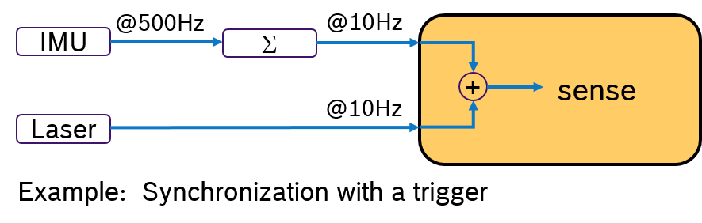
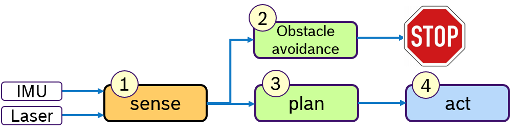

In this tutorial, you'll learn the basics of the micro-ROS C API. The major concepts (publishers, subscriptions, services,timers, ...) are identical with ROS 2. They even rely on the *same* implementation, as the micro-ROS C API is based on the ROS 2 client support library (rcl), enriched with a set of convenience functions by the package [rclc](https://github.com/micro-ROS/rclc/). That is, rclc does not add a new layer of types on top of rcl (like rclcpp and rclpy do) but only provides functions that ease the programming with the rcl types. New types are introduced only for concepts that are missing in rcl, such as the concept of an executor.

* [Creating a node](#node)
* [Publishers and subscriptions](#pub_sub)
* [Services](#services)
* [Timers](#timers)
* [Rclc Executor](#rclc_executor)


## <a name="node"/>Creating a Node

To simplify the creation of a node with rcl, rclc provides two functions `rclc_support_init(..)` and `rclc_node_init_default(..)` in [rclc/init.h](https://github.com/micro-ROS/rclc/blob/master/rclc/include/rclc/init.h) and [rclc/node.h](https://github.com/micro-ROS/rclc/blob/master/rclc/include/rclc/node.h), respectively. The first lines of the main function of a micro-ROS programm are:

```c
rcl_allocator_t allocator = rcl_get_default_allocator();
rclc_support_t support;
rcl_ret_t rc;

rc = rclc_support_init(&support, argc, argv, &allocator);
if (rc != RCL_RET_OK) {
  ...  // Some error reporting.
  return -1;
}

rcl_node_t my_node = rcl_get_zero_initialized_node();
rc = rclc_node_init_default(&my_node, "my_node_name", "my_namespace", &support);
if (rc != RCL_RET_OK) {
  ...  // Some error reporting.
  return -1;
}
```

## <a name="pub_sub"/>Publishers and Subscriptions

Publishers and subscribers are most easily created with the rclc package.

Creating a publisher by `rclc_publisher_init_default(..)` from [rclc/publisher.h](https://github.com/micro-ROS/rclc/blob/master/rclc/include/rclc/publisher.h):

```c
rcl_publisher_t my_pub;
std_msgs__msg__String my_msg;
const char * my_topic = "topic_0";
const rosidl_message_type_support_t * my_type_support = ROSIDL_GET_MSG_TYPE_SUPPORT(std_msgs, msg, String);

rc = rclc_publisher_init_default(&my_pub, &my_node, &my_type_support, &my_topic_name);
if (RCL_RET_OK != rc) {
  printf("Error in rclc_publisher_init_default.\n");
  return -1;
}
```

Initializing a message:

```c
std_msgs__msg__String__init(&pub_msg);
const unsigned int PUB_MSG_SIZE = 20;
char pub_string[PUB_MSG_SIZE];
snprintf(pub_string, 13, "%s", "Hello World!");
rosidl_generator_c__String__assignn(&pub_msg, pub_string, PUB_MSG_SIZE);
```

Creating a subscription by `rclc_subscription_init_default(..)` from [rclc/subscription.h](https://github.com/micro-ROS/rclc/blob/master/rclc/include/rclc/subscription.h):

```c
rcl_subscription_t my_sub = rcl_get_zero_initialized_subscription();
rc = rclc_subscription_init_default(&my_sub, &my_node, &my_type_support, &my_topic_name);
if (rc != RCL_RET_OK) {
  printf("Failed to create subscriber.\n");
  return -1;
}
```

## <a name="services"/>Services

ROS 2 services is another communication mechanism between nodes. Services implement a client-server paradigm based on ROS 2 messages and types. Further information about ROS 2 services can be found [here](https://index.ros.org/doc/ros2/Tutorials/Services/Understanding-ROS2-Services/)

Ready to use code related to this tutorial can be found in [`micro-ROS-demos/rcl/addtwoints_server`](https://github.com/micro-ROS/micro-ROS-demos/blob/dashing/rcl/addtwoints_server/main.c) and [`micro-ROS-demos/rcl/addtwoints_client`](https://github.com/micro-ROS/micro-ROS-demos/blob/dashing/rcl/addtwoints_client/main.c) folders.

Note: Services are not supported in rclc package yet. Therefore the configuration is described using RCL layer.

Starting from a code where RCL is initialized and a micro-ROS node is created, these steps are required in order to generate a service server:

```c
// Creating service server and options
rcl_service_options_t service_options = rcl_service_get_default_options();
rcl_service_t server = rcl_get_zero_initialized_service();

// Initializing service server
rcl_service_init(&server, &node, ROSIDL_GET_SRV_TYPE_SUPPORT(example_interfaces, srv, AddTwoInts), "addtwoints", &service_options);

// Init service server wait set
rcl_wait_set_t wait_set = rcl_get_zero_initialized_wait_set();
rcl_wait_set_init(&wait_set, 0, 0, 0, 0, 1, 0, &context, rcl_get_default_allocator());

```

On the other hand the service client initialization looks like that:

```c
// Creating service client and options
rcl_client_options_t client_options = rcl_client_get_default_options();
rcl_client_t client = rcl_get_zero_initialized_client();

// Initializing service client
rcl_client_init(&client, &node, ROSIDL_GET_SRV_TYPE_SUPPORT(example_interfaces, srv, AddTwoInts), "addtwoints", &client_options)

// Init service client wait set
rcl_wait_set_t wait_set = rcl_get_zero_initialized_wait_set();
rcl_wait_set_init(&wait_set, 0, 0, 0, 1, 0, 0, &context, rcl_get_default_allocator());
```

First of all, by looking at `AddTwoInts.srv` type definition it is possible to determine request and reply elements of the service. Service client will make a request with two integers and service server should send its sum as a response.

```
int64 a
int64 b
---
int64 sum
```

Once service client and server are configured, service client can perform a request and wait for reply:

```c
// Creating a service request
int64_t seq;
example_interfaces__srv__AddTwoInts_Request req;
req.a = 24;
req.b = 42;

// Sending the request
rcl_send_request(&client, &req, &seq)
printf("Send service request %d + %d. Seq %ld\n",(int)req.a, (int)req.b, (int)seq);

// Wait for response
bool done = false;
do {
    rcl_wait_set_clear(&wait_set);

    size_t index;
    rcl_wait_set_add_client(&wait_set, &client, &index);

    rcl_wait(&wait_set, RCL_MS_TO_NS(1));

    // If wait set client element is not null, response is ready
    if (wait_set.clients[index]) {   
        rmw_request_id_t req_id;

        // Create a service response struct
        example_interfaces__srv__AddTwoInts_Response res;

        // Take the response
        rcl_ret_t rc = rcl_take_response(&client, &req_id, &res);

        if (RCL_RET_OK == rc) {
            printf("Received service response %d + %d = %d. Seq %d\n",(int)req.a, (int)req.b, (int)res.sum,req_id.sequence_number);
            done = true;
        }
    }
} while ( !done );
```

On service server side, the ROS 2 node should be waiting for service requests and generate service replies:

```c
while(1){
    rcl_wait_set_clear(&wait_set);

    size_t index;
    rcl_wait_set_add_service(&wait_set, &service, &index);

    rcl_wait(&wait_set, RCL_MS_TO_NS(1));

    // If wait set service element is not null, request is ready
    if (wait_set.services[index]) {   
        rmw_request_id_t req_id;

        // Create a service request struct
        example_interfaces__srv__AddTwoInts_Request req;

        // Take the request
        rcl_take_request(&service, &req_id, &req);

        printf("Service request value: %d + %d. Seq %d\n", (int)req.a, (int)req.b, (int)req_id.sequence_number);

        // Create a service response, fill the result and send it
        example_interfaces__srv__AddTwoInts_Response res;
        res.sum = req.a + req.b;
        rcl_send_response(&service, &req_id,&res);
    }
}
```


## <a name="timers"/>Timers
A timer can be created with the rclc-package with the function
`rclc_timer_init_default(..)` in [rclc/timer.h](https://github.com/micro-ROS/rclc/blob/master/rclc/include/rclc/timer.h):
```c
// create a timer, which will call the publisher with period=`timer_timeout` ms in the 'my_timer_callback'
rcl_timer_t my_timer = rcl_get_zero_initialized_timer();
const unsigned int timer_timeout = 1000;
rc = rclc_timer_init_default(&my_timer, &support, RCL_MS_TO_NS(timer_timeout), my_timer_callback);
if (rc != RCL_RET_OK) {
  printf("Error in rcl_timer_init_default.\n");
  return -1;
} else {
  printf("Created timer with timeout %d ms.\n", timer_timeout);
}
```

## <a name="rclc_executor"/>RCLC Executor
The rclc Executor provides an C-API to manage the execution of communication objects, like subscriptions and timers, like the rclcpp Executor for C++. Due to the complex semantics of the rclcpp Executor, it is difficult to reason about end-to-end latencies and to give real-time guarantees. To improve determinism, the rclc Executor provides also some additional features. But first, we are providing as simple example how to setup the rclc Executor with one subscription and one timer.

### Example 1: 'Hello World'
To start with, we provide a very simple example for an rclc Executor with one timer and one subscription, so to say, a 'Hello world' example.

The 'Hello world' example consists of a publisher, sending a 'hello world' message to a subscriber, which then prints out the received message on the console.

First, you include some header files, in particular the [rclc/rclc.h](https://github.com/micro-ROS/rclc/blob/master/rclc/include/rclc/rclc.h) and [rclc/executor.h](https://github.com/micro-ROS/rclc/blob/master/rclc/include/rclc/executor.h).

```c
#include <stdio.h>
#include <std_msgs/msg/string.h>
#include <rclc/rclc.h>
#include <rclc/executor.h>
```

We define a publisher and two strings, which will be used later.
```c
rcl_publisher_t my_pub;
std_msgs__msg__String pub_msg;
std_msgs__msg__String sub_msg;
```
The subscription callback casts the message parameter `msgin` to an equivalent type of `std_msgs::msg::String` in C and prints out the received message.

```C
void my_subscriber_callback(const void * msgin)
{
  const std_msgs__msg__String * msg = (const std_msgs__msg__String *)msgin;
  if (msg == NULL) {
    printf("Callback: msg NULL\n");
  } else {
    printf("Callback: I heard: %s\n", msg->data.data);
  }
}
```
The timer callback publishes the message `pub_msg` with the publisher `my_pub`, which is initialized later in `main()`.

```C
void my_timer_callback(rcl_timer_t * timer, int64_t last_call_time)
{
  rcl_ret_t rc;
  UNUSED(last_call_time);
  if (timer != NULL) {
    rc = rcl_publish(&my_pub, &pub_msg, NULL);
    if (rc == RCL_RET_OK) {
      printf("Published message %s\n", pub_msg.data.data);
    } else {
      printf("timer_callback: Error publishing message %s\n", pub_msg.data.data);
    }
  } else {
    printf("timer_callback Error: timer parameter is NULL\n");
  }
}
```
First, some initialization for ROS 2 is necessary to create later rcl objects. That is an `allocator` for dynamic memory allocation, and a `support` object, which contains some rcl-objects simplifying the initialization of an rcl-node, an rcl-subscription, an rcl-timer and an rclc executor.
```C
int main(int argc, const char * argv[])
{
  rcl_allocator_t allocator = rcl_get_default_allocator();
  rclc_support_t support;
  rcl_ret_t rc;

  // create init_options
  rc = rclc_support_init(&support, argc, argv, &allocator);
  if (rc != RCL_RET_OK) {
    printf("Error rclc_support_init.\n");
    return -1;
  }
```

Next, you define a ROS 2 node `my_node` with `rcl_get_zero_initialized_node()` and initialize it with `rclc_executor_init_default()`:
```C
  // create rcl_node
  rcl_node_t my_node = rcl_get_zero_initialized_node();
  rc = rclc_node_init_default(&my_node, "node_0", "executor_examples", &support);
  if (rc != RCL_RET_OK) {
    printf("Error in rclc_node_init_default\n");
    return -1;
  }
```
You can create a publisher to publish topic 'topic_0' with type std_msg::msg::String with the following code:
```C
const char * topic_name = "topic_0";
const rosidl_message_type_support_t * my_type_support =
  ROSIDL_GET_MSG_TYPE_SUPPORT(std_msgs, msg, String);

rc = rclc_publisher_init_default(&my_pub, &my_node, my_type_support, topic_name);
if (RCL_RET_OK != rc) {
  printf("Error in rclc_publisher_init_default %s.\n", topic_name);
  return -1;
}
```
Note, that variable `my_pub` was defined globally, so it can be used by the timer callback.

You can create a timer `my_timer` with a period of one second which will execute the callback `my_timer_callback` like this:
```C
  rcl_timer_t my_timer = rcl_get_zero_initialized_timer();
  const unsigned int timer_timeout = 1000; // in ms
  rc = rclc_timer_init_default(&my_timer, &support, RCL_MS_TO_NS(timer_timeout), my_timer_callback);
  if (rc != RCL_RET_OK) {
    printf("Error in rcl_timer_init_default.\n");
    return -1;
  } else {
    printf("Created timer with timeout %d ms.\n", timer_timeout);
  }
```
The string `Hello World!` can be assigned directly to the message of the publisher `pub_msg.data`. First the publisher message is initialized with `std_msgs__msg__String__init`. Then you need to allocate memory for `pub_msg.data.data`, set the maximum capacity `pub_msg.data.capacity` and set the length of the message `pub_msg.data.size` accordingly. You can assign the content of the message with `snprintf` of `pub_msg.data.data`.
```C
  // assign message to publisher
  std_msgs__msg__String__init(&pub_msg);
  const unsigned int PUB_MSG_CAPACITY = 20;
  pub_msg.data.data = malloc(PUB_MSG_CAPACITY);
  pub_msg.data.capacity = PUB_MSG_CAPACITY;
  snprintf(pub_msg.data.data, pub_msg.data.capacity, "Hello World!");
  pub_msg.data.size = strlen(pub_msg.data.data);
```

A subscription `my_sub`can be defined like this:
```C
  rcl_subscription_t my_sub = rcl_get_zero_initialized_subscription();
  rc = rclc_subscription_init_default(&my_sub, &my_node, my_type_support, topic_name);
  if (rc != RCL_RET_OK) {
    printf("Failed to create subscriber %s.\n", topic_name);
    return -1;
  } else {
    printf("Created subscriber %s:\n", topic_name);
  }
```
The global messsage for this subscription `sub_msg` needs to be initialized with:
```C
  std_msgs__msg__String__init(&sub_msg);
```

Now, all preliminary steps are done, and you can define and initialized the rclc executor with:
```c
  rclc_executor_t executor;
  executor = rclc_executor_get_zero_initialized_executor();
```
In the next step, executor is initialized with the ROS 2 `context`, the number of communication objects `num_handles` and an `allocator`. The number of communication objects defines the total number of times and subscriptions, the executor shall manage. In this example, the executor will be setup with one timer and one subscription.

```C
  // total number of handles = #subscriptions + #timers
  unsigned int num_handles = 1 + 1;
  rclc_executor_init(&executor, &support.context, num_handles, &allocator);
```

Now, you can add a subscription with the function `rclc_c_executor_add_subscription` with the previously defined subscription `my_sub`, its message `sub_msg`and its callback `my_subscriber_callback`:

```C
rc = rclc_executor_add_subscription(&executor, &my_sub, &sub_msg, &my_subscriber_callback, ON_NEW_DATA);
if (rc != RCL_RET_OK) {
  printf("Error in rclc_executor_add_subscription. \n");
}
```
The option `ON_NEW_DATA` selects the execution semantics of the spin-method. In this example, the callback of the subscription `my_sub`is only called if new data is available.

Note: Another execution semantics is `ALWAYS`, which means, that the subscription callback is always executed when the spin-method of the executor is called. This option might be useful in cases in which the callback shall be executed at a fixed rate irrespective of new data is available or not. If you choose this option, then the callback will be executed with message argument `NULL`, if no new data is available. Therefore you need to make sure, that your callback can also accept `NULL` as message argument.


Likewise, you can add the timer `my_timer` with the function `rclc_c_executor_add_timer`:
```c
rclc_executor_add_timer(&executor, &my_timer);
if (rc != RCL_RET_OK) {
  printf("Error in rclc_executor_add_timer.\n");
}
```
A key feature of the rclc-Executor is, that the order of these `rclc-executor-add-* `-functions matters. It defines static processing order of the callbacks when the spin-function is called.

In this example, if the timer is ready and also a new message for the subscription is available, then the timer is executed first and then the subscription. Such a behavior cannot be defined currently with the rclcpp Executor.

The easiest way to run the Executor is to call `rclc_executor_spin()`:
```C
  rclc_executor_spin(&executor);
```
This function runs forever without coming back. In this example we want to publish the message only ten times. Therefore we are using another spin-method `rclc_executor_spin_some`, which spins once and returns. The timeout for waiting for new messages is one second
```C
for (unsigned int i = 0; i < 10; i++) {
  // timeout specified in nanoseconds (here 1s)
  rclc_executor_spin_some(&executor, 1000 * (1000 * 1000));
}
```

At the end, you need to free dynamically allocated memory:

```C   
  // clean up
  rc = rclc_executor_fini(&executor);
  rc += rcl_publisher_fini(&my_pub, &my_node);
  rc += rcl_timer_fini(&my_timer);
  rc += rcl_subscription_fini(&my_sub, &my_node);
  rc += rcl_node_fini(&my_node);
  rc += rclc_support_fini(&support);
  std_msgs__msg__String__fini(&pub_msg);
  std_msgs__msg__String__fini(&sub_msg);

  if (rc != RCL_RET_OK) {
    printf("Error while cleaning up!\n");
    return -1;
  }
return 0;
} // main
```

This completes the example. The source code can be found in [rclc-examples/example_executor_convenience.c](https://github.com/micro-ROS/rclc-examples/example_executor_convenience.c).

#### Example 2: Triggered rclc_executor

rclc_example_trigger

The source code can be found in [rclc-examples/example_executor_trigger.c](https://github.com/micro-ROS/rclc-examples/example_executor_trigger.c).


#### Example 2: Sense-plan-act pipeline in mobile robotics

A common design paradigm in mobile robotics is a control loop, consisting of several phases: A sensing phase to aquire sensor data, a plan phase for localization and path planning and an actuation-phase to steer the mobile robot. Of course, more phases are possible, here these three phases shall serve as an example.
Such a processing pipeline is shown in Figure 1.


Figure 1: Multiple sensors driving a Sense-Plan-Act pipeline.

Typically multiple sensors are used to perceive the environment.
For example an IMU and a laser scanner.
The quality of localization algorithms highly depend on how old such sensor data is when it is processed.
Ideally the latest data of all sensors should be processed.
One way to achieve this is to execute first all sensor drivers in the sense-phase and then process all algorithms in the plan-phase.

For this sense-plan-act pattern, we can define one rclc executor for each phase.
The plan-phase would be triggered only when all callbacks in the sense-phase have finished.

In this example we want to realise a sense-plan-act pipeline in a single thread. The trigger condition is demonstrated by activating the sense-phase when both data for the Laser and IMU are available. We define  one Laser subscription `sense_Laser` and one for IMU subscription `sense_IMU`. Forthermore, one for each phase: `plan` and `act`. Three executors are necessary `exe_sense`, `exe_plan` and `exe_act`. The configuration of the subscriptions and the definitions of the corresponding callbacks are omitted.

```C
rcl_subscription_t sense_Laser, sense_IMU, plan, act;
rclc_executor_t exe_sense, exe_plan, exe_act;
exe_sense = rclc_get_zero_initialized_executor();
exe_plan = rclc_get_zero_initialized_executor();
exe_act = rclc_get_zero_initialized_executor();
```
The executor `exe_sense` executes the two handles `sense_Laser` and `sense_IMU`, while the other two executors only one handle, the `plan` and the `act` subscription, respectivly:

```C
rclc_executor_init(&exe_sense, &context, 2, ...);
rclc_executor_init(&exe_plan, &context, 1, ...);
rclc_executor_init(&exe_act, &context, 1, ...);
```
The two sensor acquisition callbacks `sense_Laser` and `sense_IMU` are registered in the executor `exe_sense`. The trigger condition `rclc_executor_trigger_all` is set to activate the sense-phase only if new data for both callbacks is available.

```C
// executor for sense-phase
rclc_executor_add_subscription(&exe_sense, &sense_Laser, &my_sub_cb1, ON_NEW_DATA);
rclc_executor_add_subscription(&exe_sense, &sense_IMU, &my_sub_cb2, ON_NEW_DATA);
rclc_executor_set_trigger(&exe_sense, rclc_executor_trigger_all, NULL);
```
The `plan` subscription is configured in the executor `exe-plan`, and likewise the `act` subscription in the executor `exe_act`:
```C
// executor for plan-phase
rclc_executor_add_subscription(&exe_plan, &plan, &my_sub_cb3, ON_NEW_DATA);
// executor for act-phase
rclc_executor_add_subscription(&exe_act, &act, &my_sub_cb4, ON_NEW_DATA);
```


Finally all three Executors are spinning using a `while`-loop and the `spin_some` function with a rcl-wait timeout of one second (parameter of the timeout is in nanoseconds).

```C
// spin all executors
while (true) {
  rclc_executor_spin_some(&exe_sense, 1000000000);
  rclc_executor_spin_some(&exe_plan, 1000000000);
  rclc_executor_spin_some(&exe_act, 1000000000);
}
```
#### Example 3: Synchronization input data with multiple rates

Often multiple sensors are being used to sense the environment for mobile robotics.
While an IMU sensor provides data samples at a very high rate (e.g. 500 Hz), laser scans are available at a much slower frequency (e.g. 10Hz) determined by the revolution time.
Then the challenge is, how to deterministically fuse sensor data with different frequencies. This problem is depicted in Figure 2.


Figure 2: How to deterministically process multi-frequent sensor data.

Due to scheduling effects, the callback for evaluating the laser scan might be called just before or just after an IMU data is received.
One way to tackle this is to write additional synchronization code inside the application.
Obviously, this is a cumbersome and not-portable solution.

##### Synchronizing by data frequency
An Alternative would be to evaluate the IMU sample and the laser scan by synchronizing their frequency.
For example by processing always 50 IMU samples with one laser scan. This approach is shown in Figure 3.
A pre-processing callback aggregates the IMU samples and sends an aggregated message with 50 samples at 10Hz rate.
Now both messages have the same frequency.
With a trigger condition, which fires when both messages are available, the sensor fusion algorithm can expect always synchronized input data.



Figure 3: Synchronization of multiple input data with a trigger.

This sensor fusion synchronizing approach is shown below.
```C
...
rcl_subscription_t aggr_IMU, sense_Laser, sense_IMU;
rcle_let_executor_t exe_aggr, exe_sense;
// initialize executors
rclc_executor_init(&exe_aggr, &context, 1, ...);
rclc_executor_init(&exe_sense, &context, 2, ...);
// executor for aggregate IMU data
rclc_executor_add_subscription(&exe_aggr, &aggr_IMU, &my_sub_cb1, ON_NEW_DATA);
// executor for sense-phase
rclc_executor_add_subscription(&exe_sense, &sense_Laser, &my_sub_cb2, ON_NEW_DATA);
rclc_executor_add_subscription(&exe_sense, &sense_IMU, &my_sub_cb3, ON_NEW_DATA);
rclc_executor_set_trigger(&exe_sense, rclc_executor_trigger_all, NULL);

// spin all executors
while (true) {
  rclc_executor_spin_some(&exe_aggr);
  rclc_executor_spin_some(&exe_sense);
}
```
#### Example 3: Synchronization by activly requesting data

Another idea would be to actively request for IMU data only when a laser scan is received.
This concept is shown in Figure 4.
Upon arrival of a laser scan message, first, a message with aggregated IMU samples is requested.
Then, the laser scan is processed and later the sensor fusion algorithm.
An Executor, which would support sequential execution of callbacks, could realize this idea.


Figure 4: Synchronization with sequential processing.

The setup for the sensor fusion using sequential execution is shown below.
Note, that the sequential order is `sense_IMU`, which will request the aggregated IMU message, and then `sense_Laser` while the trigger will fire, when a laser message is received.

```C
...
rcl_subscription_t sense_Laser, sense_IMU;
rcle_let_executor_t exe_sense;
// initialize executor
rclc_executor_init(&exe_sense, &context, 2, ...);
// executor for sense-phase
rclc_executor_add_subscription(&exe_sense, &sense_IMU, &my_sub_cb1, ALWAYS);
rclc_executor_add_subscription(&exe_sense, &sense_Laser, &my_sub_cb2, ON_NEW_DATA);
rclc_executor_set_trigger(&exe_sense, rclc_executor_trigger_one, &sense_Laser);
// spin
rclc_executor_spin(&exe_sense);
```
#### Example 4: high-priority processing path

Often a robot has to fullfill several activities at the same time. For example following a path and avoiding obstacles.
While path following is a permanent activity, obstacle avoidance is triggered by the environment and should be immediately reacted upon.
Therefore one would like to specify priorities to activities. This is depicted in Figure 5:



Figure 5: Managing high priority path with sequential order.

Assuming a simplified control loop with the activities sense-plan-act, the obstacle avoidance, which might temporarily stop the robot, should be processed before the planning phase. In this example we assume that these activities are processed in one thread.

The following code-snippet shows the sequential processing order to execute the obstacle avoidance `obst_avoid` with a higher priority then the 'plan' phase.
The control loop is started when a laser message is received.
Then an aggregated IMU message is requested, like in the example above.
Then all the other callbacks are always executed. This assumes that these callbacks communicate via a global data structure.
Race conditions cannot occur, because all callbacks all in a single thread.

```C
...
rcl_subscription_t sense_Laser, sense_IMU, plan, act, obst_avoid;
rcle_let_executor_t exe;
// initialize executors
rclc_executor_init(&exe, &context, 5, ...);
// define processing order
rclc_executor_add_subscription(&exe, &sense_IMU, &my_sub_cb1, ALWAYS);
rclc_executor_add_subscription(&exe, &sense_Laser, &my_sub_cb2, ON_NEW_DATA);
rclc_executor_add_subscription(&exe, &obst_avoid, &my_sub_cb3, ALWAYS);
rclc_executor_add_subscription(&exe, &plan, &my_sub_cb4, ALWAYS);
rclc_executor_add_subscription(&exe, &act, &my_sub_cb5, ALWAYS);
rclc_executor_set_trigger(&exe, rclc_executor_trigger_one, &sense_Laser);
// spin
rclc_executor_spin(&exe);
```
