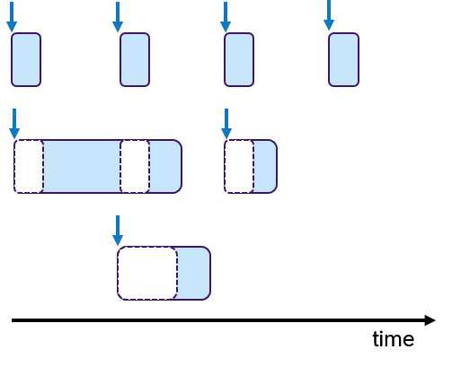

In this tutorial, you'll learn the basics of the micro-ROS C API. The major concepts (publishers, subscriptions, services,timers, ...) are identical with ROS 2. They even rely on the *same* implementation, as the micro-ROS C API is based on the ROS 2 client support library (rcl), enriched with a set of convenience functions by the package [rclc](https://github.com/micro-ROS/rclc/). That is, rclc does not add a new layer of types on top of rcl (like rclcpp and rclpy do) but only provides functions that ease the programming with the rcl types. New types are introduced only for concepts that are missing in rcl, such as the concept of an executor.

* [Creating a node](#node)
* [Publishers and subscriptions](#pub_sub)
* [Services](#services)
* [Timers](#timers)
* [Rclc Executor](#rclc_executor)


## <a name="node"/>Creating a Node

To simplify the creation of a node with rcl, rclc provides two functions `rclc_support_init(..)` and `rclc_node_init_default(..)` in [rclc/init.h](https://github.com/micro-ROS/rclc/blob/master/rclc/include/rclc/init.h) and [rclc/node.h](https://github.com/micro-ROS/rclc/blob/master/rclc/include/rclc/node.h), respectively. The first lines of the main function of a micro-ROS programm are:

```c
rcl_allocator_t allocator = rcl_get_default_allocator();
rclc_support_t support;
rcl_ret_t rc;

rc = rclc_support_init(&support, argc, argv, &allocator);
if (rc != RCL_RET_OK) {
  ...  // Some error reporting.
  return -1;
}

rcl_node_t my_node = rcl_get_zero_initialized_node();
rc = rclc_node_init_default(&my_node, "my_node_name", "my_namespace", &support);
if (rc != RCL_RET_OK) {
  ...  // Some error reporting.
  return -1;
}
```

## <a name="pub_sub"/>Publishers and Subscriptions

Publishers and subscribers are most easily created with the rclc package.

Creating a publisher by `rclc_publisher_init_default(..)` from [rclc/publisher.h](https://github.com/micro-ROS/rclc/blob/master/rclc/include/rclc/publisher.h):

```c
rcl_publisher_t my_pub;
std_msgs__msg__String my_msg;
const char * my_topic = "topic_0";
const rosidl_message_type_support_t * my_type_support = ROSIDL_GET_MSG_TYPE_SUPPORT(std_msgs, msg, String);

rc = rclc_publisher_init_default(&my_pub, &my_node, &my_type_support, &my_topic_name);
if (RCL_RET_OK != rc) {
  printf("Error in rclc_publisher_init_default.\n");
  return -1;
}
```

Initializing a message:

```c
std_msgs__msg__String__init(&pub_msg);
const unsigned int PUB_MSG_SIZE = 20;
char pub_string[PUB_MSG_SIZE];
snprintf(pub_string, 13, "%s", "Hello World!");
rosidl_generator_c__String__assignn(&pub_msg, pub_string, PUB_MSG_SIZE);
```

Creating a subscription by `rclc_subscription_init_default(..)` from [rclc/subscription.h](https://github.com/micro-ROS/rclc/blob/master/rclc/include/rclc/subscription.h):

```c
rcl_subscription_t my_sub = rcl_get_zero_initialized_subscription();
rc = rclc_subscription_init_default(&my_sub, &my_node, &my_type_support, &my_topic_name);
if (rc != RCL_RET_OK) {
  printf("Failed to create subscriber.\n");
  return -1;
}
```

## <a name="services"/>Services

ROS 2 services is another communication mechanism between nodes. Services implement a client-server paradigm based on ROS 2 messages and types. Further information about ROS 2 services can be found [here](https://index.ros.org/doc/ros2/Tutorials/Services/Understanding-ROS2-Services/)

Ready to use code related to this tutorial can be found in [`micro-ROS-demos/rcl/addtwoints_server`](https://github.com/micro-ROS/micro-ROS-demos/blob/dashing/rcl/addtwoints_server/main.c) and [`micro-ROS-demos/rcl/addtwoints_client`](https://github.com/micro-ROS/micro-ROS-demos/blob/dashing/rcl/addtwoints_client/main.c) folders.

Note: Services are not supported in rclc package yet. Therefore the configuration is described using RCL layer.

Starting from a code where RCL is initialized and a micro-ROS node is created, these steps are required in order to generate a service server:

```c
// Creating service server and options
rcl_service_options_t service_options = rcl_service_get_default_options();
rcl_service_t server = rcl_get_zero_initialized_service();

// Initializing service server
rcl_service_init(&server, &node, ROSIDL_GET_SRV_TYPE_SUPPORT(example_interfaces, srv, AddTwoInts), "addtwoints", &service_options);

// Init service server wait set
rcl_wait_set_t wait_set = rcl_get_zero_initialized_wait_set();
rcl_wait_set_init(&wait_set, 0, 0, 0, 0, 1, 0, &context, rcl_get_default_allocator());

```

On the other hand the service client initialization looks like that:

```c
// Creating service client and options
rcl_client_options_t client_options = rcl_client_get_default_options();
rcl_client_t client = rcl_get_zero_initialized_client();

// Initializing service client
rcl_client_init(&client, &node, ROSIDL_GET_SRV_TYPE_SUPPORT(example_interfaces, srv, AddTwoInts), "addtwoints", &client_options)

// Init service client wait set
rcl_wait_set_t wait_set = rcl_get_zero_initialized_wait_set();
rcl_wait_set_init(&wait_set, 0, 0, 0, 1, 0, 0, &context, rcl_get_default_allocator());
```

First of all, by looking at `AddTwoInts.srv` type definition it is possible to determine request and reply elements of the service. Service client will make a request with two integers and service server should send its sum as a response.

```
int64 a
int64 b
---
int64 sum
```

Once service client and server are configured, service client can perform a request and wait for reply:

```c
// Creating a service request
int64_t seq;
example_interfaces__srv__AddTwoInts_Request req;
req.a = 24;
req.b = 42;

// Sending the request
rcl_send_request(&client, &req, &seq)
printf("Send service request %d + %d. Seq %ld\n",(int)req.a, (int)req.b, (int)seq);

// Wait for response
bool done = false;
do {
    rcl_wait_set_clear(&wait_set);

    size_t index;
    rcl_wait_set_add_client(&wait_set, &client, &index);

    rcl_wait(&wait_set, RCL_MS_TO_NS(1));

    // If wait set client element is not null, response is ready
    if (wait_set.clients[index]) {   
        rmw_request_id_t req_id;

        // Create a service response struct
        example_interfaces__srv__AddTwoInts_Response res;

        // Take the response
        rcl_ret_t rc = rcl_take_response(&client, &req_id, &res);

        if (RCL_RET_OK == rc) {
            printf("Received service response %d + %d = %d. Seq %d\n",(int)req.a, (int)req.b, (int)res.sum,req_id.sequence_number);
            done = true;
        }
    }
} while ( !done );
```

On service server side, the ROS 2 node should be waiting for service requests and generate service replies:

```c
while(1){
    rcl_wait_set_clear(&wait_set);

    size_t index;
    rcl_wait_set_add_service(&wait_set, &service, &index);

    rcl_wait(&wait_set, RCL_MS_TO_NS(1));

    // If wait set service element is not null, request is ready
    if (wait_set.services[index]) {   
        rmw_request_id_t req_id;

        // Create a service request struct
        example_interfaces__srv__AddTwoInts_Request req;

        // Take the request
        rcl_take_request(&service, &req_id, &req);

        printf("Service request value: %d + %d. Seq %d\n", (int)req.a, (int)req.b, (int)req_id.sequence_number);

        // Create a service response, fill the result and send it
        example_interfaces__srv__AddTwoInts_Response res;
        res.sum = req.a + req.b;
        rcl_send_response(&service, &req_id,&res);
    }
}
```


## <a name="timers"/>Timers
A timer can be created with the rclc-package with the function
`rclc_timer_init_default(..)` in [rclc/timer.h](https://github.com/micro-ROS/rclc/blob/master/rclc/include/rclc/timer.h):
```c
// create a timer, which will call the publisher with period=`timer_timeout` ms in the 'my_timer_callback'
rcl_timer_t my_timer = rcl_get_zero_initialized_timer();
const unsigned int timer_timeout = 1000;
rc = rclc_timer_init_default(&my_timer, &support, RCL_MS_TO_NS(timer_timeout), my_timer_callback);
if (rc != RCL_RET_OK) {
  printf("Error in rcl_timer_init_default.\n");
  return -1;
} else {
  printf("Created timer with timeout %d ms.\n", timer_timeout);
}
```

## <a name="rclc_executor"/>RCLC Executor

The rclc Executor provides an C-API to manage the execution of communication objects, like subscriptions and timers, like the rclcpp Executor for C++.
Due to the complex semantics of the rclcpp Executor, it is difficult to reason about end-to-end latencies and to give real-time guarantees.
To resolve these issues, the rclc Executor provides additional features for deterministic execution.

### Minimal setup
This example demonstrates a minimal setup of the rclc Executor.

First, you include the header files [rclc/rclc.h](https://github.com/micro-ROS/rclc/blob/master/rclc/include/rclc/rclc.h). and [rclc/executor.h](https://github.com/micro-ROS/rclc/blob/master/rclc/include/rclc/executor.h).. After defining the `executor` you need to call the function `rclc_executor_get_zero_initialized_executor()` which returns a properly zero-initialized executor object.

```c
#include<rclc/rclc.h>
#include<rclc/executor.h>

main(int argc, const char * argv[]) {
  rclc_executor_t executor;
  executor = rclc_executor_get_zero_initialized_executor();
```
In the next step, executor is initialized with the RCL `context`, the number of communication objects `num_handles` and an `allocator`. The number of communication objects defines the total number of times and subscriptions, the executor shall manage. In this example, the executor will be setup with one timer and one subscription.

The `context` can be created with the convenience function `rclc_support_init()`, which creates a `support` variable of the type `rclc_support_t`, containing also other rcl objects necessary for the executor. To dynamically create memory, the `rclc_support_init()` function also needs an `allocator`, which is defined first.

```c

  rcl_allocator_t allocator = rcl_get_default_allocator();
  rclc_support_t support;
  rcl_ret_t rc;

  // create init_options
  rc = rclc_support_init(&support, argc, argv, &allocator);
  if (rc != RCL_RET_OK) {
    printf("Error rclc_support_init.\n");
    return -1;
  }

  // compute total number of subsribers and timers
  unsigned int num_handles = 1 + 1;
  rclc_executor_init(&executor, &support.context, num_handles, &allocator);
```

To add a subscription the function `rclc_c_executor_add_subscription` is used. Assuming you have created a susbscription `my_sub` with its message `sub_msg`and its callback `my_subscriber_callback`, the code looks like this:

continue Here

 and a timer `my_timer`, as described above, the following code snippet shows the configuration for the executor:

```c
// add subscription to executor
rc = rclc_executor_add_subscription(&executor, &my_sub, &sub_msg, &my_subscriber_callback,
    ON_NEW_DATA);
if (rc != RCL_RET_OK) {
  printf("Error in rclc_executor_add_subscription. \n");
}

rclc_executor_add_timer(&executor, &my_timer);
if (rc != RCL_RET_OK) {
  printf("Error in rclc_executor_add_timer.\n");
}
```

```c
  // set timeout for rcl_wait()
  unsigned int rcl_wait_timeout = 1000;   // in ms
  rc = rclc_executor_set_timeout(&executor, RCL_MS_TO_NS(rcl_wait_timeout));
  if (rc != RCL_RET_OK) {
    printf("Error in rclc_executor_set_timeout.");
  }
  ```


  A key feature of the rclc-Executor is, that the order of these functions to add handles matters. It defines the processing order when multiple messages have arrived or timers are ready. This provides full control over the execution order to the user.

  There are are several functions, how to start the executor, one is `rclc_executor_spin_some(...)`, which allows the user to specify a timeout in nanoseconds.

  Finally the code snippet shows how to destroy the objects for the node, publisher, subscriber and the executor with the respective fini-methods.

  ```c


    for (;;) {
      // timeout specified in ns (here 1s)
      rclc_executor_spin_some(&executor, 1000 * (1000 * 1000));
    }

    // clean up
    rc = rclc_executor_fini(&executor);
    rc += rcl_publisher_fini(&my_pub, &my_node);
    rc += rcl_timer_fini(&my_timer);
    rc += rcl_subscription_fini(&my_sub, &my_node);
    rc += rcl_node_fini(&my_node);
    rc += rclc_support_fini(&support);

    if (rc != RCL_RET_OK) {
      printf("Error while cleaning up!\n");
      return -1;
    }
  ```

### rclc Executor Features
The rclc Executor is a ROS 2 Executor implemented based on and for the rcl API, for applications written in the C language.
Often embedded applications require real-time to guarantee end-to-end latencies and need to ensure deterministic runtime behavior. However, this is difficult to obtain with the default ROS 2 Executor because of its complex semantics.

The rclc Executor has the following main features:
- user-defined sequential execution of callbacks
- trigger condition to activate processing
- data synchronization: LET-semantics or rclcpp Executor semantics

#### Sequential execution

- At configuration, the user defines the order of handles.
- At configuration, the user defines, whether the handle shall be called only when new data is available (ON_NEW_DATA) or whether the callback shall always be called (ALWAYS).
- At runtime, all handles are processed in the user-defined order:
  - if the configuration of handle is ON_NEW_DATA, then the corresponding callback is only called if new data is available
  - if the configuration of the handle is ALWAYS, then the corresponding callback is always executed.
    In case, no data is available from DDS, then the callback is called with no data (e.g. NULL pointer).

#### Trigger condition

- Given a set of handles, a trigger condition based on the input data of these handles shall decide when the processing is started.

- Available options:
  - ALL operation: fires when input data is available for all handles
  - ANY operation: fires when input data is available for at least one handle
  - ONE: fires when input data for a user-specified handle is available
  - User-defined function: user can implement more sophisticated logic

#### LET-Semantics
- Assumption: time-triggered system, the executor is activated periodically
- When the trigger fires, reads all input data and makes a local copy
- Processes all callbacks in sequential order
- Write output data at the end of the executor's period (Note: this is not implemented yet)

Additionally, the current rclcpp Executor semantics (RCLCPP) is implemented:
- waiting for new data for all handles (rcl_wait)
- using trigger condition ANY
- if trigger fires, start processing handles in pre-defined sequential order
- request from DDS-queue the new data just before the handle is executed (rcl_take)

The selection of the LET semantics is optional. The default semantics is RCLCPP.
### rclc Executor API

The API of the RCLC-Executor can be divided in several phases: Configuration, Running and Clean-Up.

#### Configuration phase

During the configuration phase, the user shall define:
- the total number of callbacks
- trigger condition (optional; default: ANY)
- data communcation semantics (optional; default RCLCPP)
- the processing sequence of the callbacks

The following functions are supported for this configuration:

**rclc_executor_t * rclc_get_zero_initialized_executor()**

Returns a zero initialized executor object.

**rclc_executor_init(rclc_executor_t * executor, rcl_context_t * context, const size_t number_of_handles, const rcl_allocator_t * allocator)**

As the Executor is intended for embedded controllers, dynamic memory management is crucial.
Therefore at initialization of the RCLC-Executor, the user defines the total number of handles `number_of_handles`.
The necessary dynamic memory will be allocated only in this phase and no more memory in the running phase.
This makes this Executor static in the sense, that during runtime no additional callbacks can be added.
The `context` is the RCL context, and `allocator` points to a memory allocator.

**rclc_executor_set_timeout(rclc_executor_t * executor, const uint64_t timeout_ns)**

The timeout in nano-seconds `timeout_ns`for waiting for new data from the DDS-queue is specified in `rclc_executor_set_timeout()` (this is the timeout parameter for `rcl_wait()`).

**rclc_executor_set_semantics(rclc_executor_t * executor, rclc_executor_semantics_t semantics)**

The data communication `semantics` can either be `RCLCPP`(default) or `LET`.

To be compatible with ROS 2 rclcpp Executor, the existing rclcpp semantics is implemented with the option `RCLCPP`.
That is, with the spin-function the DDS-queue is constantly monitored for new data (rcl_wait).
If new data becomes available, then it is fetched from DDS (rcl_take) immediately before the callback is executed.
All callbacks are processed in the user-defined order, this is the only difference to the rclcpp Executor, in which the order can not be defined by the user.

The `LET` semantics is implemented such that at the beginning of processing all available data is fetched (rcl_take) and buffered and then the callbacks are processed in the pre-defined operating on the buffered copy.

**rclc_executor_set_trigger(rclc_executor_t * executor, rclc_executor_trigger_t trigger_function, void * trigger_object)**

The trigger condition `rclc_executor_set_trigger` defines when the processing of the callbacks shall start.
For convenience some trigger conditions have been defined:
- `rclc_executor_trigger_any`(default) : start executing if any callback has new data
- `rclc_executor_trigger_all` : start executing if all callbacks have new data
- `rclc_executor_trigger_one(&data)` : start executing if `data` has been received
- `rclc_executor_trigger_always`: returns always true, that is every time the Executor spins, the processing of the callbacks is invocated.
For example with `spin_period` and this trigger condition as well as specifying all callbacks of subscriptions being called as `ALWAYS`, a fixed period execution of all callbacks can be implemented, irrespective whether new data is available or not.
- user_defined_function: the user can also define its own function with more complex logic

With `rclc_executor_trigger_any` being the default trigger condition, the current semantics of the rclcpp Executor is selected.

With the `rclc_executor_trigger_one` trigger, the handle to trigger is specified with `trigger_object`.
In the other cases of the trigger conditions this parameter shall be `NULL`.

**rclc_executor_add_subscription(rclc_executor_t * executor, rcl_subscription_t * subscription, void * msg, rclc_callback_t callback, rclc_executor_handle_invocation_t invocation)**

**rclc_executor_add_timer(  rclc_executor_t * executor, rcl_timer_t * timer)**

The user adds handles to the Executor the functions `rclc_executor_add_subscription()` for subscriptions and `rclc_executor_add_timer()` for timers.
The order in which these functions are called, defines later the sequential processing order during runtime.

For adding a subscription, the rcl subscription handle `subscription`, a pointer an allocated message `msg`, the message callback `callback` and an invocation option `invocation` need to be specified.
The invocation option specifies, whether the callback shall be executed only if new data is available (`ON_NEW_DATA`) or if the callback shall always be executed (`ALWAYS`).
The second option is useful for example when the callback is expected to be called at a fixed rate.

For a timer, only the rcl timer object `timer` is needed.

#### Running phase

**rclc_executor_spin_some(rclc_executor_t * executor, const uint64_t timeout_ns)**

The function `rclc_executor_spin_some` checks for new data from the DDS queue once.
It first copies all data into local data structures and then executes all handles according the specified order.
This implements the LET semantics.

**rclc_executor_spin(rclc_executor_t * executor)**

The function `rclc_executor_spin` calls `rclc_executor_spin_some` indefinitely as long
as the ROS system is alive.
This might create a high performance load on your processor.

**rclc_executor_spin_period(rclc_executor_t * executor, const uint64_t period)**

The function `rclc_executor_spin_period` calls `rclc_executor_spin_some` periodically
(as defined with the argument period) as long as the ROS system is alive.

**rclc_executor_spin_one_period(rclc_executor_t * executor, const uint64_t period)**

This is a function used by `rclc_executor_spin_period` to spin one time.
The purpose is to test the accurary of the spin_period function in the unit tests.

#### Clean-Up

**rclc_executor_fini()**

The function `rlce_executor_fini` frees the dynamically allocated memory of the executor.

### Examples RCLC Executor

We provide the relevant code snippets how to setup the rclc Executor for typical software design patterns in mobile robotics applications and for real-time embedded use-cases.

#### Example sense-plan-act pipeline in mobile robotics

A common design paradigm in mobile robotics is a control loop, consisting of several phases: A sensing phase to aquire sensor data, a plan phase for localization and path planning and an actuation-phase to steer the mobile robot.
Of course, more phases are possible, here these three phases shall serve as an example.
Such a processing pipeline is shown in Figure 1.


Figure 1: Multiple sensors driving a Sense-Plan-Act pipeline.

Typically multiple sensors are used to perceive the environment.
For example an IMU and a laser scanner.
The quality of localization algorithms highly depend on how old such sensor data is when it is processed.
Ideally the latest data of all sensors should be processed.
One way to achieve this is to execute first all sensor drivers in the sense-phase and then process all algorithms in the plan-phase.

For this sense-plan-act pattern, we can define one rclc executor for each phase.
The plan-phase would be triggered only when all callbacks in the sense-phase have finished.

In this example we want to realise a sense-plan-act pipeline in a single thread. The trigger condition is demonstrated by activating the sense-phase when both data for the Laser and IMU are available.
Three executors are necessary `exe_sense`, `exe_plan` and `exe_act`. The two sensor acquisition callbacks `sense_Laser` and `sense_IMU` are registered in the Executor `exe_sense`.
The trigger condition ALL is responsible to activate the sense-phase only when all data for these two callbacks are available.
Finally all three Executors are spinning using a `while`-loop and the `spin_some` function.

The definitions of callbacks are omitted.

```C
...
rcl_subscription_t sense_Laser, sense_IMU, plan, act;
rcle_let_executor_t exe_sense, exe_plan, exe_act;
// initialize executors
rclc_executor_init(&exe_sense, &context, 2, ...);
rclc_executor_init(&exe_plan, &context, 1, ...);
rclc_executor_init(&exe_act, &context, 1, ...);
// executor for sense-phase
rclc_executor_add_subscription(&exe_sense, &sense_Laser, &my_sub_cb1, ON_NEW_DATA);
rclc_executor_add_subscription(&exe_sense, &sense_IMU, &my_sub_cb2, ON_NEW_DATA);
rclc_let_executor_set_trigger(&exe_sense, rclc_executor_trigger_all, NULL);
// executor for plan-phase
rclc_executor_add_subscription(&exe_plan, &plan, &my_sub_cb3, ON_NEW_DATA);
// executor for act-phase
rclc_executor_add_subscription(&exe_act, &act, &my_sub_cb4, ON_NEW_DATA);

// spin all executors
while (true) {
  rclc_executor_spin_some(&exe_sense);
  rclc_executor_spin_some(&exe_plan);
  rclc_executor_spin_some(&exe_act);
}
```
#### Example synchronization of multiple rates

Often multiple sensors are being used to sense the environment for mobile robotics.
While an IMU sensor provides data samples at a very high rate (e.g. 500 Hz), laser scans are available at a much slower frequency (e.g. 10Hz) determined by the revolution time.
Then the challenge is, how to deterministically fuse sensor data with different frequencies. This problem is depicted in Figure 2.


Figure 2: How to deterministically process multi-frequent sensor data.

Due to scheduling effects, the callback for evaluating the laser scan might be called just before or just after an IMU data is received.
One way to tackle this is to write additional synchronization code inside the application.
Obviously, this is a cumbersome and not-portable solution.

##### Synchronizing by data frequency
An Alternative would be to evaluate the IMU sample and the laser scan by synchronizing their frequency.
For example by processing always 50 IMU samples with one laser scan. This approach is shown in Figure 3.
A pre-processing callback aggregates the IMU samples and sends an aggregated message with 50 samples at 10Hz rate.
Now both messages have the same frequency.
With a trigger condition, which fires when both messages are available, the sensor fusion algorithm can expect always synchronized input data.


Figure 3: Synchronization of multiple input data with a trigger.

This sensor fusion synchronizing approach is shown below.
```C
...
rcl_subscription_t aggr_IMU, sense_Laser, sense_IMU;
rcle_let_executor_t exe_aggr, exe_sense;
// initialize executors
rclc_executor_init(&exe_aggr, &context, 1, ...);
rclc_executor_init(&exe_sense, &context, 2, ...);
// executor for aggregate IMU data
rclc_executor_add_subscription(&exe_aggr, &aggr_IMU, &my_sub_cb1, ON_NEW_DATA);
// executor for sense-phase
rclc_executor_add_subscription(&exe_sense, &sense_Laser, &my_sub_cb2, ON_NEW_DATA);
rclc_executor_add_subscription(&exe_sense, &sense_IMU, &my_sub_cb3, ON_NEW_DATA);
rclc_executor_set_trigger(&exe_sense, rclc_executor_trigger_all, NULL);

// spin all executors
while (true) {
  rclc_executor_spin_some(&exe_aggr);
  rclc_executor_spin_some(&exe_sense);
}
```
##### Synchronization by activly requesting data

Another idea would be to actively request for IMU data only when a laser scan is received.
This concept is shown in Figure 4.
Upon arrival of a laser scan message, first, a message with aggregated IMU samples is requested.
Then, the laser scan is processed and later the sensor fusion algorithm.
An Executor, which would support sequential execution of callbacks, could realize this idea.


Figure 4: Synchronization with sequential processing.

The setup for the sensor fusion using sequential execution is shown below.
Note, that the sequential order is `sense_IMU`, which will request the aggregated IMU message, and then `sense_Laser` while the trigger will fire, when a laser message is received.

```C
...
rcl_subscription_t sense_Laser, sense_IMU;
rcle_let_executor_t exe_sense;
// initialize executor
rclc_executor_init(&exe_sense, &context, 2, ...);
// executor for sense-phase
rclc_executor_add_subscription(&exe_sense, &sense_IMU, &my_sub_cb1, ALWAYS);
rclc_executor_add_subscription(&exe_sense, &sense_Laser, &my_sub_cb2, ON_NEW_DATA);
rclc_executor_set_trigger(&exe_sense, rclc_executor_trigger_one, &sense_Laser);
// spin
rclc_executor_spin(&exe_sense);
```
#### Example high-priority processing path

Often a robot has to fullfill several activities at the same time. For example following a path and avoiding obstacles.
While path following is a permanent activity, obstacle avoidance is triggered by the environment and should be immediately reacted upon.
Therefore one would like to specify priorities to activities. This is depicted in Figure 5:


Figure 5: Managing high priority path with sequential order.

Assuming a simplified control loop with the activities sense-plan-act, the obstacle avoidance, which might temporarily stop the robot, should be processed before the planning phase. In this example we assume that these activities are processed in one thread.

The following code-snippet shows the sequential processing order to execute the obstacle avoidance `obst_avoid` with a higher priority then the 'plan' phase.
The control loop is started when a laser message is received.
Then an aggregated IMU message is requested, like in the example above.
Then all the other callbacks are always executed. This assumes that these callbacks communicate via a global data structure.
Race conditions cannot occur, because all callbacks all in a single thread.

```C
...
rcl_subscription_t sense_Laser, sense_IMU, plan, act, obst_avoid;
rcle_let_executor_t exe;
// initialize executors
rclc_executor_init(&exe, &context, 5, ...);
// define processing order
rclc_executor_add_subscription(&exe, &sense_IMU, &my_sub_cb1, ALWAYS);
rclc_executor_add_subscription(&exe, &sense_Laser, &my_sub_cb2, ON_NEW_DATA);
rclc_executor_add_subscription(&exe, &obst_avoid, &my_sub_cb3, ALWAYS);
rclc_executor_add_subscription(&exe, &plan, &my_sub_cb4, ALWAYS);
rclc_executor_add_subscription(&exe, &act, &my_sub_cb5, ALWAYS);
rclc_executor_set_trigger(&exe, rclc_executor_trigger_one, &sense_Laser);
// spin
rclc_executor_spin(&exe);
```

#### Example real-time embedded application use-case

In embedded applications, real-time behavior is approached by using the time-triggered paradigm, which means that the processes are periodically activated.
Processes can be assigned priorities to allow pre-emptions.
Figure 6 shows an example, in which three processes with fixed periods are shown.
The middle and lower process are preempted multiple times depicted with empty dashed boxes.



Figure 6: Fixed periodic preemptive scheduling

To each process one or multiple tasks can be assigned, as shown in Figure 7.
These tasks are executed sequentially, which is often called cooperative scheduling.


Figure 7: Processes with sequentially executed tasks.

While there are different ways to assign priorities to a given number of processes, the rate-monotonic scheduling assignment, in which processes with a shorter period have a higher priority, has been shown optimal if the processor utilization is less than 69% [LL1973](#LL1973).

In the last decades many different scheduling approaches have been presented, however fixed-periodic preemptive scheduling is still widely used in embedded real-time systems [KZH2015](#KZH2015).
This becomes also obvious, when looking at the features of current operating systems.
Like Linux, real-time operating systems, such as NuttX, Zephyr, FreeRTOS, QNX etc., support fixed-periodic preemptive scheduling and the assignment of priorities, which makes the time-triggered paradigm the dominant design principle in this domain.

However, data consistency is often an issue when preemptive scheduling is used and if data is being shared across multiple processes via global variables.
Due to scheduling effects and varying execution times of processes, writing and reading these variables could occur sometimes sooner or later.
This results in an latency jitter of update times (the timepoint at which a variable change becomes visible to other processes).
Race conditions can occur when multiple processes access a variable at the same time. To solve this problem, the concept of logical-execution time (LET) was introduced in [HHK2001](#HHK2001), in which communication of data occurs only at pre-defined periodic time instances: Reading data only at the beginning of the period and writing data only at the end of the period.
The cost of an additional latency delay is traded for data consistency and reduced jitter.
This concept has also recently been applied to automotive applications  [NSP2018](#NSP2018).


Figure 8: Data communication without and with Logical Execution Time paradigm.

An Example of the LET concept is shown in Figure 8.
Assume that two processes are communicating data via one global variable.
The timepoint when this data is written is at the end of the processing time.
In the default case (left side), the process p<sub>3</sub> and p<sub>4</sub> receive the update.
At the right side of the figure, the same scenario is shown with LET semantics.
Here, the data is communicated only at period boundaries.
In this case, the lower process communicates at the end of the period, so that always process p<sub>3</sub> and p<sub>5</sub> receive the new data.

The described embedded use case relies on the following concepts:
- periodic execution of processes
- assignment of fixed priorities to processes
- preemptive scheduling of processes
- co-operative scheduling of tasks within a process (sequential execution)
- data synchronization with LET-semantics


With sequential execution the co-operative scheduling of tasks within a process can be modeled.
The trigger condition is used to periodically activate the process which will then execute all callbacks in a pre-defined order.
Data will be communicated using the LET-semantics.
Every Executor is executed in its own tread, to which an appropriate priority can be assigned.

In the following example, the Executor is setup with 4 handles.
We assume a process has three subscriptions `sub1`, `sub2`, `sub3`.
The sequential processing order is given by the order as they are added to the Executor.
A timer `timer` defines the period.
The `trigger_one` with the parameter `timer` is used, so that whenever the timer is ready, all callbacks are processed. Finally the data communication semantics LET is defined.
```C
#include "rcl_executor/let_executor.h"

// define subscription callback
void my_sub_cb1(const void * msgin)
{
  // ...
}
// define subscription callback
void my_sub_cb2(const void * msgin)
{
  // ...
}
// define subscription callback
void my_sub_cb3(const void * msgin)
{
  // ...
}

// define timer callback
void my_timer_cb(rcl_timer_t * timer, int64_t last_call_time)
{
  // ...
}

// necessary ROS 2 objects
rcl_context_t context;   
rcl_node_t node;
rcl_subscription_t sub1, sub2, sub3;
rcl_timer_t timer;
rcle_let_executor_t exe;

// define ROS context
context = rcl_get_zero_initialized_context();
// initialize ROS node
rcl_node_init(&node, &context,...);
// create subscriptions
rcl_subscription_init(&sub1, &node, ...);
rcl_subscription_init(&sub2, &node, ...);
rcl_subscription_init(&sub3, &node, ...);
// create a timer
rcl_timer_init(&timer, &my_timer_cb, ... );
// initialize executor with four handles
rclc_executor_init(&exe, &context, 4, ...);
// define static execution order of handles
rclc_executor_add_subscription(&exe, &sub1, &my_sub_cb1, ALWAYS);
rclc_executor_add_subscription(&exe, &sub2, &my_sub_cb2, ALWAYS);
rclc_executor_add_subscription(&exe, &sub3, &my_sub_cb3, ALWAYS);
rclc_executor_add_timer(&exe, &timer);
// trigger when handle 'timer' is ready
rclc_executor_set_trigger(&exe, rclc_executor_trigger_one, &timer);
// select LET-semantics
rclc_executor_data_comm_semantics(&exe, LET);
// spin forever
rclc_executor_spin(&exe);
```


  #### References
  * [CB2019]<a name="CB2019"> </a> D. Casini, T. Blaß, I. Lütkebohle, B. Brandenburg: Response-Time Analysis of ROS 2 Processing Chains under Reservation-Based Scheduling, in Euromicro-Conference on Real-Time Systems 2019. [[Paper](http://drops.dagstuhl.de/opus/volltexte/2019/10743/)].[[slides]](https://t-blass.de/talks/ECRTS2019.pdf)

  * [EK2018]<a name="EK2018"></a> R. Ernst, S. Kuntz, S. Quinton, M. Simons: The Logical Execution Time Paradigm: New Perspectives for Multicore Systems, February 25-28 2018 (Dagstuhl Seminar 18092). [[Paper]](http://drops.dagstuhl.de/opus/volltexte/2018/9293/pdf/dagrep_v008_i002_p122_18092.pdf)

  * [BP2017]<a name="BP2017"></a> A. Biondi, P. Pazzaglia, A. Balsini,  M. D. Natale: Logical Execution Time Implementation and Memory Optimization Issues in AUTOSAR Applications for Multicores, International Worshop on Analysis Tools and Methodologies for Embedded and Real-Time Systems (WATERS2017), Dubrovnik, Croatia.[[Paper]](https://pdfs.semanticscholar.org/4a9e/b9a616c25fd0b4a4f7810924e73eee0e7515.pdf)

  * [LL1973]<a name="LL1973"></a> Liu, C. L.; Layland, J.:Scheduling algorithms for multiprogramming in a hard real-time environment, Journal of the ACM, 20 (1): 46–61, 1973.

  * [HHK2001]<a name="HHK2001"></a> Henzinger T.A., Horowitz B., Kirsch C.M. (2001) Giotto: A Time-Triggered Language for Embedded Programming. In: Henzinger T.A., Kirsch C.M. (eds) Embedded Software. EMSOFT 2001. Lecture Notes in Computer Science, vol 2211. Springer, Berlin, Heidelberg

  * [NSP2018]<a name="NSP2018"></a> A. Naderlinger, S. Resmerita, and W. Pree: LET for Legacy and Model-based Applications,
  Proceedings of The Logical Execution Time Paradigm: New Perspectives for Multicore Systems (Dagstuhl Seminar 18092), Wadern, Germany, February 2018.

  * [KZH2015]<a name="KZH2015"></a> S. Kramer, D. Ziegenbein, and A. Hamann: Real World Automotive Benchmarks For Free, International Workshop on Analysis Tools and Methodologies for Embedded adn Real-Time Sysems (WATERS), 2015.[[Paper]](https://www.ecrts.org/forum/download/file.php?id=9&sid=efda71c95b6afdd240d72cc1e491bb8b)
  * [micro-ROS] [micro-ROS project](https://micro-ros.github.io/)
