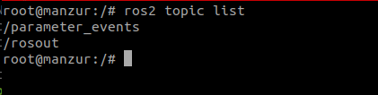
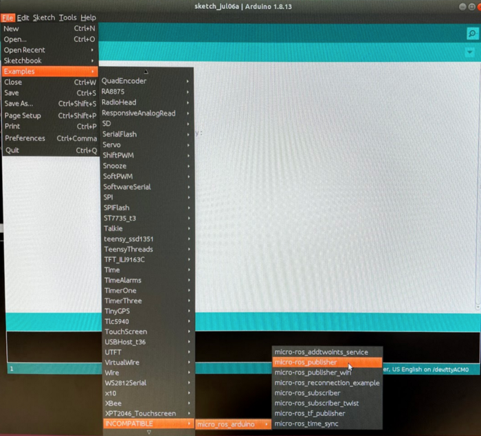
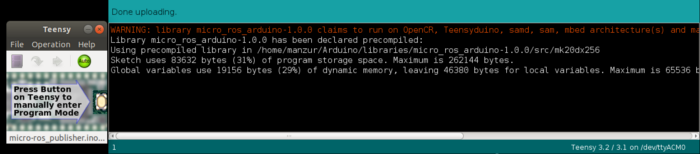
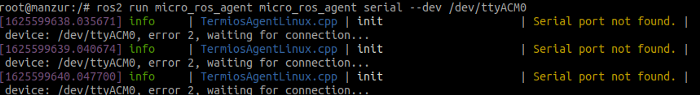

In this tutorial you will learn how to connect Teensy with micro-ROS and ROS 2. 
You will also learn how to install micro-ROS agent in Linux systems to communicate with 
Teensy-based Arduino board using Arduino IDE. This tutorial will also cover a 
simple publisher topic published from teensy and subscribed using ROS 2 interface.

## Target platform

To start with, we will need a host computer with either having a native 
Ubuntu 20.04 installed ROS 2 Foxy or using a docker version of the freshly build ROS 2 Foxy 
from this link. Now let us also look at the connection diagram which will help us 
understand the full picture better.


## Installing ROS 2 and micro-ROS in the host computer: 

Note: These first few steps are the same as in the micro-ROS installation page as in this link

For this tutorial you have to install ROS 2 Foxy Fitzroy on your Ubuntu 20.04 LTS computer. 
You can do this from binaries, via Ubuntu packages, which are detailed 
[*here*](https://docs.ros.org/en/foxy/Installation/Alternatives/Ubuntu-Install-Binary.html).

Note: Otherwise it is possible to use fresh docker build of ROS 2 Foxy installation by running these commands:

```bash
 sudo apt install docker.io
 sudo docker run -it --net=host -v /dev:/dev --privileged ros:foxy
```
After running the docker, follow the command to verify if the ROS2 is running and shows the topic list:



Docker builds ROS 2 Foxy version can also be used where it is not possible to install 
native ROS 2 Foxy from binaries, e.g., Jetson Nano running Jetpack 4.5 with Ubuntu 18.04.

Now Once you have a ROS 2 installation in the computer or docker, follow these steps to install the micro-ROS build system:

```bash
# Source the ROS 2 installation
source /opt/ros/foxy/setup.bash
# Create a workspace and download the micro-ROS tools
mkdir microros_ws
cd microros_ws
git clone -b $ROS_DISTRO https://github.com/micro-ROS/micro_ros_setup.git src/micro_ros_setup
# Update dependencies using rosdep
sudo apt update && rosdep update
rosdep install --from-paths src --ignore-src -y
# Install pip
sudo apt-get install python3-pip

# Build micro-ROS tools and source them
colcon build
source install/local_setup.bash
```

Once the micro-ROS installation is complete, we can then proceed to install the micro-ROS agent 
in the host computer or the docker version. Since we are going to use Teensy 3.2 and precompiled 
micro-ROS client library for our demonstration we will not be going to build the firmware and 
thus we will skip the firmware build steps from the [first micro-ROS Application on an RTOS tutorials](../first_application_rtos/).

To install the micro-ros Agent follow the steps below:

```bash
# Download micro-ROS agent packages
ros2 run micro_ros_setup create_agent_ws.sh
```
We will now build the agent packages and, when this is done, source the installation:

```bash
# Build step
ros2 run micro_ros_setup build_agent.sh
source install/local_setup.bash
```
Now, let's give a dry run by running the micro-ROS agent by following the command:

```bash
ros2 run micro_ros_agent micro_ros_agent serial --dev /dev/ttyACM0
```
The result should show something like this:


This means the installation of the agent is successful. 
Now we can proceed to the next step which is the installation of Arduino IDE 
and Teensyduino and patching the Arduino-based Teensy board for using the 
pre-compiled libraries as described [*in the micro_ros_arduino repository*](https://github.com/micro-ROS/micro_ros_arduino#patch-teensyduino).

## Installation of Arduino IDE, Teensyduino and setting up the patch for using the Teensy with micro-ROS and ROS2 foxy:

Please follow the link for downloading the latest version of 
[*Arduino 1.8.15*](https://github.com/arduino/Arduino/releases/download/1.8.15/arduino-1.8.15.tar.xz) 
and install by following this [*link for the Linux version*](https://www.arduino.cc/en/Guide/Linux) here.

After installing Arduino IDE download Teensyduino from this [*link here*](https://www.pjrc.com/teensy/td_154/TeensyduinoInstall.linux64) 
and follow the instruction as shown [*on this page*](https://www.pjrc.com/teensy/td_154/TeensyduinoInstall.linux64). 
To summarize the instructions which are as follow:

```
1. Download the Linux udev rules and copy the file to /etc/udev/rules.d.
https://www.pjrc.com/teensy/00-teensy.rules

2. type the following command in a terminal 
$ sudo cp 00-teensy.rules /etc/udev/rules.d/

3. Download and extract one of Arduino's Linux packages.
Note: Arduino from Linux distro packages is not supported.

4. Download the corresponding Teensyduino installer.

5. Run the installer in a termincal by adding execute permission and then execute it.
$ chmod 755 TeensyduinoInstall.linux64
$ ./TeensyduinoInstall.linux64
```
Now let's set up the patch for the teensy Arduino to use the pre-compiled micro-ros-client 
libraries, Open a terminal window and follow the commands below: For more information follow 
the GitHub link from [*micro_ros_arduino*](https://github.com/micro-ROS/micro_ros_arduino/tree/foxy)

```bash
# for me it was $ export ARDUINO_PATH=/home/manzur/arduino-1.8.13/
export ARDUINO_PATH=[Your Arduino + Teensiduino path]

cd $ARDUINO_PATH/hardware/teensy/avr/

curl https://raw.githubusercontent.com/micro-ROS/micro_ros_arduino/foxy/extras/patching_boards/platform_teensy.txt > platform.txt
```

Once the above instruction is complete, we will now be able to use the Teensy 3.2 and 
program it with the pre-compiled micro-ros-client libraries using Arduino IDE.

## Program the Teensy

Now that we have patched the teensy Arduino IDE, we will be able to use the pre-compiled library by following these instructions:

1. Go to [*link to release section*](https://github.com/micro-ROS/micro_ros_arduino/releases) 
and download the last release of micro-ROS library for Arduino. 
Place the file inside `/home/$USERNAME/Arduino/libraries/` as shown below.


Once this process is complete, now let us look at the example folder below:



For this tutorial and test, we will be using mico-ros-publisher example as shown above since this 
program will only publish integer data which will increase in every cycle. Once we selected the 
example program, we will then upload the code in the Teensy 3.2 connected to our host computer 
which should show the result as follow.



## Running micro-ROS agent in ROS 2 Foxy

Now, let's disconnect the Teensy for now from the host computer. We will then open a terminal 
or in the docker run the agent program once again as shown at the end of 
step 2. Make sure to source the ROS path as below:

```bash
source /opt/ros/foxy/setup.bash
```

and then run the agent program:

```bash
ros2 run micro_ros_agent micro_ros_agent serial --dev /dev/ttyACM0
```
Once the program is running it will show this message:



We will then reconnect the Teensy with the host computer and then we will see 
that the connection is complete and it shows like this:


This means the connection is complete with teensy containing micro-ros-client and micro-ros-agent in the host computer.
Now for the big moment and test the ROS topic published from the teensy. 
This time we will open another terminal or docker window and type as follow:

```bash
ros2 topic list
```
Which should list as shown below:


See, we have now `/micro_ros_arduino_node_publisher` topic publishing in the host computer. 
If we listen to the topic we will see something like this:


The integer msg data increasing in each cycle.

_Note: This tutorial was first published by the author [Manzur Murshid](https://github.com/shazib2t) on [https://manzurmurshid.medium.com/how-to-connect-teensy-3-2-with-micro-ros-and-ros2-foxy-6c8f99c9b66a](https://manzurmurshid.medium.com/how-to-connect-teensy-3-2-with-micro-ros-and-ros2-foxy-6c8f99c9b66a)._
