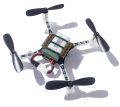

You may combine the different demos for even more functionality. In detail, the following combinations are supported by launch files:

| _Combination_ | _Description_ | _Launch Files_ |
| --- | --- | --- |
|  +  | ToF sensor serves as a invisible barrier. If the Kobuki drives into the ToF sensor's light beam, any further forward motion will be prevented until the Kobuki has been driven out of the beam. This is signalled from the ToF sensor to the Kobuki via a topic `/emergency_stop`. |  |
|  +  | Roll and pitch of the Crazyflie are used as controls for the Kobuki. Thus, if the remote-controlled Crazyflie is positioned above and aligned with the Kobuki, they will move synchronously. Alternatively, the Crazyflie may be taken into the hand and used as high-end remote control for the Kobuki. |  | 
|  +  +  | The Kobuki may be controlled using the Crazyflie or synchronous with it, as described above. Any forward movement will be prevented if the Kobuki drives into the ToF sensor's beam. |  | 
