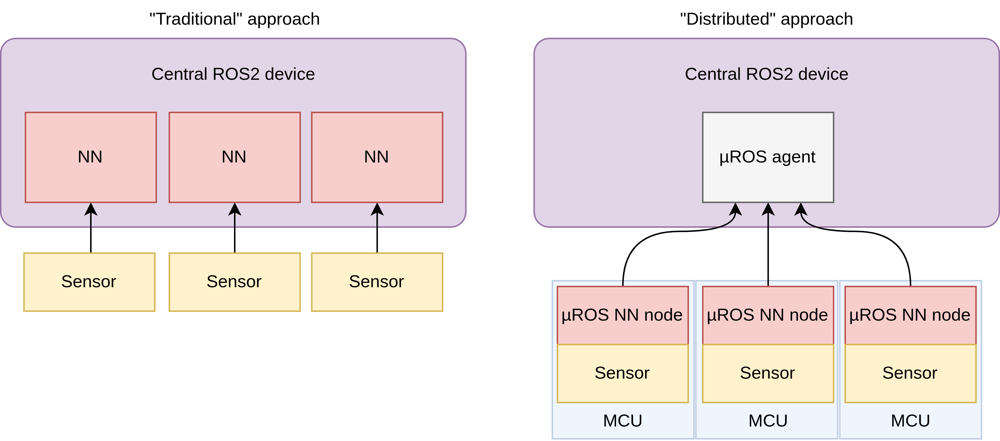

---

This example demonstrates how to run an image classification neural network (built using [Edge Impulse](https://www.edgeimpulse.com/)) on the [Arduino Portenta H7](https://store.arduino.cc/products/portenta-h7) and publish the classification results using micro-ROS. The tutorial also shows how to add custom message types to micro-ROS and ROS 2. The motivation behind this demo is to offer a way to add AI functionality to ROS 2 robots without bogging down the main computational unit with additional neural nets. This is especially helpful when the offloading of computational tasks to a companion laptop (for instance) is not an option. 

With this approach the MCU publishes inference results using a custom message type `EIResult` (Edge Impulse result), which is made up of multiple `EIClassification` items. The tutorial associated with this demo explains how to go about adding these custom message types. A single classification looks like this:

```
'dog': 0.75
```

It contains a single label (class) and its probability. A full result looks like this:

```
'dog': 0.75,
'cat': 0.25
```

It contains all labels and their probabilities (together summing to 1). The size of the result messages depends on how many labels (classes) your image model is trained on (the example above has two). The code in this example will automatically allocate the necessary memory to support an arbitrary number of labels depending on your model.


By running neural networks on MCUs and publishing their inferences using micro-ROS, it becomes straightforward to experiment with a "distributed" approach to AI in robotics, where the central computer is concerned only with the results of the neural networks and not with sensor data ingest nor calculation.



---


To run this demo yourself, check out the video walk through and instructions given [here](https://github.com/avielbr/micro_ros_ei).
