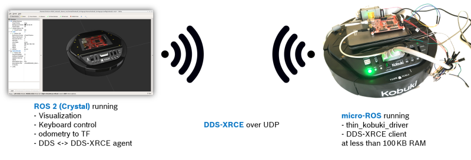

The micro-ROS Kobuki Demo illustrates the use of micro-ROS on the Kobuki platform, which is the mobile base of the well-known Turtlebot 2 research robot.

The basic idea and working principle of this demo is as follows: Instead of a laptop running ROS, the Kobuki is equipped with a STM32F4 microcontroller only. This STM32F4 runs the micro-ROS stack and a port of the [thin_kobuki driver](https://github.com/Lab-RoCoCo/thin_drivers), which interacts with the robot's firmware (which runs on a built-in microcontroller). The STM32F4 communicates the sensor data via DDS-XRCE to a remote laptop running a standard ROS 2 stack, the micro-ROS agent and rviz. At the same time, using the other direction of communication, the Kobuki can be remote-controlled.

To run this demo yourself, follow the instructions given in [https://github.com/micro-ROS/micro-ROS_kobuki_demo](https://github.com/micro-ROS/micro-ROS_kobuki_demo)
