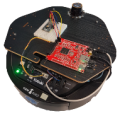
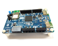
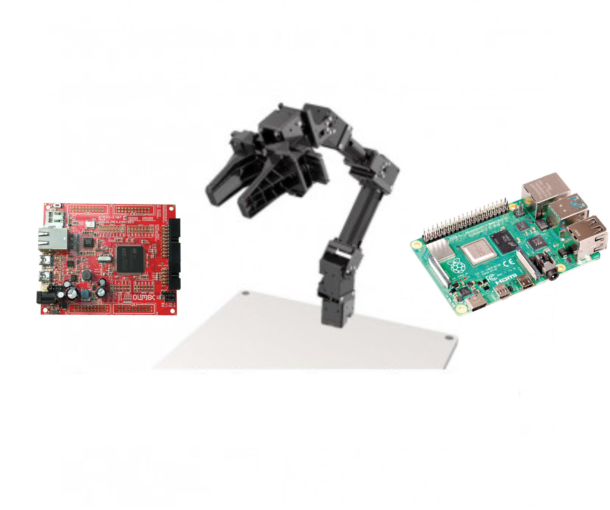
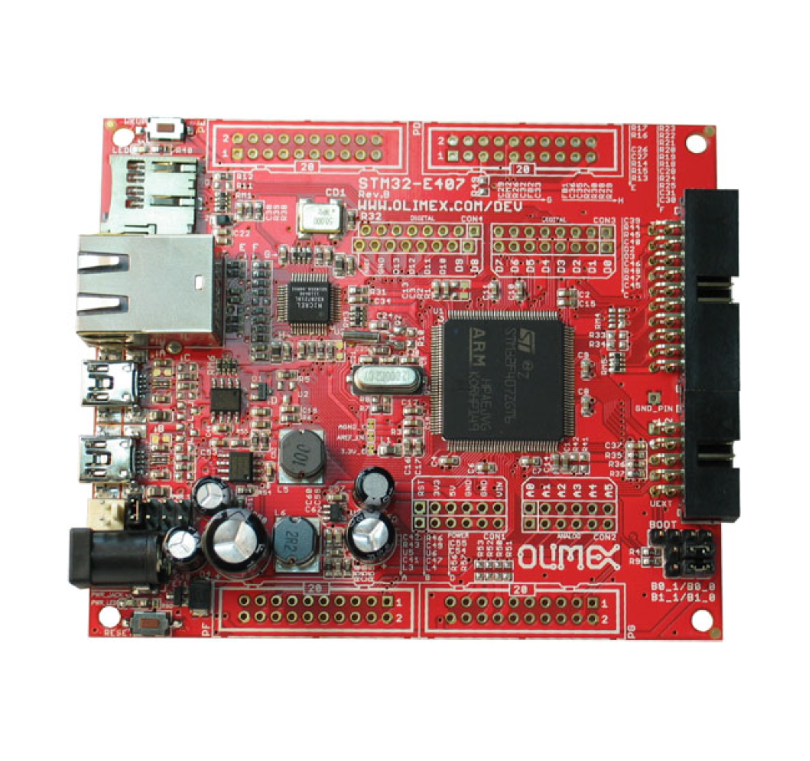
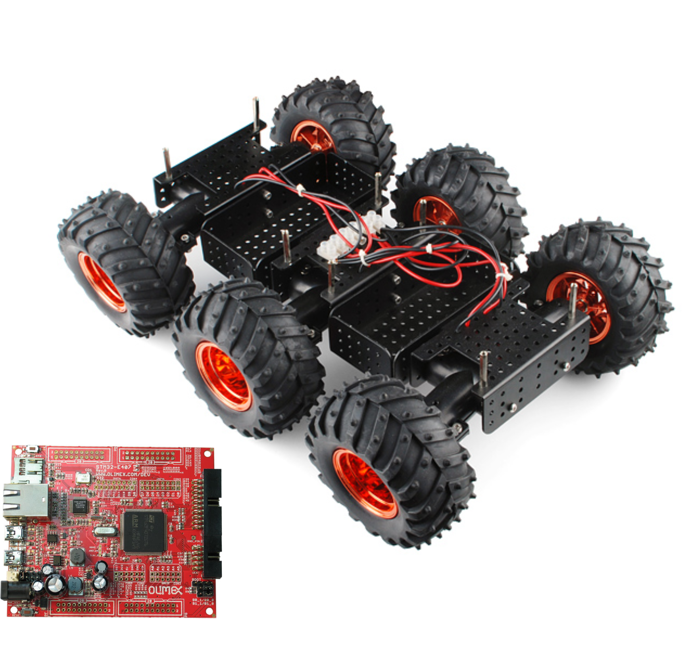
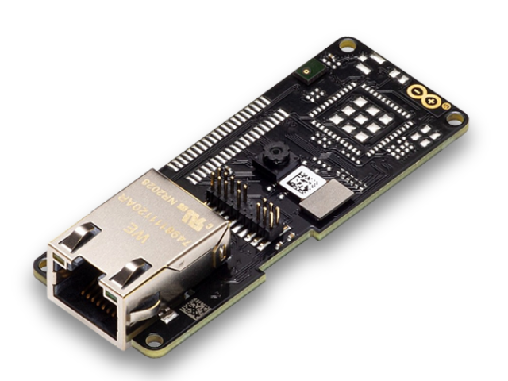

In addition to the above entry-level tutorials, we created a collection of demos that showcase micro-ROS in real applications which are easy to reproduce by the community &mdash; and thus _you_.
Unlike tutorials, we do not explain the demo code step by step, but provide ready-to-use Docker files to get you started as quickly as possible.

Below, you can find a table
Choose yourself:

| Demo |  | _RTOS_ | _Hardware_* |
| --- | :-: | :-: | :-: |
| [**Kobuki Demo**](../kobuki_demo/) |  | NuttX | Kobuki Turtlebot2, Olimex LTD STM32-E407 |
| [**Crazyflie Demo**](../crazyflie_demo/) |  | FreeRTOS | Crazyflie 2.1 Drone |
| [**ToF Sensor Demo**](../tof_demo/) |  | Zephyr | STM32L4 Discovery kit IoT |
| [**OpenManipulator-X Demo**](../openmanipulator_demo/) |  | Zephyr | Robotis OpenMANIPULATOR-X, Olimex LTD STM32-E407, Raspberry Pi 4 |
| [**Interfacing with FIWARE Context Broker**](../fiware_demo/) | -- | -- |
| [**DemoBox Power and Boot Time**](../demobox_demo/) |  | NuttX | Olimex LTD STM32-E407, Raspberry Pi 4 |
| [**Thumper, a six-wheeled robot**](../thumper_demo/) |  | NuttX | Wild Thumper 6WD, Olimex LTD STM32-E407 |
| [**MoveIt 2 Demo**](../moveit2_demo/) |  | Zephyr | STM32L4 Discovery kit IoT |
| [**Edge Impulse AI demo**](../edgeimpulse/) |  | Arduino | Arduino Portenta H7, Vision shield |
| [**Combined Demos**](../combined_demos/) | -- | -- |

*As a matter of course, in addition to the hardware detailed above, you'll need a computer/laptop, various cables, and further auxiliary equipment.

**WIP:** The demos may also interface with the FIWARE Context Broker, which is the core of the [FIWARE](https://www.fiware.org/) open source initiative for context data management. Learn more at [**Interfacing with FIWARE Context Broker**](../fiware_demo/).

**WIP:** The demos can be combined in several ways to demonstrate further functionalities. Go to [**Combined Demos**](../combined_demos/) to learn more about these combinations and how to launch them.

