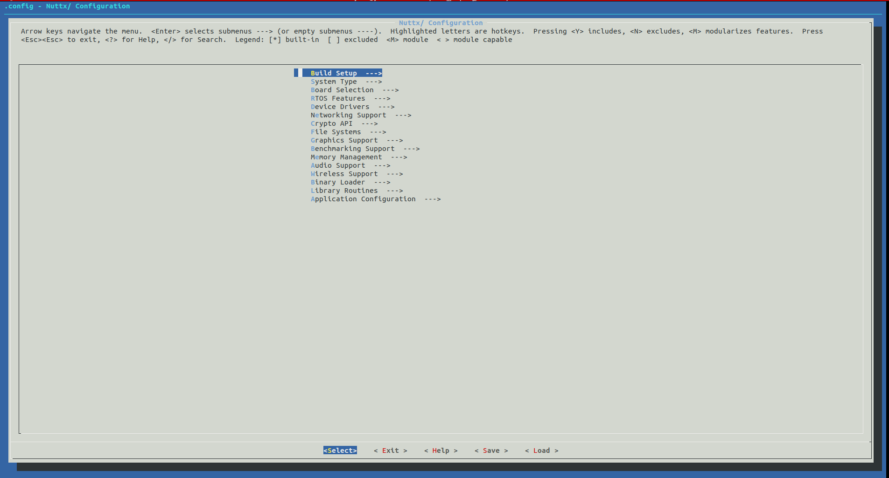

 

In this tutorial, we will see how to set a basic Micro-ROS configuration for NuttX over serial communication. Since this guide is only focused on setting the configuration, you should check the tutorial linked here before: [First micro-ROS Application on an RTOS](https://micro-ros.github.io/docs/tutorials/core/first_application_rtos/)

**Disclamer**

This guide is not guarantee to work on every NuttX supported board, because each one has a different level of peripheral implementation and memory available.

## Required hardware

- Any NuttX supported board with at least these characteristics:
    - STM32 MCU.
    - RAM: 125 Kb.
    - Flash: 512 kb.
    - Serial communication peripheral.

- USB-TTY serial cable.

## Workspace set-up

As a first thing, we're going to create a Micro-ROS workspace. To do so, we will execute the following commands on a console:

```
source /opt/ros/$ROS_DISTRO/setup.bash

mkdir uros_ws && cd uros_ws

git clone -b $ROS_DISTRO https://github.com/micro-ROS/micro_ros_setup.git src/micro_ros_setup

rosdep update && rosdep install --from-path src --ignore-src -y

colcon build

source install/local_setup.bash
```


## Set the base configuration

 In this guide we will give Micro-ROS support for the [Olimex-STM32-H407 board](https://www.olimex.com/Products/ARM/ST/STM32-H407/open-source-hardware) as an example.

This board is a simplified version of our supported Olimex-STM32-E407 board. 

In the previous console, execute the following commands to set the basic configuration:
```bash
ros2 run micro_ros_setup create_firmware_ws.sh nuttx olimex-stm32-h407
ros2 run micro_ros_setup configure_firmware.sh nsh
```

If everything goes fine, it should output the message:
```bash
Copy files
Refreshing...
```

Now the basic NSH configuration is set. With the steps that follow, we will set the required configuration to run Micro-ROS on this board.

## Micro-ROS configuration.

In the same console as before, run the commands:
```bash
cd firmware/NuttX
make menuconfig
```

The menu below should appear:


Note: Remember that you should follow this previous tutorial before starting it. [First micro-ROS Application on an RTOS](https://micro-ros.github.io/docs/tutorials/core/first_application_rtos/)

In the menu, you need to set the following configuration.

- System Type > STM32 Peripheral Support > USART3
- RTOS Features > Clocks and Timers > Support CLOCK_MONOTONIC
- Device Drivers > Serial Driver Support > Serial TERMIOS support
- Library Routines > Standard Math Library
- Library Routines > sizeof(_Bool) is a 8-bits
- Library Routines > Build uClibc++ (must be installed) 
- Application Configuration > micro-ROS
- Application Configuration > micro-ROS > Transport > Serial Transport
- Application Configuration > Examples > microROS Publisher

Push two times the key "ESC" and set yes, when it asks you if you want to save it.

Now the configuration is properly set, the only thing left is to compile it. To do so, continue in the same console and execute the commands:
```
cd ../..
ros2 run micro_ros_setup build_firmware.sh
```

If everything goes fine, it should return the following output:
```bash
CP: nuttx.hex
CP: nuttx.bin
```
