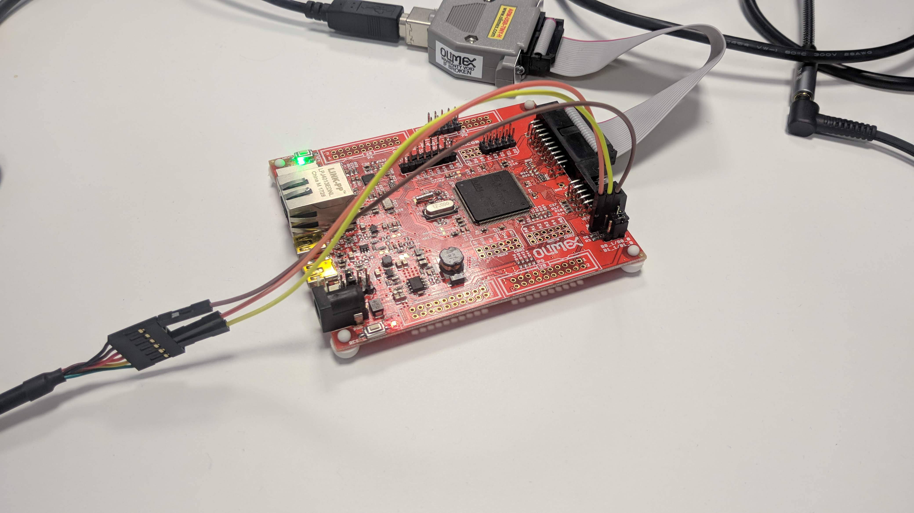

| RTOS  | Board compatible  |
| :---: | :---------------: |
| NuttX | Olimex-STM32-E407 |

NSH is a system console that can be used through different interfaces.
In this tutorial, we will show how to use it over the UART and USB peripherals.

## Hardware requirements:

- [Olimex-STM32-E407 board](https://www.olimex.com/Products/ARM/ST/STM32-E407/open-source-hardware)
- [JTAG Flasher device](https://www.olimex.com/Products/ARM/JTAG/ARM-USB-TINY/)
- USB-TTL232 cable.
- Mini USB cable.

## Create the firmware

For this tutorial we are going to execute the following configuration in micro_ros_setup:

```bash
ros2 run micro_ros_setup create_firmware_ws.sh nuttx olimex-stm32-e407
# For UART
ros2 run micro_ros_setup configure_firmware.sh nsh_uart
# For USB
ros2 run micro_ros_setup configure_firmware.sh nsh
```

Once the board is configured, we need to build it by typing the command:

```bash
ros2 run micro_ros_setup build_firmware.sh
```

If the compilation succeeds, it should return this output:
```bash
CP: nuttx.hex
CP: nuttx.bin
```

# Flash the firmware

The firmware is ready, it is just necessary to upload it.
Now you need to do the following connections:
- Connect the JTAG flasher device.
- Connect the USB TTL-232 to the USART3 in case of UART communication:
  - `USART3 TX` -> `TTL232 RX`
  - `USART3 RX` -> `TTL232 TX`
  - `GND Board` -> `TTL232 GND`


- Connect the mini USB to the OTG2 for USB communication.


Now flash the board by typing the next command:
```bash
ros2 run micro_ros_setup flash_firmware.sh
```

This should return this output once the process is finished:

```bash
wrote 49152 bytes from file nuttx.bin in 6.279262s (7.644 KiB/s)
Info : Listening on port 6666 for tcl connections
Info : Listening on port 4444 for telnet connections
```

## Connect to the console

Finally, to use the NSH console you need to follow the steps listed below:
- Push the reset button. The green LED will turn on to say that it is working properly.
- Look for the device by typing `dmesg` on the console, this should return something like this:

```bash
# For UART
[17154.225244] usb 1-2: new full-speed USB device number 6 using xhci_hcd
[17154.380060] usb 1-2: New USB device found, idVendor=0403, idProduct=6001, bcdDevice= 6.00
[17154.380066] usb 1-2: New USB device strings: Mfr=1, Product=2, SerialNumber=3
[17154.380069] usb 1-2: Product: USB <-> Serial Cable
[17154.380072] usb 1-2: Manufacturer: FTDI
[17154.380075] usb 1-2: SerialNumber: 12TBZ31
[17154.400389] usbcore: registered new interface driver usbserial_generic
[17154.400395] usbserial: USB Serial support registered for generic
[17154.402690] usbcore: registered new interface driver ftdi_sio
[17154.402699] usbserial: USB Serial support registered for FTDI USB Serial Device
[17154.402745] ftdi_sio 1-2:1.0: FTDI USB Serial Device converter detected
[17154.402762] usb 1-2: Detected FT232RL
[17154.403058] usb 1-2: FTDI USB Serial Device converter now attached to ttyUSB0

# For USB
[20614.570781] usb 1-2: new full-speed USB device number 7 using xhci_hcd
[20614.724366] usb 1-2: New USB device found, idVendor=0525, idProduct=a4a7, bcdDevice= 1.01
[20614.724372] usb 1-2: New USB device strings: Mfr=1, Product=2, SerialNumber=3
[20614.724375] usb 1-2: Product: CDC/ACM Serial
[20614.724378] usb 1-2: Manufacturer: NuttX
[20614.724381] usb 1-2: SerialNumber: 0
[20614.745693] cdc_acm 1-2:1.0: ttyACM0: USB ACM device
[20614.746274] usbcore: registered new interface driver cdc_acm
[20614.746277] cdc_acm: USB Abstract Control Model driver for USB modems and ISDN adapters
```
In this specific situation, the device is assigned to `dev/ttyUSB0` and `dev/ttyACM0` for UART and USB communication respectively. Note that the last number could be different.

Finally, execute the next command to open the NSH console:
```
# For UART
sudo minicom -D /dev/ttyUSB0

# For USB
sudo minicom -D /dev/ttyACM0
```

Once the port is opened, **you need to push two times the Enter key** and it should show the next menu:

```bash
nsh> ?
help usage:  help [-v] [<cmd>]

  ?           exec        hexdump     mb          sleep       
  cat         exit        kill        mh          usleep      
  echo        help        ls          mw          xd          

Builtin Apps:
nsh>
```