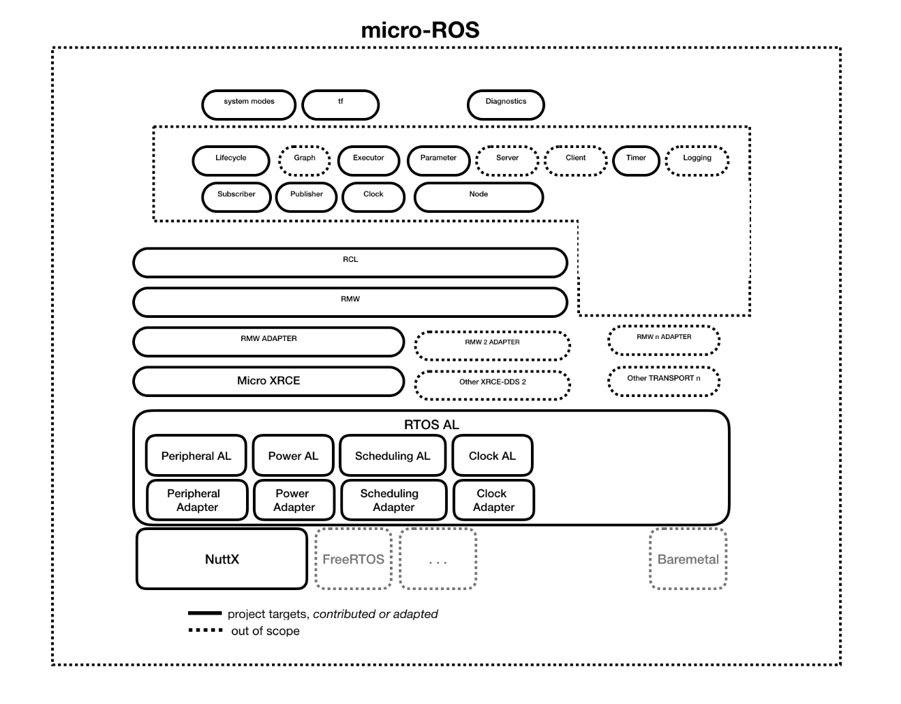

[micro-ROS](https://cordis.europa.eu/project/rcn/213167_en.html) puts ROS2 onto microcontrollers, making them first class participants of the ROS 2 environment.

From the level of ROS onwards, we strive to re-use as much as possible from ROS 2, and be as compatible with it as possible. In some areas, we will probably do custom implementations optimized for resource use. This will definitely include TF, and maybe other areas such as scheduling. These optimized implementations may also be interesting for use with "normal" ROS2.

We'll update this README as we proceed. For now, you can check out our work on:
 - Real-Time Operating System: [https://github.com/microROS/NuttX](https://github.com/microROS/NuttX)
 - Reference hardware: [https://github.com/microROS/hardware](https://github.com/microROS/hardware)
 - Build infrastructure for embedded development using docker: [https://github.com/microROS/docker](https://github.com/microROS/docker)

### Architecture
The micro-ROS architecture is a work in progress. It's modular and built with the following ingredients:

 - A Real-Time Operating System (RTOS). This includes at least NuttX, and possibly others.
 - An embedded communications middleware, at least [Micro XRCE-DDS](https://github.com/eProsima/Micro-XRCE-DDS)
 - The [ROS client library](http://github.com/microROS/rcl)

A first approach (yet not final) of the architecture is represented below:

