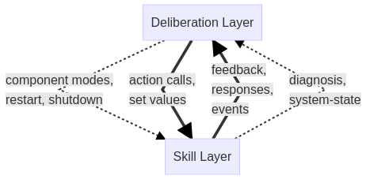

# Lifecycle and System Modes

Table of Contents
*   [Introduction and goal](#introductionandgoal)
*   [Requirements](#requirements)
*   [Background: ROS 2 Lifecycle](#backgroundros2lifecycle)
*   [Main features](#mainfeatures)
    *   [Extended lifecycle](#extendedlifecycle)
    *   [System hierarchy and modes](#systemhierarchyandmodes)
    *   [Mode manager](#modemanager)
*   [Roadmap](#roadmap)
*   [Related Work](#relatedwork)
*   [Acknowledgments](#acknowledgments)

TODO CHECK FUNCTIONING OF THE LINKS ABOVE (AND THE GENERATED IDS FOR THE SECTION HEADERS).

## Introduction and Goal

Modern robotic software architectures follow a layered approach. The layer with the core algorithms for SLAM, vision-based object recognition, motion planning, etc. is often referred to as *skill layer* or *functional layer*. To perform a complex task, these skills are orchestrated by one or more upper layers named *executive layer and planning layer*. Other common names are *task layer and mission layer* or *deliberation layer(s)*. In the following, we used the last term.

We observed three different but closely interwoven aspects to be handled on the deliberation layer:

1.  **Task Handling**: Orchestration of the actual task, the *straight-forward*, *error-free* flow
2.  **Contingency Handling**: Handling of task-specific contingencies, e.g., expectable retries and failure attempts, obstacles, low battery.
3.  **System Error Handling**: Handling of exceptions, e.g., sensor/actuator failures.

The mechanisms being used to orchestrate the skills are service and action calls, re-parameterizations, set values, activating/deactivating of components, etc. We distinguish between *function-oriented calls* to a running skill component (e.g., set values, action queries) and *system-oriented calls* to individual or multiple components (e.g., switching between component modes, restart, shutdown).

Analogously, we distinguish between *function-oriented notifications* from the skill layer in form a feedback on long-running service calls, messages on relevant events in the environment, etc. and *system-oriented notifications* about component failures, hardware errors, etc.

Our observation is that interweaving of task, contingency and system error handling generally leads to a high complexity of the control flow on the deliberation layer. Yet, we hypothesize that this complexity can be reduced by introducing abstractions for system-oriented calls and notifications.

Therefore, our **goal** within this work is to provide suitable abstractions and framework functions for (1.) system runtime configuration and (2.) system error and contingency diagnosis, to reduce the effort for the application developer of designing and implementing the task, contingency and error handling.

This goal is illustrated in the following high-level architecture:

The envisioned key elements to achieve this goal are:

1.  Extensible concept to specify the runtime states of components (i.e ROS nodes).
2.  Modeling approach for specifying system modes based on these component states.
3.  Diagnosis module for deriving relevant information from the operating systems, the hardware and the functional components.
4.  Mode manager module for system runtime configuration.

## Requirements

The list of requirements is maintained in the doc folder of the micro-ROS system modes repository at **TODO INSERT LINK**.

## Background: ROS 2 Lifecycle

Our approach is based on the ROS 2 Lifecycle. The primary goal of the ROS 2 lifecycle is TODO INSERT TEXT.

The description of the concept can be found at [http://design.ros2.org/articles/node_lifecycle.html](http://design.ros2.org/articles/node_lifecycle.html). The implementation is described at [https://index.ros.org/doc/ros2/Managed-Nodes/](https://index.ros.org/doc/ros2/Managed-Nodes/).

## Main Features

### Extended Lifecycle

In micro-ROS, we extended the ROS 2 lifecycle by allowing to specify specific modes (i.e. substates) for the ACTIVE state based on the standard parameters mechanism. We implemented this concept in rcl and rclcpp for ROS 2 and micro-ROS.

The documentation and code can be found at TODO INSERT LINK.

### System Hierarchy and Modes

We provide a modeling concept for specifying the hierarchical composition of systems recursively from nodes and for specifying the states and modes of systems and subsystems with the extended lifecycle, analogously to nodes. This system hierarchy and modes model also includes an application-specific the mapping of the states and modes along the system hierarchy down to nodes.

The description of this model can be found at TODO INSERT LINK.

### Mode manager

The mode manager allows for runtime system adaptation based on such a system hierarchy and modes model. It parses the model and provides all services and topics to request state and mode changes and to monitor these changes.

The documentation and code can be found at TODO INSERT LINK. A small demo is provided at TODO INSERT LINK.

## Roadmap

**2018**
*   Designed extended lifecycle  concept and implemented this concept in rcl and rclcpp for ROS 2 and micro-ROS.
*   Designed modeling concept to specify system hierarchy as well as to model states and modes of system and subsystems and their mapping along the system hierarchy down to nodes.
*   Implemented mode manager in C++ for ROS 2.

**2019**
*   Specific implementation of mode manager for micro-ROS as may be necessary.
*   Diagnostics framework for micro-ROS, interoperating with ROS 2 diagnostics.
*   MCU-specific diagnostics functions for resource usage on RTOS layer, latencies, statistics from middleware, ...
*   Integration of mode manager with real-time executor.

**2020**
*   Lightweight concept for specifying error propagations between nodes and subsystems.

_Note: The extension of the ACTIVE state by modes (substates) was originally planned for 2020 but brought forward in 2018._

## Related Work

In this section, we provide an overview to related approaches and link to the corresponding APIs.

### AADL

INSERT SOME WORDS ON AADL AND LINK DOCUMENTATION - OR REMOVE THIS SECTION.

## Acknowledgments

This activity has received funding from the European Research Council (ERC) under the European Union's Horizon 2020 research and innovation programme (grant agreement n° 780785).
